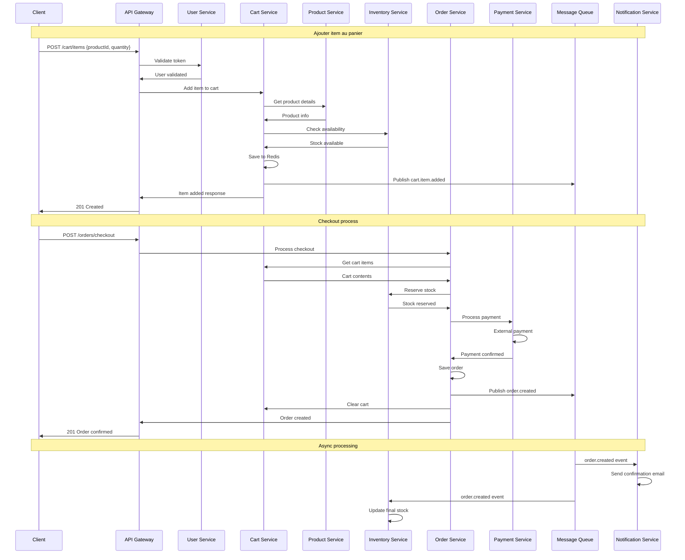

🔝 Retour au [Sommaire](/SOMMAIRE.md)

# 17-2 : Communication inter-services

## Introduction

Dans une architecture microservices, les services doivent communiquer entre eux pour accomplir des tâches complexes. C'est comme dans une entreprise : les départements doivent se parler pour collaborer efficacement.

Imaginez que vous commandez une pizza :
1. **Vous** appelez le restaurant (communication)
2. **Le restaurant** vérifie les ingrédients disponibles (communication interne)
3. **La cuisine** prépare la pizza (traitement)
4. **La livraison** vous apporte la pizza (communication de retour)

C'est exactement ce qui se passe entre microservices !

## Types de communication

### 1. Communication Synchrone (Request-Response)

**Principe** : Le service appelant attend une réponse immédiate.

**Analogie** : Comme un appel téléphonique - vous parlez et attendez une réponse.

```
Service A ──────────────→ Service B
          Demande
Service A ←────────────── Service B
          Réponse
```

**Avantages** :
- Simple à comprendre et implémenter
- Réponse immédiate
- Facile à déboguer

**Inconvénients** :
- Couplage fort entre services
- Si un service est en panne, toute la chaîne s'arrête
- Latence accumulée

### 2. Communication Asynchrone (Event-Driven)

**Principe** : Le service envoie un message et continue son travail sans attendre de réponse.

**Analogie** : Comme envoyer un email - vous envoyez et continuez votre travail.

```
Service A ──────────────→ Message Queue ──────────────→ Service B
          Événement                        Traitement
```

**Avantages** :
- Faible couplage entre services
- Résilience aux pannes
- Meilleure performance

**Inconvénients** :
- Plus complexe à implémenter
- Difficile à déboguer
- Gestion de l'ordre des messages

## Communication Synchrone avec HTTP/REST

### Exemple pratique : Vérifier un utilisateur

Supposons que le service Commandes doit vérifier qu'un utilisateur existe avant de créer une commande.

#### 1. Création du client HTTP

```go
package client

import (
    "bytes"
    "encoding/json"
    "fmt"
    "net/http"
    "time"
)

type UserClient struct {
    baseURL    string
    httpClient *http.Client
}

func NewUserClient(baseURL string) *UserClient {
    return &UserClient{
        baseURL: baseURL,
        httpClient: &http.Client{
            Timeout: 10 * time.Second, // Timeout important !
        },
    }
}

type User struct {
    ID       string `json:"id"`
    Email    string `json:"email"`
    Name     string `json:"name"`
    IsActive bool   `json:"isActive"`
}

// Obtenir un utilisateur par ID
func (c *UserClient) GetUser(userID string) (*User, error) {
    url := fmt.Sprintf("%s/api/v1/users/%s", c.baseURL, userID)

    resp, err := c.httpClient.Get(url)
    if err != nil {
        return nil, fmt.Errorf("failed to call user service: %w", err)
    }
    defer resp.Body.Close()

    // Gestion des codes d'erreur HTTP
    switch resp.StatusCode {
    case http.StatusOK:
        // Tout va bien, on continue
    case http.StatusNotFound:
        return nil, fmt.Errorf("user not found: %s", userID)
    case http.StatusInternalServerError:
        return nil, fmt.Errorf("user service internal error")
    default:
        return nil, fmt.Errorf("unexpected status code: %d", resp.StatusCode)
    }

    var user User
    if err := json.NewDecoder(resp.Body).Decode(&user); err != nil {
        return nil, fmt.Errorf("failed to decode response: %w", err)
    }

    return &user, nil
}

// Vérifier si un utilisateur existe et est actif
func (c *UserClient) IsUserActive(userID string) (bool, error) {
    user, err := c.GetUser(userID)
    if err != nil {
        return false, err
    }

    return user.IsActive, nil
}
```

#### 2. Utilisation dans le service Commandes

```go
package service

import (
    "fmt"
    "myapp/client"
)

type OrderService struct {
    userClient *client.UserClient
    repository OrderRepository
}

func NewOrderService(userClient *client.UserClient, repo OrderRepository) *OrderService {
    return &OrderService{
        userClient: userClient,
        repository: repo,
    }
}

type Order struct {
    ID       string  `json:"id"`
    UserID   string  `json:"userId"`
    Amount   float64 `json:"amount"`
    Status   string  `json:"status"`
}

func (s *OrderService) CreateOrder(order *Order) error {
    // 1. Vérifier que l'utilisateur existe et est actif
    isActive, err := s.userClient.IsUserActive(order.UserID)
    if err != nil {
        return fmt.Errorf("failed to validate user: %w", err)
    }

    if !isActive {
        return fmt.Errorf("user %s is not active", order.UserID)
    }

    // 2. Créer la commande
    order.Status = "pending"
    return s.repository.Save(order)
}
```

### Gestion avancée des erreurs et retry

```go
package client

import (
    "context"
    "time"
)

// Configuration pour les retry
type RetryConfig struct {
    MaxRetries int
    BaseDelay  time.Duration
}

func (c *UserClient) GetUserWithRetry(userID string, config RetryConfig) (*User, error) {
    var lastErr error

    for attempt := 0; attempt <= config.MaxRetries; attempt++ {
        user, err := c.GetUser(userID)
        if err == nil {
            return user, nil // Succès !
        }

        lastErr = err

        // Ne pas retry sur certaines erreurs (404, 400, etc.)
        if isClientError(err) {
            break
        }

        // Attendre avant de réessayer (backoff exponentiel)
        if attempt < config.MaxRetries {
            delay := time.Duration(attempt+1) * config.BaseDelay
            time.Sleep(delay)
        }
    }

    return nil, fmt.Errorf("failed after %d attempts: %w", config.MaxRetries, lastErr)
}

func isClientError(err error) bool {
    // Simplification - dans la vraie vie, analyser le type d'erreur
    return false
}
```

### Circuit Breaker Pattern

Le Circuit Breaker protège votre service des services défaillants.

```go
package client

import (
    "errors"
    "sync"
    "time"
)

type CircuitState int

const (
    StateClosed CircuitState = iota // Fonctionnement normal
    StateOpen                       // Circuit ouvert - pas d'appels
    StateHalfOpen                   // Test - un seul appel autorisé
)

type CircuitBreaker struct {
    mutex           sync.Mutex
    state          CircuitState
    failureCount   int
    lastFailureTime time.Time
    maxFailures    int
    timeout        time.Duration
}

func NewCircuitBreaker(maxFailures int, timeout time.Duration) *CircuitBreaker {
    return &CircuitBreaker{
        state:       StateClosed,
        maxFailures: maxFailures,
        timeout:     timeout,
    }
}

var ErrCircuitOpen = errors.New("circuit breaker is open")

func (cb *CircuitBreaker) Call(fn func() error) error {
    cb.mutex.Lock()
    defer cb.mutex.Unlock()

    // Vérifier l'état du circuit
    if cb.state == StateOpen {
        // Vérifier si on peut passer en half-open
        if time.Since(cb.lastFailureTime) > cb.timeout {
            cb.state = StateHalfOpen
        } else {
            return ErrCircuitOpen
        }
    }

    // Exécuter la fonction
    err := fn()

    if err != nil {
        cb.onFailure()
        return err
    }

    cb.onSuccess()
    return nil
}

func (cb *CircuitBreaker) onFailure() {
    cb.failureCount++
    cb.lastFailureTime = time.Now()

    if cb.failureCount >= cb.maxFailures {
        cb.state = StateOpen
    }
}

func (cb *CircuitBreaker) onSuccess() {
    cb.failureCount = 0
    cb.state = StateClosed
}
```

#### Utilisation du Circuit Breaker

```go
func (c *UserClient) GetUserWithCircuitBreaker(userID string) (*User, error) {
    var user *User
    var err error

    cbErr := c.circuitBreaker.Call(func() error {
        user, err = c.GetUser(userID)
        return err
    })

    if cbErr != nil {
        return nil, cbErr
    }

    return user, err
}
```

## Communication Asynchrone avec Messages

### 1. Publisher/Subscriber avec Redis

#### Installation et configuration

```bash
go get github.com/go-redis/redis/v8
```

```go
package messaging

import (
    "context"
    "encoding/json"
    "fmt"
    "time"

    "github.com/go-redis/redis/v8"
)

type RedisPublisher struct {
    client *redis.Client
}

func NewRedisPublisher(addr, password string, db int) *RedisPublisher {
    rdb := redis.NewClient(&redis.Options{
        Addr:     addr,
        Password: password,
        DB:       db,
    })

    return &RedisPublisher{client: rdb}
}

// Publier un événement
func (p *RedisPublisher) Publish(ctx context.Context, channel string, event interface{}) error {
    data, err := json.Marshal(event)
    if err != nil {
        return fmt.Errorf("failed to marshal event: %w", err)
    }

    return p.client.Publish(ctx, channel, data).Err()
}
```

#### Subscriber (Consommateur)

```go
type RedisSubscriber struct {
    client *redis.Client
}

func NewRedisSubscriber(addr, password string, db int) *RedisSubscriber {
    rdb := redis.NewClient(&redis.Options{
        Addr:     addr,
        Password: password,
        DB:       db,
    })

    return &RedisSubscriber{client: rdb}
}

type EventHandler func(data []byte) error

func (s *RedisSubscriber) Subscribe(ctx context.Context, channel string, handler EventHandler) error {
    pubsub := s.client.Subscribe(ctx, channel)
    defer pubsub.Close()

    // Écouter les messages
    for {
        select {
        case <-ctx.Done():
            return ctx.Err()
        default:
            msg, err := pubsub.ReceiveMessage(ctx)
            if err != nil {
                return err
            }

            // Traiter le message
            if err := handler([]byte(msg.Payload)); err != nil {
                // Log l'erreur mais continue à écouter
                fmt.Printf("Error handling message: %v\n", err)
            }
        }
    }
}
```

### 2. Exemple complet : Système de commandes

#### Événements

```go
package events

import "time"

type OrderCreated struct {
    OrderID    string    `json:"orderId"`
    UserID     string    `json:"userId"`
    Amount     float64   `json:"amount"`
    CreatedAt  time.Time `json:"createdAt"`
}

type UserRegistered struct {
    UserID    string    `json:"userId"`
    Email     string    `json:"email"`
    CreatedAt time.Time `json:"createdAt"`
}

type PaymentProcessed struct {
    OrderID       string    `json:"orderId"`
    PaymentID     string    `json:"paymentId"`
    Amount        float64   `json:"amount"`
    Status        string    `json:"status"` // "success" or "failed"
    ProcessedAt   time.Time `json:"processedAt"`
}
```

#### Service Commandes (Publisher)

```go
package service

import (
    "context"
    "time"
    "myapp/events"
    "myapp/messaging"
)

type OrderService struct {
    repository OrderRepository
    publisher  *messaging.RedisPublisher
}

func (s *OrderService) CreateOrder(ctx context.Context, order *Order) error {
    // 1. Sauvegarder la commande
    order.Status = "pending"
    order.CreatedAt = time.Now()

    if err := s.repository.Save(order); err != nil {
        return err
    }

    // 2. Publier l'événement
    event := events.OrderCreated{
        OrderID:   order.ID,
        UserID:    order.UserID,
        Amount:    order.Amount,
        CreatedAt: order.CreatedAt,
    }

    return s.publisher.Publish(ctx, "order.created", event)
}
```

#### Service Notifications (Subscriber)

```go
package service

import (
    "context"
    "encoding/json"
    "fmt"
    "myapp/events"
    "myapp/messaging"
)

type NotificationService struct {
    subscriber   *messaging.RedisSubscriber
    emailSender  EmailSender
}

func (s *NotificationService) Start(ctx context.Context) error {
    // S'abonner aux événements de commandes
    return s.subscriber.Subscribe(ctx, "order.created", s.handleOrderCreated)
}

func (s *NotificationService) handleOrderCreated(data []byte) error {
    var event events.OrderCreated
    if err := json.Unmarshal(data, &event); err != nil {
        return fmt.Errorf("failed to unmarshal order created event: %w", err)
    }

    // Envoyer un email de confirmation
    return s.emailSender.SendOrderConfirmation(event.UserID, event.OrderID)
}
```

### 3. Patterns avancés

#### Saga Pattern pour les transactions distribuées

Le pattern Saga gère les transactions qui s'étendent sur plusieurs services.

```go
package saga

import (
    "context"
    "fmt"
)

type SagaStep struct {
    Name    string
    Execute func(ctx context.Context, data interface{}) error
    Rollback func(ctx context.Context, data interface{}) error
}

type Saga struct {
    steps []SagaStep
}

func NewSaga() *Saga {
    return &Saga{steps: make([]SagaStep, 0)}
}

func (s *Saga) AddStep(step SagaStep) {
    s.steps = append(s.steps, step)
}

func (s *Saga) Execute(ctx context.Context, data interface{}) error {
    executedSteps := 0

    // Exécuter les étapes une par une
    for i, step := range s.steps {
        if err := step.Execute(ctx, data); err != nil {
            // Rollback des étapes déjà exécutées
            s.rollback(ctx, data, executedSteps)
            return fmt.Errorf("saga failed at step %s: %w", step.Name, err)
        }
        executedSteps = i + 1
    }

    return nil
}

func (s *Saga) rollback(ctx context.Context, data interface{}, executedSteps int) {
    // Rollback en ordre inverse
    for i := executedSteps - 1; i >= 0; i-- {
        step := s.steps[i]
        if step.Rollback != nil {
            if err := step.Rollback(ctx, data); err != nil {
                // Log l'erreur mais continue le rollback
                fmt.Printf("Failed to rollback step %s: %v\n", step.Name, err)
            }
        }
    }
}
```

#### Exemple d'utilisation Saga

```go
func CreateOrderSaga(orderService *OrderService, paymentService *PaymentService, inventoryService *InventoryService) *saga.Saga {
    orderSaga := saga.NewSaga()

    // Étape 1: Réserver le stock
    orderSaga.AddStep(saga.SagaStep{
        Name: "reserve_inventory",
        Execute: func(ctx context.Context, data interface{}) error {
            order := data.(*Order)
            return inventoryService.ReserveStock(ctx, order.ProductID, order.Quantity)
        },
        Rollback: func(ctx context.Context, data interface{}) error {
            order := data.(*Order)
            return inventoryService.ReleaseStock(ctx, order.ProductID, order.Quantity)
        },
    })

    // Étape 2: Traiter le paiement
    orderSaga.AddStep(saga.SagaStep{
        Name: "process_payment",
        Execute: func(ctx context.Context, data interface{}) error {
            order := data.(*Order)
            return paymentService.ProcessPayment(ctx, order.UserID, order.Amount)
        },
        Rollback: func(ctx context.Context, data interface{}) error {
            order := data.(*Order)
            return paymentService.RefundPayment(ctx, order.UserID, order.Amount)
        },
    })

    // Étape 3: Créer la commande
    orderSaga.AddStep(saga.SagaStep{
        Name: "create_order",
        Execute: func(ctx context.Context, data interface{}) error {
            order := data.(*Order)
            return orderService.CreateOrder(ctx, order)
        },
        Rollback: func(ctx context.Context, data interface{}) error {
            order := data.(*Order)
            return orderService.CancelOrder(ctx, order.ID)
        },
    })

    return orderSaga
}
```

## Choix du type de communication

### Utilisez la communication synchrone quand :

- Vous avez besoin d'une réponse immédiate
- L'opération doit être en temps réel
- La cohérence des données est critique
- La logique métier est simple

**Exemples** :
- Vérification d'authentification
- Validation de données
- Calculs en temps réel

### Utilisez la communication asynchrone quand :

- Vous pouvez traiter la demande plus tard
- Vous voulez découpler les services
- Vous gérez des pics de charge
- L'opération peut échouer et être retentée

**Exemples** :
- Envoi d'emails
- Traitement d'images
- Synchronisation de données
- Notifications

## Patterns de communication recommandés

### 1. API Gateway Pattern

```go
package gateway

import (
    "net/http/httputil"
    "net/url"
    "github.com/gin-gonic/gin"
)

type APIGateway struct {
    routes map[string]*httputil.ReverseProxy
}

func NewAPIGateway() *APIGateway {
    return &APIGateway{
        routes: make(map[string]*httputil.ReverseProxy),
    }
}

func (gw *APIGateway) AddRoute(prefix string, targetURL string) error {
    target, err := url.Parse(targetURL)
    if err != nil {
        return err
    }

    proxy := httputil.NewSingleHostReverseProxy(target)
    gw.routes[prefix] = proxy
    return nil
}

func (gw *APIGateway) Handler() gin.HandlerFunc {
    return func(c *gin.Context) {
        path := c.Request.URL.Path

        for prefix, proxy := range gw.routes {
            if strings.HasPrefix(path, prefix) {
                proxy.ServeHTTP(c.Writer, c.Request)
                return
            }
        }

        c.JSON(404, gin.H{"error": "route not found"})
    }
}
```

### 2. Service Discovery

```go
package discovery

import (
    "fmt"
    "sync"
    "time"
)

type ServiceRegistry struct {
    mutex    sync.RWMutex
    services map[string][]ServiceInstance
}

type ServiceInstance struct {
    ID       string
    Address  string
    Port     int
    Health   string
    LastSeen time.Time
}

func NewServiceRegistry() *ServiceRegistry {
    return &ServiceRegistry{
        services: make(map[string][]ServiceInstance),
    }
}

func (sr *ServiceRegistry) Register(serviceName string, instance ServiceInstance) {
    sr.mutex.Lock()
    defer sr.mutex.Unlock()

    instance.LastSeen = time.Now()
    instance.Health = "healthy"

    instances := sr.services[serviceName]
    instances = append(instances, instance)
    sr.services[serviceName] = instances
}

func (sr *ServiceRegistry) Discover(serviceName string) ([]ServiceInstance, error) {
    sr.mutex.RLock()
    defer sr.mutex.RUnlock()

    instances, exists := sr.services[serviceName]
    if !exists {
        return nil, fmt.Errorf("service %s not found", serviceName)
    }

    // Filtrer les instances saines
    healthy := make([]ServiceInstance, 0)
    for _, instance := range instances {
        if instance.Health == "healthy" {
            healthy = append(healthy, instance)
        }
    }

    return healthy, nil
}
```

## Bonnes pratiques

### 1. Timeout et configuration

```go
type ClientConfig struct {
    BaseURL        string
    Timeout        time.Duration
    MaxRetries     int
    RetryDelay     time.Duration
    CircuitBreaker *CircuitBreakerConfig
}

type CircuitBreakerConfig struct {
    MaxFailures int
    Timeout     time.Duration
}

func NewDefaultConfig() *ClientConfig {
    return &ClientConfig{
        Timeout:    10 * time.Second,
        MaxRetries: 3,
        RetryDelay: 1 * time.Second,
        CircuitBreaker: &CircuitBreakerConfig{
            MaxFailures: 5,
            Timeout:     30 * time.Second,
        },
    }
}
```

### 2. Logging et monitoring

```go
package client

import (
    "log"
    "time"
)

func (c *UserClient) GetUserWithLogging(userID string) (*User, error) {
    start := time.Now()

    log.Printf("Calling user service for user: %s", userID)

    user, err := c.GetUser(userID)

    duration := time.Since(start)

    if err != nil {
        log.Printf("User service call failed for user %s after %v: %v", userID, duration, err)
        return nil, err
    }

    log.Printf("User service call successful for user %s in %v", userID, duration)
    return user, nil
}
```

### 3. Gestion des versions d'API

```go
func (c *UserClient) GetUserV2(userID string) (*UserV2, error) {
    url := fmt.Sprintf("%s/api/v2/users/%s", c.baseURL, userID)

    req, err := http.NewRequest("GET", url, nil)
    if err != nil {
        return nil, err
    }

    // Spécifier la version dans les headers
    req.Header.Set("Accept", "application/vnd.myapi.v2+json")

    // Reste de l'implémentation...
}
```

## Récapitulatif

La communication inter-services est cruciale dans une architecture microservices :

- **Synchrone** : Simple mais couplée, pour les besoins temps réel
- **Asynchrone** : Complexe mais résiliente, pour le découplage
- **Patterns** : Circuit Breaker, Saga, API Gateway pour la robustesse
- **Bonnes pratiques** : Timeout, retry, logging, versioning

Le choix dépend de vos besoins métier, de vos contraintes de performance et de votre tolérance à la complexité.

## Exercices pratiques

1. **Implémentez** un client HTTP avec retry et circuit breaker
2. **Créez** un système publisher/subscriber simple avec Redis
3. **Dessinez** le flux de communication pour un système de panier e-commerce
4. **Comparez** les avantages/inconvénients de sync vs async pour différents cas d'usage

## Prochaines étapes

Dans la section suivante, nous aborderons l'**observabilité** (logs, métriques, tracing) pour surveiller et déboguer efficacement nos communications inter-services.

⏭️

# Solutions des exercices - Communication inter-services

## Exercice 1 : Client HTTP avec retry et circuit breaker

### Implémentation complète

```go
package httpclient

import (
    "context"
    "encoding/json"
    "errors"
    "fmt"
    "io"
    "net/http"
    "sync"
    "time"
)

// Configuration du client
type Config struct {
    BaseURL         string
    Timeout         time.Duration
    MaxRetries      int
    RetryDelay      time.Duration
    CBMaxFailures   int
    CBTimeout       time.Duration
}

// États du Circuit Breaker
type CircuitState int

const (
    StateClosed CircuitState = iota
    StateOpen
    StateHalfOpen
)

// Circuit Breaker
type CircuitBreaker struct {
    mutex           sync.Mutex
    state          CircuitState
    failureCount   int
    lastFailureTime time.Time
    maxFailures    int
    timeout        time.Duration
}

func NewCircuitBreaker(maxFailures int, timeout time.Duration) *CircuitBreaker {
    return &CircuitBreaker{
        state:       StateClosed,
        maxFailures: maxFailures,
        timeout:     timeout,
    }
}

var ErrCircuitOpen = errors.New("circuit breaker is open")

func (cb *CircuitBreaker) Call(fn func() error) error {
    cb.mutex.Lock()
    defer cb.mutex.Unlock()

    // Vérifier si on peut passer de Open à HalfOpen
    if cb.state == StateOpen {
        if time.Since(cb.lastFailureTime) > cb.timeout {
            cb.state = StateHalfOpen
            cb.failureCount = 0
        } else {
            return ErrCircuitOpen
        }
    }

    // Exécuter la fonction
    err := fn()

    if err != nil {
        cb.onFailure()
        return err
    }

    cb.onSuccess()
    return nil
}

func (cb *CircuitBreaker) onFailure() {
    cb.failureCount++
    cb.lastFailureTime = time.Now()

    if cb.failureCount >= cb.maxFailures {
        cb.state = StateOpen
    }
}

func (cb *CircuitBreaker) onSuccess() {
    cb.failureCount = 0
    if cb.state == StateHalfOpen {
        cb.state = StateClosed
    }
}

func (cb *CircuitBreaker) GetState() CircuitState {
    cb.mutex.Lock()
    defer cb.mutex.Unlock()
    return cb.state
}

// Client HTTP robuste
type RobustHTTPClient struct {
    config         Config
    httpClient     *http.Client
    circuitBreaker *CircuitBreaker
}

func NewRobustHTTPClient(config Config) *RobustHTTPClient {
    return &RobustHTTPClient{
        config: config,
        httpClient: &http.Client{
            Timeout: config.Timeout,
        },
        circuitBreaker: NewCircuitBreaker(config.CBMaxFailures, config.CBTimeout),
    }
}

// Structure de réponse générique
type APIResponse struct {
    Data    json.RawMessage `json:"data"`
    Error   *APIError       `json:"error,omitempty"`
    Success bool           `json:"success"`
}

type APIError struct {
    Code    string `json:"code"`
    Message string `json:"message"`
}

// Méthode GET avec retry et circuit breaker
func (c *RobustHTTPClient) Get(ctx context.Context, endpoint string, result interface{}) error {
    url := c.config.BaseURL + endpoint

    var lastErr error

    // Retry loop
    for attempt := 0; attempt <= c.config.MaxRetries; attempt++ {
        err := c.circuitBreaker.Call(func() error {
            return c.makeRequest(ctx, "GET", url, nil, result)
        })

        if err == nil {
            return nil // Succès !
        }

        // Si c'est une erreur de circuit breaker, on arrête
        if errors.Is(err, ErrCircuitOpen) {
            return fmt.Errorf("circuit breaker open: %w", err)
        }

        lastErr = err

        // Ne pas retry sur les erreurs client (4xx)
        if isClientError(err) {
            break
        }

        // Attendre avant de réessayer (si ce n'est pas le dernier attempt)
        if attempt < c.config.MaxRetries {
            select {
            case <-time.After(c.calculateDelay(attempt)):
                // Continue
            case <-ctx.Done():
                return ctx.Err()
            }
        }
    }

    return fmt.Errorf("failed after %d attempts: %w", c.config.MaxRetries, lastErr)
}

// Méthode POST avec retry et circuit breaker
func (c *RobustHTTPClient) Post(ctx context.Context, endpoint string, body interface{}, result interface{}) error {
    url := c.config.BaseURL + endpoint

    var lastErr error

    for attempt := 0; attempt <= c.config.MaxRetries; attempt++ {
        err := c.circuitBreaker.Call(func() error {
            return c.makeRequest(ctx, "POST", url, body, result)
        })

        if err == nil {
            return nil
        }

        if errors.Is(err, ErrCircuitOpen) {
            return fmt.Errorf("circuit breaker open: %w", err)
        }

        lastErr = err

        if isClientError(err) {
            break
        }

        if attempt < c.config.MaxRetries {
            select {
            case <-time.After(c.calculateDelay(attempt)):
                // Continue
            case <-ctx.Done():
                return ctx.Err()
            }
        }
    }

    return fmt.Errorf("failed after %d attempts: %w", c.config.MaxRetries, lastErr)
}

// Faire la requête HTTP
func (c *RobustHTTPClient) makeRequest(ctx context.Context, method, url string, body interface{}, result interface{}) error {
    var reqBody io.Reader

    if body != nil {
        jsonData, err := json.Marshal(body)
        if err != nil {
            return fmt.Errorf("failed to marshal request body: %w", err)
        }
        reqBody = bytes.NewBuffer(jsonData)
    }

    req, err := http.NewRequestWithContext(ctx, method, url, reqBody)
    if err != nil {
        return fmt.Errorf("failed to create request: %w", err)
    }

    if body != nil {
        req.Header.Set("Content-Type", "application/json")
    }
    req.Header.Set("Accept", "application/json")

    resp, err := c.httpClient.Do(req)
    if err != nil {
        return fmt.Errorf("http request failed: %w", err)
    }
    defer resp.Body.Close()

    // Lire la réponse
    respBody, err := io.ReadAll(resp.Body)
    if err != nil {
        return fmt.Errorf("failed to read response body: %w", err)
    }

    // Vérifier le code de statut
    if resp.StatusCode >= 400 {
        return &HTTPError{
            StatusCode: resp.StatusCode,
            Body:       string(respBody),
        }
    }

    // Parser la réponse
    if result != nil {
        var apiResp APIResponse
        if err := json.Unmarshal(respBody, &apiResp); err != nil {
            // Fallback: essayer de parser directement
            return json.Unmarshal(respBody, result)
        }

        if !apiResp.Success && apiResp.Error != nil {
            return &APIError{
                Code:    apiResp.Error.Code,
                Message: apiResp.Error.Message,
            }
        }

        if len(apiResp.Data) > 0 {
            return json.Unmarshal(apiResp.Data, result)
        }
    }

    return nil
}

// Calculer le délai avec backoff exponentiel
func (c *RobustHTTPClient) calculateDelay(attempt int) time.Duration {
    // Backoff exponentiel avec jitter
    delay := c.config.RetryDelay * time.Duration(1<<uint(attempt))

    // Ajouter un peu de randomness pour éviter le thundering herd
    jitter := time.Duration(rand.Intn(100)) * time.Millisecond

    return delay + jitter
}

// Types d'erreurs
type HTTPError struct {
    StatusCode int
    Body       string
}

func (e *HTTPError) Error() string {
    return fmt.Sprintf("HTTP %d: %s", e.StatusCode, e.Body)
}

func isClientError(err error) bool {
    if httpErr, ok := err.(*HTTPError); ok {
        return httpErr.StatusCode >= 400 && httpErr.StatusCode < 500
    }
    return false
}

// Exemple d'utilisation
func ExampleUsage() {
    config := Config{
        BaseURL:       "https://api.example.com",
        Timeout:       10 * time.Second,
        MaxRetries:    3,
        RetryDelay:    1 * time.Second,
        CBMaxFailures: 5,
        CBTimeout:     30 * time.Second,
    }

    client := NewRobustHTTPClient(config)

    ctx := context.Background()

    // GET request
    var user User
    err := client.Get(ctx, "/users/123", &user)
    if err != nil {
        fmt.Printf("Error: %v\n", err)
        return
    }

    fmt.Printf("User: %+v\n", user)

    // POST request
    newUser := User{Name: "John", Email: "john@example.com"}
    var createdUser User
    err = client.Post(ctx, "/users", newUser, &createdUser)
    if err != nil {
        fmt.Printf("Error: %v\n", err)
        return
    }

    fmt.Printf("Created user: %+v\n", createdUser)
}

type User struct {
    ID    string `json:"id"`
    Name  string `json:"name"`
    Email string `json:"email"`
}
```

### Tests unitaires

```go
package httpclient

import (
    "context"
    "net/http"
    "net/http/httptest"
    "testing"
    "time"
)

func TestRobustHTTPClient_Retry(t *testing.T) {
    attempts := 0
    server := httptest.NewServer(http.HandlerFunc(func(w http.ResponseWriter, r *http.Request) {
        attempts++
        if attempts < 3 {
            w.WriteHeader(http.StatusInternalServerError)
            return
        }
        w.WriteHeader(http.StatusOK)
        w.Write([]byte(`{"success": true, "data": {"id": "123", "name": "John"}}`))
    }))
    defer server.Close()

    config := Config{
        BaseURL:       server.URL,
        Timeout:       5 * time.Second,
        MaxRetries:    3,
        RetryDelay:    100 * time.Millisecond,
        CBMaxFailures: 5,
        CBTimeout:     30 * time.Second,
    }

    client := NewRobustHTTPClient(config)

    var user User
    err := client.Get(context.Background(), "/users/123", &user)

    if err != nil {
        t.Fatalf("Expected success after retries, got error: %v", err)
    }

    if user.ID != "123" {
        t.Errorf("Expected user ID 123, got %s", user.ID)
    }

    if attempts != 3 {
        t.Errorf("Expected 3 attempts, got %d", attempts)
    }
}

func TestCircuitBreaker_OpenState(t *testing.T) {
    cb := NewCircuitBreaker(2, 100*time.Millisecond)

    // Simuler des échecs
    for i := 0; i < 3; i++ {
        cb.Call(func() error {
            return errors.New("simulated error")
        })
    }

    // Le circuit devrait être ouvert
    if cb.GetState() != StateOpen {
        t.Error("Expected circuit breaker to be open")
    }

    // Les appels suivants devraient échouer immédiatement
    err := cb.Call(func() error {
        return nil
    })

    if !errors.Is(err, ErrCircuitOpen) {
        t.Error("Expected circuit open error")
    }
}
```

---

## Exercice 2 : Système Publisher/Subscriber avec Redis

### Implémentation complète

```go
package pubsub

import (
    "context"
    "encoding/json"
    "fmt"
    "log"
    "sync"
    "time"

    "github.com/go-redis/redis/v8"
)

// Configuration Redis
type RedisConfig struct {
    Addr     string
    Password string
    DB       int
}

// Event générique
type Event struct {
    ID        string                 `json:"id"`
    Type      string                 `json:"type"`
    Source    string                 `json:"source"`
    Data      map[string]interface{} `json:"data"`
    Timestamp time.Time              `json:"timestamp"`
}

// Publisher
type Publisher struct {
    client *redis.Client
    source string
}

func NewPublisher(config RedisConfig, source string) *Publisher {
    rdb := redis.NewClient(&redis.Options{
        Addr:     config.Addr,
        Password: config.Password,
        DB:       config.DB,
    })

    return &Publisher{
        client: rdb,
        source: source,
    }
}

func (p *Publisher) Publish(ctx context.Context, eventType string, data map[string]interface{}) error {
    event := Event{
        ID:        generateEventID(),
        Type:      eventType,
        Source:    p.source,
        Data:      data,
        Timestamp: time.Now(),
    }

    eventData, err := json.Marshal(event)
    if err != nil {
        return fmt.Errorf("failed to marshal event: %w", err)
    }

    channel := fmt.Sprintf("events.%s", eventType)

    return p.client.Publish(ctx, channel, eventData).Err()
}

func (p *Publisher) Close() error {
    return p.client.Close()
}

// Subscriber
type Subscriber struct {
    client   *redis.Client
    handlers map[string][]EventHandler
    mutex    sync.RWMutex
    running  bool
    stopCh   chan struct{}
}

type EventHandler func(ctx context.Context, event Event) error

func NewSubscriber(config RedisConfig) *Subscriber {
    rdb := redis.NewClient(&redis.Options{
        Addr:     config.Addr,
        Password: config.Password,
        DB:       config.DB,
    })

    return &Subscriber{
        client:   rdb,
        handlers: make(map[string][]EventHandler),
        stopCh:   make(chan struct{}),
    }
}

func (s *Subscriber) Subscribe(eventType string, handler EventHandler) {
    s.mutex.Lock()
    defer s.mutex.Unlock()

    if s.handlers[eventType] == nil {
        s.handlers[eventType] = make([]EventHandler, 0)
    }

    s.handlers[eventType] = append(s.handlers[eventType], handler)
}

func (s *Subscriber) Start(ctx context.Context) error {
    s.mutex.Lock()
    if s.running {
        s.mutex.Unlock()
        return fmt.Errorf("subscriber already running")
    }
    s.running = true
    s.mutex.Unlock()

    // Collecter tous les channels à écouter
    channels := make([]string, 0)
    for eventType := range s.handlers {
        channels = append(channels, fmt.Sprintf("events.%s", eventType))
    }

    if len(channels) == 0 {
        return fmt.Errorf("no event handlers registered")
    }

    pubsub := s.client.Subscribe(ctx, channels...)
    defer pubsub.Close()

    log.Printf("Subscriber started, listening on channels: %v", channels)

    // Écouter les messages
    for {
        select {
        case <-ctx.Done():
            log.Println("Subscriber stopping due to context cancellation")
            return ctx.Err()
        case <-s.stopCh:
            log.Println("Subscriber stopping due to stop signal")
            return nil
        default:
            msg, err := pubsub.ReceiveMessage(ctx)
            if err != nil {
                log.Printf("Error receiving message: %v", err)
                continue
            }

            go s.handleMessage(ctx, msg)
        }
    }
}

func (s *Subscriber) handleMessage(ctx context.Context, msg *redis.Message) {
    var event Event
    if err := json.Unmarshal([]byte(msg.Payload), &event); err != nil {
        log.Printf("Error unmarshaling event: %v", err)
        return
    }

    s.mutex.RLock()
    handlers := s.handlers[event.Type]
    s.mutex.RUnlock()

    for _, handler := range handlers {
        if err := handler(ctx, event); err != nil {
            log.Printf("Error handling event %s: %v", event.ID, err)
        }
    }
}

func (s *Subscriber) Stop() {
    s.mutex.Lock()
    defer s.mutex.Unlock()

    if s.running {
        close(s.stopCh)
        s.running = false
    }
}

func (s *Subscriber) Close() error {
    s.Stop()
    return s.client.Close()
}

// Utilitaire pour générer des IDs d'événements
func generateEventID() string {
    return fmt.Sprintf("evt_%d", time.Now().UnixNano())
}

// Exemple d'événements métier
type OrderCreatedData struct {
    OrderID    string  `json:"orderId"`
    CustomerID string  `json:"customerId"`
    Amount     float64 `json:"amount"`
    Items      []Item  `json:"items"`
}

type Item struct {
    ProductID string  `json:"productId"`
    Quantity  int     `json:"quantity"`
    Price     float64 `json:"price"`
}

type UserRegisteredData struct {
    UserID string `json:"userId"`
    Email  string `json:"email"`
    Name   string `json:"name"`
}

// Service exemple - Order Service
type OrderService struct {
    publisher *Publisher
}

func NewOrderService(publisher *Publisher) *OrderService {
    return &OrderService{publisher: publisher}
}

func (s *OrderService) CreateOrder(ctx context.Context, order OrderCreatedData) error {
    // Logique métier pour créer la commande
    log.Printf("Creating order %s for customer %s", order.OrderID, order.CustomerID)

    // Publier l'événement
    eventData := map[string]interface{}{
        "orderId":    order.OrderID,
        "customerId": order.CustomerID,
        "amount":     order.Amount,
        "items":      order.Items,
    }

    return s.publisher.Publish(ctx, "order.created", eventData)
}

// Service exemple - Notification Service
type NotificationService struct {
    subscriber *Subscriber
}

func NewNotificationService(subscriber *Subscriber) *NotificationService {
    service := &NotificationService{subscriber: subscriber}

    // S'abonner aux événements
    subscriber.Subscribe("order.created", service.handleOrderCreated)
    subscriber.Subscribe("user.registered", service.handleUserRegistered)

    return service
}

func (s *NotificationService) handleOrderCreated(ctx context.Context, event Event) error {
    log.Printf("Handling order created event: %s", event.ID)

    // Extraire les données
    orderID, _ := event.Data["orderId"].(string)
    customerID, _ := event.Data["customerId"].(string)
    amount, _ := event.Data["amount"].(float64)

    // Envoyer notification
    return s.sendOrderConfirmation(customerID, orderID, amount)
}

func (s *NotificationService) handleUserRegistered(ctx context.Context, event Event) error {
    log.Printf("Handling user registered event: %s", event.ID)

    email, _ := event.Data["email"].(string)
    name, _ := event.Data["name"].(string)

    return s.sendWelcomeEmail(email, name)
}

func (s *NotificationService) sendOrderConfirmation(customerID, orderID string, amount float64) error {
    log.Printf("Sending order confirmation to customer %s for order %s (€%.2f)", customerID, orderID, amount)
    // Ici on enverrait vraiment l'email
    return nil
}

func (s *NotificationService) sendWelcomeEmail(email, name string) error {
    log.Printf("Sending welcome email to %s (%s)", name, email)
    // Ici on enverrait vraiment l'email
    return nil
}

// Exemple d'utilisation complète
func ExamplePubSub() {
    config := RedisConfig{
        Addr:     "localhost:6379",
        Password: "",
        DB:       0,
    }

    // Créer publisher et subscriber
    publisher := NewPublisher(config, "order-service")
    subscriber := NewSubscriber(config)

    // Créer les services
    orderService := NewOrderService(publisher)
    notificationService := NewNotificationService(subscriber)

    ctx := context.Background()

    // Démarrer le subscriber dans une goroutine
    go func() {
        if err := subscriber.Start(ctx); err != nil {
            log.Printf("Subscriber error: %v", err)
        }
    }()

    // Attendre un peu pour que le subscriber soit prêt
    time.Sleep(1 * time.Second)

    // Créer quelques commandes
    orders := []OrderCreatedData{
        {
            OrderID:    "order-001",
            CustomerID: "customer-123",
            Amount:     99.99,
            Items: []Item{
                {ProductID: "product-456", Quantity: 2, Price: 49.995},
            },
        },
        {
            OrderID:    "order-002",
            CustomerID: "customer-456",
            Amount:     149.99,
            Items: []Item{
                {ProductID: "product-789", Quantity: 1, Price: 149.99},
            },
        },
    }

    for _, order := range orders {
        if err := orderService.CreateOrder(ctx, order); err != nil {
            log.Printf("Error creating order: %v", err)
        }
        time.Sleep(500 * time.Millisecond)
    }

    // Laisser le temps au traitement
    time.Sleep(2 * time.Second)

    // Nettoyage
    subscriber.Close()
    publisher.Close()
}
```

### Tests d'intégration

```go
package pubsub

import (
    "context"
    "sync"
    "testing"
    "time"
)

func TestPubSub_Integration(t *testing.T) {
    // Note: Ce test nécessite Redis running
    config := RedisConfig{
        Addr:     "localhost:6379",
        Password: "",
        DB:       1, // Utiliser une DB différente pour les tests
    }

    publisher := NewPublisher(config, "test-service")
    subscriber := NewSubscriber(config)

    defer publisher.Close()
    defer subscriber.Close()

    // Channel pour recevoir les événements
    receivedEvents := make(chan Event, 10)

    // Handler de test
    testHandler := func(ctx context.Context, event Event) error {
        receivedEvents <- event
        return nil
    }

    subscriber.Subscribe("test.event", testHandler)

    ctx, cancel := context.WithTimeout(context.Background(), 10*time.Second)
    defer cancel()

    // Démarrer le subscriber
    var wg sync.WaitGroup
    wg.Add(1)
    go func() {
        defer wg.Done()
        subscriber.Start(ctx)
    }()

    // Attendre que le subscriber soit prêt
    time.Sleep(100 * time.Millisecond)

    // Publier un événement
    testData := map[string]interface{}{
        "message": "Hello World",
        "number":  42,
    }

    err := publisher.Publish(ctx, "test.event", testData)
    if err != nil {
        t.Fatalf("Failed to publish event: %v", err)
    }

    // Attendre l'événement
    select {
    case event := <-receivedEvents:
        if event.Type != "test.event" {
            t.Errorf("Expected event type 'test.event', got %s", event.Type)
        }

        if event.Data["message"] != "Hello World" {
            t.Errorf("Expected message 'Hello World', got %v", event.Data["message"])
        }

        if event.Data["number"].(float64) != 42 {
            t.Errorf("Expected number 42, got %v", event.Data["number"])
        }

    case <-time.After(5 * time.Second):
        t.Fatal("Timeout waiting for event")
    }

    cancel()
    wg.Wait()
}
```

---

## Exercice 3 : Flux de communication pour système de panier e-commerce

### Architecture du système

```
                    ┌─────────────────┐
                    │   API Gateway   │
                    │   (nginx/envoy) │
                    └─────────────────┘
                             │
        ┌────────────────────┼────────────────────┐
        │                    │                    │
┌─────────────┐    ┌─────────────┐    ┌─────────────┐
│  Service    │    │  Service    │    │  Service    │
│   Users     │    │  Products   │    │    Cart     │
│             │    │             │    │             │
│ PostgreSQL  │    │ PostgreSQL  │    │    Redis    │
└─────────────┘    └─────────────┘    └─────────────┘
        │                    │                    │
        └────────────────────┼────────────────────┘
                             │
        ┌────────────────────┼────────────────────┐
        │                    │                    │
┌─────────────┐    ┌─────────────┐    ┌─────────────┐
│  Service    │    │  Service    │    │  Message    │
│   Orders    │    │ Inventory   │    │    Queue    │
│             │    │             │    │   (Redis)   │
│ PostgreSQL  │    │ PostgreSQL  │    └─────────────┘
└─────────────┘    └─────────────┘           │
        │                    │               │
        └────────────────────┼───────────────┘
                             │
                    ┌─────────────┐
                    │  Service    │
                    │Notifications│
                    │             │
                    │    Redis    │
                    └─────────────┘
```

### Flux détaillé : Ajouter un produit au panier

```
1. Client → API Gateway : POST /api/v1/cart/items
   Headers: Authorization: Bearer <jwt_token>
   Body: {
     "productId": "prod-123",
     "quantity": 2
   }

2. API Gateway → Service Users : GET /internal/users/validate-token
   Headers: Authorization: Bearer <jwt_token>

3. Service Users → API Gateway : 200 OK
   Body: {
     "userId": "user-456",
     "valid": true
   }

4. API Gateway → Service Cart : POST /internal/cart/user-456/items
   Body: {
     "productId": "prod-123",
     "quantity": 2
   }

5. Service Cart → Service Products : GET /internal/products/prod-123
   (Vérifier que le produit existe et obtenir le prix)

6. Service Products → Service Cart : 200 OK
   Body: {
     "id": "prod-123",
     "name": "Laptop Dell",
     "price": 999.99,
     "available": true
   }

7. Service Cart → Service Inventory : GET /internal/inventory/prod-123
   (Vérifier la disponibilité du stock)

8. Service Inventory → Service Cart : 200 OK
   Body: {
     "productId": "prod-123",
     "stockLevel": 15,
     "available": true
   }

9. Service Cart → Redis : ZADD cart:user-456 <score> <item_data>
   (Sauvegarder l'item dans le panier)

10. Service Cart → Message Queue : PUBLISH cart.item.added
    Event: {
      "userId": "user-456",
      "productId": "prod-123",
      "quantity": 2,
      "price": 999.99,
      "timestamp": "2024-01-15T10:30:00Z"
    }

11. Service Cart → API Gateway : 201 Created
    Body: {
      "id": "item-789",
      "productId": "prod-123",
      "productName": "Laptop Dell",
      "quantity": 2,
      "unitPrice": 999.99,
      "totalPrice": 1999.98
    }

12. API Gateway → Client : 201 Created
    (Même body que l'étape 11)

13. Service Notifications ← Message Queue : CONSUME cart.item.added
    (Processing asynchrone)

14. Service Notifications → Email Service : Send cart reminder
    (Email différé ou notification push)
```

### Flux : Checkout du panier

```
1. Client → API Gateway : POST /api/v1/orders/checkout
   Body: {
     "cartId": "cart-user-456",
     "shippingAddress": {...},
     "paymentMethod": "card-123"
   }

2. API Gateway → Service Orders : POST /internal/orders/checkout

3. Service Orders → Service Cart : GET /internal/cart/user-456
   (Récupérer tous les items du panier)

4. Service Cart → Service Orders : 200 OK
   Body: {
     "items": [
       {
         "productId": "prod-123",
         "quantity": 2,
         "unitPrice": 999.99
       },
       {
         "productId": "prod-456",
         "quantity": 1,
         "unitPrice": 299.99
       }
     ],
     "totalAmount": 2299.97
   }

5. Service Orders → Service Inventory : POST /internal/inventory/reserve
   Body: {
     "items": [
       {"productId": "prod-123", "quantity": 2},
       {"productId": "prod-456", "quantity": 1}
     ]
   }

6. Service Inventory → Service Orders : 200 OK
   Body: {
     "reservationId": "res-789",
     "success": true,
     "items": [...]
   }

7. Service Orders → Service Payments : POST /internal/payments/charge
   Body: {
     "amount": 2299.97,
     "currency": "EUR",
     "paymentMethod": "card-123",
     "orderId": "order-001"
   }

8. Service Payments → External Payment Provider : POST /charge
   (Stripe, PayPal, etc.)

9. External Payment Provider → Service Payments : 200 OK
   Body: {
     "chargeId": "ch_123456",
     "status": "succeeded"
   }

10. Service Payments → Service Orders : 200 OK
    Body: {
      "paymentId": "pay-789",
      "status": "completed",
      "chargeId": "ch_123456"
    }

11. Service Orders → Database : INSERT order + order_items
    (Sauvegarder la commande)

12. Service Orders → Message Queue : PUBLISH order.created
    Event: {
      "orderId": "order-001",
      "userId": "user-456",
      "items": [...],
      "totalAmount": 2299.97,
      "status": "confirmed"
    }

13. Service Orders → Service Cart : DELETE /internal/cart/user-456
    (Vider le panier après commande réussie)

14. Service Orders → API Gateway : 201 Created
    Body: {
      "orderId": "order-001",
      "status": "confirmed",
      "totalAmount": 2299.97,
      "estimatedDelivery": "2024-01-20"
    }

15. API Gateway → Client : 201 Created
    (Même body que l'étape 14)

// Traitement asynchrone des événements
16. Service Notifications ← Message Queue : CONSUME order.created
17. Service Inventory ← Message Queue : CONSUME order.created
    (Mettre à jour les stocks définitivement)
18. Service Analytics ← Message Queue : CONSUME order.created
    (Mettre à jour les métriques business)
```

### Flux d'erreur : Stock insuffisant

```
1-5. [Même processus jusqu'à la vérification d'inventaire]

6. Service Inventory → Service Orders : 409 Conflict
   Body: {
     "error": "INSUFFICIENT_STOCK",
     "details": {
       "productId": "prod-123",
       "requested": 2,
       "available": 1
     }
   }

7. Service Orders → API Gateway : 409 Conflict
   Body: {
     "error": {
       "code": "INSUFFICIENT_STOCK",
       "message": "Not enough stock for product prod-123",
       "productId": "prod-123",
       "available": 1,
       "requested": 2
     }
   }

8. API Gateway → Client : 409 Conflict
   (Même body que l'étape 7)

9. Service Orders → Message Queue : PUBLISH checkout.failed
   Event: {
     "userId": "user-456",
     "reason": "insufficient_stock",
     "productId": "prod-123"
   }

10. Service Notifications ← Message Queue : CONSUME checkout.failed
    (Envoyer notification d'échec au client)
```

### Diagramme de séquence complet



---

## Exercice 4 : Comparaison Sync vs Async

### Analyse par cas d'usage

#### 1. Authentification/Autorisation

**Communication Synchrone (Recommandé)**

```go
// ✅ SYNC - Authentification
func (h *OrderHandler) CreateOrder(c *gin.Context) {
    token := c.GetHeader("Authorization")

    // DOIT être synchrone - besoin de la réponse immédiatement
    user, err := h.authClient.ValidateToken(token)
    if err != nil {
        c.JSON(401, gin.H{"error": "Unauthorized"})
        return
    }

    // Continuer avec l'utilisateur validé
    // ...
}
```

**Avantages Sync** :
- ✅ Réponse immédiate nécessaire
- ✅ Sécurité - pas de fenêtre temporelle
- ✅ Simple à comprendre et déboguer
- ✅ Cohérence forte

**Inconvénients Sync** :
- ❌ Latence si service auth lent
- ❌ Point de défaillance unique
- ❌ Couplage fort

**Asynchrone (Non recommandé)** :
- ❌ Impossible - on ne peut pas autoriser sans validation

---

#### 2. Validation de données

**Communication Synchrone (Recommandé)**

```go
// ✅ SYNC - Validation produit
func (s *CartService) AddItem(userID, productID string, quantity int) error {
    // DOIT être synchrone - besoin de valider avant d'ajouter
    product, err := s.productClient.GetProduct(productID)
    if err != nil {
        return fmt.Errorf("product not found: %w", err)
    }

    if !product.Available {
        return fmt.Errorf("product not available")
    }

    if product.Stock < quantity {
        return fmt.Errorf("insufficient stock")
    }

    // Ajouter au panier seulement si valide
    return s.repository.AddItem(userID, productID, quantity)
}
```

**Avantages Sync** :
- ✅ Validation immédiate
- ✅ Cohérence des données
- ✅ Évite les états incohérents
- ✅ UX - feedback immédiat

**Inconvénients Sync** :
- ❌ Latence accumulée
- ❌ Dépendance forte entre services

---

#### 3. Notifications

**Communication Asynchrone (Recommandé)**

```go
// ✅ ASYNC - Notifications
func (s *OrderService) CreateOrder(order *Order) error {
    // 1. Sauvegarder la commande (critique)
    if err := s.repository.Save(order); err != nil {
        return err
    }

    // 2. Publier événement pour notifications (non-critique)
    event := OrderCreatedEvent{
        OrderID:   order.ID,
        UserID:    order.UserID,
        Amount:    order.Amount,
        CreatedAt: time.Now(),
    }

    // Async - ne bloque pas si notification service en panne
    return s.eventBus.Publish("order.created", event)
}

// Service de notification - traitement async
func (s *NotificationService) HandleOrderCreated(event OrderCreatedEvent) error {
    return s.emailSender.SendOrderConfirmation(event.UserID, event.OrderID)
}
```

**Avantages Async** :
- ✅ Performance - pas d'attente
- ✅ Résilience - panne notification n'affecte pas commande
- ✅ Scalabilité - peut traiter par lots
- ✅ Retry automatique possible

**Inconvénients Async** :
- ❌ Pas de garantie de livraison immédiate
- ❌ Complexité de debug
- ❌ Gestion de l'ordre des messages

**Synchrone (Non recommandé)** :
```go
// ❌ SYNC - Notifications (problématique)
func (s *OrderService) CreateOrder(order *Order) error {
    if err := s.repository.Save(order); err != nil {
        return err
    }

    // Problématique : commande échoue si email service en panne
    return s.notificationClient.SendOrderConfirmation(order.UserID, order.ID)
}
```

---

#### 4. Calculs financiers/Prix

**Communication Synchrone (Recommandé)**

```go
// ✅ SYNC - Calcul de prix
func (s *CartService) CalculateTotal(userID string) (*CartTotal, error) {
    items, err := s.GetCartItems(userID)
    if err != nil {
        return nil, err
    }

    var total float64

    for _, item := range items {
        // DOIT être synchrone - prix exact nécessaire
        product, err := s.productClient.GetProduct(item.ProductID)
        if err != nil {
            return nil, err
        }

        total += product.Price * float64(item.Quantity)
    }

    // Calcul des taxes synchrone aussi
    taxes, err := s.taxClient.CalculateTaxes(total, userID)
    if err != nil {
        return nil, err
    }

    return &CartTotal{
        Subtotal: total,
        Taxes:    taxes,
        Total:    total + taxes,
    }, nil
}
```

**Avantages Sync** :
- ✅ Prix exact et à jour
- ✅ Cohérence financière
- ✅ Conformité réglementaire
- ✅ UX - prix immédiat

**Inconvénients Sync** :
- ❌ Latence si services pricing lents
- ❌ Complexité avec devises multiples

---

#### 5. Synchronisation de données

**Communication Asynchrone (Recommandé)**

```go
// ✅ ASYNC - Synchronisation de données
func (s *UserService) UpdateProfile(userID string, profile *Profile) error {
    // 1. Mettre à jour dans le service principal
    if err := s.repository.UpdateProfile(userID, profile); err != nil {
        return err
    }

    // 2. Synchroniser avec autres services de façon asynchrone
    event := UserProfileUpdatedEvent{
        UserID:    userID,
        Profile:   profile,
        UpdatedAt: time.Now(),
    }

    return s.eventBus.Publish("user.profile.updated", event)
}

// Autres services synchronisent leurs données
func (s *RecommendationService) HandleProfileUpdate(event UserProfileUpdatedEvent) error {
    return s.updateUserPreferences(event.UserID, event.Profile)
}

func (s *AnalyticsService) HandleProfileUpdate(event UserProfileUpdatedEvent) error {
    return s.updateUserSegmentation(event.UserID, event.Profile)
}
```

**Avantages Async** :
- ✅ Performance - pas d'attente de sync
- ✅ Résilience - panne d'un service n'affecte pas les autres
- ✅ Scalabilité - traitement par lots possible
- ✅ Eventual consistency acceptable

**Inconvénients Async** :
- ❌ Données temporairement incohérentes
- ❌ Complexité de debug
- ❌ Gestion des conflits

---

#### 6. Réservation de ressources

**Approche Hybride (Recommandé)**

```go
// HYBRIDE - Réservation d'inventaire
func (s *OrderService) ProcessOrder(order *Order) error {
    // PHASE 1: Réservation synchrone (critique)
    reservation, err := s.inventoryClient.ReserveItems(order.Items)
    if err != nil {
        return fmt.Errorf("reservation failed: %w", err)
    }

    // PHASE 2: Paiement synchrone (critique)
    payment, err := s.paymentClient.ProcessPayment(order.Amount, order.PaymentMethod)
    if err != nil {
        // Rollback réservation
        s.inventoryClient.ReleaseReservation(reservation.ID)
        return fmt.Errorf("payment failed: %w", err)
    }

    // PHASE 3: Confirmer commande
    order.Status = "confirmed"
    order.ReservationID = reservation.ID
    order.PaymentID = payment.ID

    if err := s.repository.Save(order); err != nil {
        // Rollback paiement et réservation
        s.paymentClient.RefundPayment(payment.ID)
        s.inventoryClient.ReleaseReservation(reservation.ID)
        return err
    }

    // PHASE 4: Traitement asynchrone (non-critique)
    event := OrderConfirmedEvent{
        OrderID:       order.ID,
        ReservationID: reservation.ID,
        PaymentID:     payment.ID,
    }

    return s.eventBus.Publish("order.confirmed", event)
}

// Traitement asynchrone final
func (s *FulfillmentService) HandleOrderConfirmed(event OrderConfirmedEvent) error {
    // Convertir réservation en allocation définitive
    return s.inventoryClient.ConvertReservationToAllocation(event.ReservationID)
}
```

---

### Tableau de décision

| Cas d'usage | Type recommandé | Raison principale |
|------------|----------------|-------------------|
| **Authentification** | ✅ Synchrone | Sécurité critique |
| **Validation données** | ✅ Synchrone | Cohérence immédiate |
| **Calculs financiers** | ✅ Synchrone | Précision requise |
| **Notifications** | ✅ Asynchrone | Performance + résilience |
| **Logs/Analytics** | ✅ Asynchrone | Non-critique |
| **Synchronisation données** | ✅ Asynchrone | Eventual consistency OK |
| **Réservation ressources** | 🔄 Hybride | Critique + non-critique |
| **Workflow complexe** | 🔄 Saga/Orchestration | Transaction distribuée |

### Pattern de décision

```go
// Framework de décision
type CommunicationPattern int

const (
    Synchronous CommunicationPattern = iota
    Asynchronous
    Hybrid
)

func DeterminePattern(requirement CommunicationRequirement) CommunicationPattern {
    // Critères de décision
    if requirement.ImmediateResponse && requirement.StrongConsistency {
        return Synchronous
    }

    if !requirement.Critical && requirement.CanBeDelayed {
        return Asynchronous
    }

    if requirement.HasCriticalAndNonCriticalParts {
        return Hybrid
    }

    // Default vers synchrone pour la simplicité
    return Synchronous
}

type CommunicationRequirement struct {
    ImmediateResponse              bool
    StrongConsistency             bool
    Critical                      bool
    CanBeDelayed                  bool
    HasCriticalAndNonCriticalParts bool
    PerformanceCritical           bool
    HighVolumeExpected            bool
}
```

### Recommandations générales

#### Utilisez Synchrone quand :
- ✅ Réponse immédiate nécessaire (auth, validation)
- ✅ Cohérence forte requise (finance, inventaire)
- ✅ Logique simple et linéaire
- ✅ Faible latence acceptable
- ✅ Debugging/observabilité important

#### Utilisez Asynchrone quand :
- ✅ Performance critique (haute charge)
- ✅ Résilience importante (services indépendants)
- ✅ Traitement différé acceptable (notifications, analytics)
- ✅ Scalabilité requise
- ✅ Eventual consistency suffisante

#### Utilisez Hybride quand :
- ✅ Transactions distribuées (Saga pattern)
- ✅ Workflow complexe avec parties critiques/non-critiques
- ✅ Besoin de rollback sophistiqué
- ✅ Orchestration de multiples services

### Métriques de monitoring

```go
// Métriques pour évaluer le choix
type CommunicationMetrics struct {
    Latency          time.Duration
    ErrorRate        float64
    Throughput       int
    AvailabilityP99  float64
    ConsistencyLevel string // strong, eventual, weak
}

// Seuils de décision
var DecisionThresholds = map[string]CommunicationMetrics{
    "auth": {
        Latency:          100 * time.Millisecond,
        ErrorRate:        0.01, // 1%
        AvailabilityP99:  99.9,
        ConsistencyLevel: "strong",
    },
    "notifications": {
        Latency:          5 * time.Second, // acceptable
        ErrorRate:        0.05, // 5%
        AvailabilityP99:  95.0,
        ConsistencyLevel: "eventual",
    },
}
```

---

## Résumé des solutions

Ces exercices illustrent les concepts clés de la communication inter-services :

1. **Client robuste** : Retry, circuit breaker, timeout pour la résilience
2. **Messaging asynchrone** : Publisher/Subscriber avec Redis pour le découplage
3. **Flux complexe** : Orchestration de multiples services avec gestion d'erreurs
4. **Choix architectural** : Critères de décision entre sync/async basés sur les besoins métier

La maîtrise de ces patterns est essentielle pour construire des microservices robustes et performants.

⏭️
