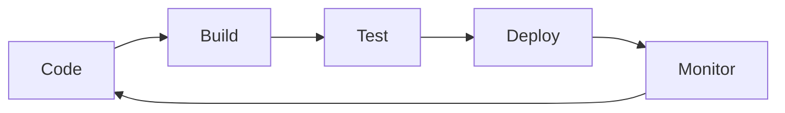

🔝 Retour au [Sommaire](/SOMMAIRE.md)

# 20-1 : CI/CD avec Go

## Introduction au CI/CD

### Qu'est-ce que le CI/CD ?

**CI (Continuous Integration)** = Intégration Continue
- Fusion automatique et fréquente du code
- Tests automatiques à chaque modification
- Détection rapide des erreurs

**CD (Continuous Deployment/Delivery)** = Déploiement/Livraison Continue
- Déploiement automatique des applications
- Livraison rapide et fiable
- Réduction des risques de déploiement

### Pourquoi utiliser CI/CD avec Go ?



**Avantages :**
- Détection précoce des bugs
- Déploiements plus fréquents et fiables
- Réduction du temps de mise sur le marché
- Amélioration de la qualité du code

## Pipeline CI/CD basique pour Go

### Structure type d'un pipeline

```yaml
# Exemple de pipeline basique
stages:
  - build      # Compilation du code
  - test       # Exécution des tests
  - quality    # Vérification qualité
  - package    # Création des artefacts
  - deploy     # Déploiement
```

### Exemple de projet Go simple

Créons d'abord un projet Go simple pour notre exemple :

```go
// main.go
package main

import (
    "fmt"
    "net/http"
    "log"
)

func main() {
    http.HandleFunc("/", helloHandler)
    http.HandleFunc("/health", healthHandler)

    log.Println("Serveur démarré sur :8080")
    log.Fatal(http.ListenAndServe(":8080", nil))
}

func helloHandler(w http.ResponseWriter, r *http.Request) {
    fmt.Fprintf(w, "Hello, World!")
}

func healthHandler(w http.ResponseWriter, r *http.Request) {
    w.WriteHeader(http.StatusOK)
    fmt.Fprintf(w, "OK")
}
```

```go
// main_test.go
package main

import (
    "net/http"
    "net/http/httptest"
    "testing"
)

func TestHelloHandler(t *testing.T) {
    req, err := http.NewRequest("GET", "/", nil)
    if err != nil {
        t.Fatal(err)
    }

    rr := httptest.NewRecorder()
    handler := http.HandlerFunc(helloHandler)
    handler.ServeHTTP(rr, req)

    if status := rr.Code; status != http.StatusOK {
        t.Errorf("Mauvais status code: got %v want %v", status, http.StatusOK)
    }

    expected := "Hello, World!"
    if rr.Body.String() != expected {
        t.Errorf("Mauvaise réponse: got %v want %v", rr.Body.String(), expected)
    }
}

func TestHealthHandler(t *testing.T) {
    req, err := http.NewRequest("GET", "/health", nil)
    if err != nil {
        t.Fatal(err)
    }

    rr := httptest.NewRecorder()
    handler := http.HandlerFunc(healthHandler)
    handler.ServeHTTP(rr, req)

    if status := rr.Code; status != http.StatusOK {
        t.Errorf("Health check failed: got %v want %v", status, http.StatusOK)
    }
}
```

## GitHub Actions pour Go

### Configuration basique

Créez le fichier `.github/workflows/ci.yml` :

```yaml
# .github/workflows/ci.yml
name: CI/CD Pipeline

on:
  push:
    branches: [ main, develop ]
  pull_request:
    branches: [ main ]

jobs:
  test:
    runs-on: ubuntu-latest

    steps:
    - name: Checkout code
      uses: actions/checkout@v3

    - name: Setup Go
      uses: actions/setup-go@v4
      with:
        go-version: 1.21

    - name: Cache Go modules
      uses: actions/cache@v3
      with:
        path: ~/go/pkg/mod
        key: ${{ runner.os }}-go-${{ hashFiles('**/go.sum') }}
        restore-keys: |
          ${{ runner.os }}-go-

    - name: Install dependencies
      run: go mod download

    - name: Run tests
      run: go test -v ./...

    - name: Run tests with coverage
      run: go test -v -race -coverprofile=coverage.out ./...

    - name: Upload coverage to Codecov
      uses: codecov/codecov-action@v3
      with:
        file: ./coverage.out

  build:
    needs: test
    runs-on: ubuntu-latest

    steps:
    - name: Checkout code
      uses: actions/checkout@v3

    - name: Setup Go
      uses: actions/setup-go@v4
      with:
        go-version: 1.21

    - name: Build application
      run: |
        go build -v -o myapp .
        chmod +x myapp

    - name: Upload build artifact
      uses: actions/upload-artifact@v3
      with:
        name: myapp
        path: myapp

  quality:
    needs: test
    runs-on: ubuntu-latest

    steps:
    - name: Checkout code
      uses: actions/checkout@v3

    - name: Setup Go
      uses: actions/setup-go@v4
      with:
        go-version: 1.21

    - name: Install golangci-lint
      run: |
        curl -sSfL https://raw.githubusercontent.com/golangci/golangci-lint/master/install.sh | sh -s -- -b $(go env GOPATH)/bin v1.54.2

    - name: Run linter
      run: $(go env GOPATH)/bin/golangci-lint run

    - name: Check formatting
      run: |
        if [ "$(gofmt -s -l . | wc -l)" -gt 0 ]; then
          echo "Code is not formatted"
          exit 1
        fi

    - name: Check for vulnerabilities
      run: |
        go install golang.org/x/vuln/cmd/govulncheck@latest
        govulncheck ./...
```

### Pipeline avec Docker

Ajoutons la containerisation :

```dockerfile
# Dockerfile
FROM golang:1.21-alpine AS builder

WORKDIR /app
COPY go.mod go.sum ./
RUN go mod download

COPY . .
RUN CGO_ENABLED=0 GOOS=linux go build -a -installsuffix cgo -o main .

FROM alpine:latest
RUN apk --no-cache add ca-certificates
WORKDIR /root/
COPY --from=builder /app/main .
EXPOSE 8080
CMD ["./main"]
```

Mise à jour du workflow pour inclure Docker :

```yaml
# Ajout dans .github/workflows/ci.yml
  docker:
    needs: [test, build, quality]
    runs-on: ubuntu-latest

    steps:
    - name: Checkout code
      uses: actions/checkout@v3

    - name: Set up Docker Buildx
      uses: docker/setup-buildx-action@v2

    - name: Login to DockerHub
      uses: docker/login-action@v2
      with:
        username: ${{ secrets.DOCKER_USERNAME }}
        password: ${{ secrets.DOCKER_PASSWORD }}

    - name: Build and push Docker image
      uses: docker/build-push-action@v4
      with:
        context: .
        push: true
        tags: |
          myusername/myapp:latest
          myusername/myapp:${{ github.sha }}
        cache-from: type=gha
        cache-to: type=gha,mode=max
```

## GitLab CI/CD pour Go

### Configuration GitLab CI

Créez le fichier `.gitlab-ci.yml` :

```yaml
# .gitlab-ci.yml
stages:
  - test
  - build
  - quality
  - package
  - deploy

variables:
  GO_VERSION: "1.21"
  DOCKER_IMAGE: $CI_REGISTRY_IMAGE:$CI_COMMIT_SHA

# Template pour les jobs Go
.go_template: &go_template
  image: golang:$GO_VERSION
  before_script:
    - mkdir -p $GOPATH/src/$(dirname $REPO_NAME)
    - ln -svf $CI_PROJECT_DIR $GOPATH/src/$REPO_NAME
    - cd $GOPATH/src/$REPO_NAME
    - go mod download

# Tests
test:
  <<: *go_template
  stage: test
  script:
    - go test -v -race -coverprofile=coverage.out ./...
    - go tool cover -html=coverage.out -o coverage.html
  coverage: '/coverage: \d+\.\d+% of statements/'
  artifacts:
    reports:
      coverage_report:
        coverage_format: cobertura
        path: coverage.xml
    paths:
      - coverage.html
    expire_in: 1 week

# Build
build:
  <<: *go_template
  stage: build
  script:
    - go build -v -o myapp .
  artifacts:
    paths:
      - myapp
    expire_in: 1 week

# Qualité du code
quality:
  <<: *go_template
  stage: quality
  script:
    - go install github.com/golangci/golangci-lint/cmd/golangci-lint@latest
    - golangci-lint run
    - gofmt -s -l . | tee /tmp/fmt-output
    - test ! -s /tmp/fmt-output
  allow_failure: true

# Construction Docker
package:
  stage: package
  image: docker:latest
  services:
    - docker:dind
  before_script:
    - docker login -u $CI_REGISTRY_USER -p $CI_REGISTRY_PASSWORD $CI_REGISTRY
  script:
    - docker build -t $DOCKER_IMAGE .
    - docker push $DOCKER_IMAGE
  only:
    - main
    - develop

# Déploiement
deploy_staging:
  stage: deploy
  script:
    - echo "Déploiement en staging..."
    - kubectl set image deployment/myapp myapp=$DOCKER_IMAGE
  environment:
    name: staging
    url: https://staging.myapp.com
  only:
    - develop

deploy_production:
  stage: deploy
  script:
    - echo "Déploiement en production..."
    - kubectl set image deployment/myapp myapp=$DOCKER_IMAGE
  environment:
    name: production
    url: https://myapp.com
  when: manual
  only:
    - main
```

## Makefile pour l'automatisation

Créez un `Makefile` pour simplifier les tâches locales :

```makefile
# Makefile
.PHONY: help build test clean run docker-build docker-run lint fmt

# Variables
BINARY_NAME=myapp
DOCKER_IMAGE=myapp:latest
GO_VERSION=1.21

help: ## Affiche cette aide
	@grep -E '^[a-zA-Z_-]+:.*?## .*$$' $(MAKEFILE_LIST) | sort | awk 'BEGIN {FS = ":.*?## "}; {printf "\033[36m%-30s\033[0m %s\n", $$1, $$2}'

build: ## Compile l'application
	@echo "Building $(BINARY_NAME)..."
	@go build -v -o $(BINARY_NAME) .

test: ## Exécute les tests
	@echo "Running tests..."
	@go test -v -race -coverprofile=coverage.out ./...
	@go tool cover -html=coverage.out -o coverage.html

test-coverage: ## Exécute les tests avec couverture
	@echo "Running tests with coverage..."
	@go test -v -race -coverprofile=coverage.out ./...
	@go tool cover -func=coverage.out

clean: ## Nettoie les fichiers générés
	@echo "Cleaning..."
	@rm -f $(BINARY_NAME)
	@rm -f coverage.out coverage.html
	@docker rmi $(DOCKER_IMAGE) 2>/dev/null || true

run: build ## Compile et exécute l'application
	@echo "Running $(BINARY_NAME)..."
	@./$(BINARY_NAME)

docker-build: ## Construit l'image Docker
	@echo "Building Docker image..."
	@docker build -t $(DOCKER_IMAGE) .

docker-run: docker-build ## Construit et exécute l'image Docker
	@echo "Running Docker container..."
	@docker run -p 8080:8080 --rm $(DOCKER_IMAGE)

lint: ## Exécute le linter
	@echo "Running linter..."
	@golangci-lint run

fmt: ## Formate le code
	@echo "Formatting code..."
	@gofmt -s -w .
	@go mod tidy

deps: ## Installe les dépendances
	@echo "Installing dependencies..."
	@go mod download
	@go mod verify

security: ## Vérifie les vulnérabilités
	@echo "Checking for vulnerabilities..."
	@go install golang.org/x/vuln/cmd/govulncheck@latest
	@govulncheck ./...

all: clean deps fmt lint test build ## Exécute toutes les tâches

ci: deps fmt lint test build ## Tâches CI (sans clean)
```

## Configuration avancée

### Variables d'environnement pour les secrets

```yaml
# Dans GitHub Actions
env:
  DATABASE_URL: ${{ secrets.DATABASE_URL }}
  API_KEY: ${{ secrets.API_KEY }}
  JWT_SECRET: ${{ secrets.JWT_SECRET }}
```

### Configuration multi-environnements

```yaml
# Déploiement conditionnel
deploy:
  if: github.ref == 'refs/heads/main'
  environment: production
  steps:
    - name: Deploy to production
      run: |
        echo "Deploying to production..."
        # Commandes de déploiement
```

### Notifications

```yaml
# Notification Slack en cas d'échec
- name: Slack notification
  if: failure()
  uses: 8398a7/action-slack@v3
  with:
    status: failure
    channel: '#deployments'
    webhook_url: ${{ secrets.SLACK_WEBHOOK }}
```

## Bonnes pratiques CI/CD

### 1. Tests automatisés

```bash
# Tests unitaires
go test ./... -v -race

# Tests d'intégration
go test ./... -tags=integration

# Tests avec couverture
go test ./... -coverprofile=coverage.out
go tool cover -func=coverage.out
```

### 2. Gestion des versions

```bash
# Utilisation de tags Git
git tag -a v1.0.0 -m "Version 1.0.0"
git push origin v1.0.0
```

### 3. Rollback automatique

```yaml
# Exemple de rollback
rollback:
  if: failure()
  steps:
    - name: Rollback deployment
      run: |
        kubectl rollout undo deployment/myapp
```

### 4. Monitoring du pipeline

```yaml
# Métriques du pipeline
- name: Pipeline metrics
  run: |
    echo "Build time: $(date)"
    echo "Test coverage: $(go tool cover -func=coverage.out | grep total | awk '{print $3}')"
```

## Exercices pratiques

### Exercice 1 : Pipeline basique
Créez un pipeline GitHub Actions pour votre projet Go qui :
- Exécute les tests
- Vérifie le formatage du code
- Construit l'application

### Exercice 2 : Déploiement automatique
Ajoutez une étape de déploiement qui :
- Construit une image Docker
- La pousse vers un registry
- Déclenche un déploiement en staging

### Exercice 3 : Pipeline multi-environnements
Configurez un pipeline qui déploie :
- Automatiquement en staging sur la branche `develop`
- Manuellement en production sur la branche `main`

## Points clés à retenir

1. **Automatisation** : Automatisez tout ce qui peut l'être
2. **Tests** : Les tests sont la base d'un bon CI/CD
3. **Feedback rapide** : Les développeurs doivent connaître rapidement le résultat
4. **Sécurité** : Utilisez des secrets pour les informations sensibles
5. **Monitoring** : Surveillez vos pipelines et déploiements

Le CI/CD est un processus itératif. Commencez simple et ajoutez progressivement des fonctionnalités selon vos besoins !

## Ressources utiles

- [GitHub Actions Documentation](https://docs.github.com/en/actions)
- [GitLab CI/CD](https://docs.gitlab.com/ee/ci/)
- [Go Testing](https://golang.org/pkg/testing/)
- [golangci-lint](https://golangci-lint.run/)
- [Docker Multi-stage builds](https://docs.docker.com/develop/dev-best-practices/)

⏭️

# Solutions des Exercices CI/CD avec Go

## Exercice 1 : Pipeline basique

### Solution

Créez le fichier `.github/workflows/basic-pipeline.yml` :

```yaml
name: Pipeline Basique

on:
  push:
    branches: [ main, develop ]
  pull_request:
    branches: [ main ]

jobs:
  basic-pipeline:
    runs-on: ubuntu-latest

    steps:
    # 1. Récupération du code
    - name: Checkout code
      uses: actions/checkout@v3

    # 2. Configuration de Go
    - name: Setup Go
      uses: actions/setup-go@v4
      with:
        go-version: 1.21

    # 3. Cache des modules Go pour accélérer les builds
    - name: Cache Go modules
      uses: actions/cache@v3
      with:
        path: ~/go/pkg/mod
        key: ${{ runner.os }}-go-${{ hashFiles('**/go.sum') }}
        restore-keys: |
          ${{ runner.os }}-go-

    # 4. Installation des dépendances
    - name: Download dependencies
      run: go mod download

    # 5. Exécution des tests
    - name: Run tests
      run: |
        echo "🧪 Exécution des tests..."
        go test -v ./...
        echo "✅ Tests terminés avec succès"

    # 6. Vérification du formatage du code
    - name: Check code formatting
      run: |
        echo "🔍 Vérification du formatage..."
        unformatted=$(gofmt -s -l .)
        if [ -n "$unformatted" ]; then
          echo "❌ Code mal formaté:"
          echo "$unformatted"
          echo "Utilisez 'go fmt ./...' pour corriger"
          exit 1
        fi
        echo "✅ Code correctement formaté"

    # 7. Construction de l'application
    - name: Build application
      run: |
        echo "🔨 Construction de l'application..."
        go build -v -o myapp .
        echo "✅ Application construite avec succès"
        ls -la myapp

    # 8. Vérification que l'exécutable fonctionne
    - name: Test executable
      run: |
        echo "🚀 Test de l'exécutable..."
        timeout 5s ./myapp || true
        echo "✅ Exécutable testé"
```

### Explication des étapes

1. **Checkout** : Récupère le code source
2. **Setup Go** : Configure l'environnement Go
3. **Cache** : Optimise les temps de build
4. **Dependencies** : Télécharge les modules
5. **Tests** : Vérifie que le code fonctionne
6. **Formatting** : S'assure que le code respecte les standards
7. **Build** : Compile l'application
8. **Test executable** : Vérifie que l'application démarre

---

## Exercice 2 : Déploiement automatique

### Solution

Créez le fichier `.github/workflows/deploy-pipeline.yml` :

```yaml
name: Pipeline avec Déploiement

on:
  push:
    branches: [ main, develop ]
  pull_request:
    branches: [ main ]

env:
  REGISTRY: docker.io
  IMAGE_NAME: myusername/myapp

jobs:
  test-and-build:
    runs-on: ubuntu-latest

    steps:
    - name: Checkout code
      uses: actions/checkout@v3

    - name: Setup Go
      uses: actions/setup-go@v4
      with:
        go-version: 1.21

    - name: Cache Go modules
      uses: actions/cache@v3
      with:
        path: ~/go/pkg/mod
        key: ${{ runner.os }}-go-${{ hashFiles('**/go.sum') }}

    - name: Download dependencies
      run: go mod download

    - name: Run tests
      run: go test -v ./...

    - name: Check formatting
      run: |
        unformatted=$(gofmt -s -l .)
        if [ -n "$unformatted" ]; then
          echo "Code mal formaté: $unformatted"
          exit 1
        fi

    - name: Build application
      run: go build -v -o myapp .

  docker-deploy:
    needs: test-and-build
    runs-on: ubuntu-latest
    if: github.ref == 'refs/heads/main' || github.ref == 'refs/heads/develop'

    steps:
    - name: Checkout code
      uses: actions/checkout@v3

    # 1. Configuration Docker Buildx
    - name: Set up Docker Buildx
      uses: docker/setup-buildx-action@v2

    # 2. Connexion au registry Docker
    - name: Login to Docker Hub
      uses: docker/login-action@v2
      with:
        registry: ${{ env.REGISTRY }}
        username: ${{ secrets.DOCKER_USERNAME }}
        password: ${{ secrets.DOCKER_PASSWORD }}

    # 3. Extraction des métadonnées pour les tags
    - name: Extract metadata
      id: meta
      uses: docker/metadata-action@v4
      with:
        images: ${{ env.REGISTRY }}/${{ env.IMAGE_NAME }}
        tags: |
          type=ref,event=branch
          type=sha,prefix={{branch}}-
          type=raw,value=latest,enable={{is_default_branch}}

    # 4. Construction et push de l'image Docker
    - name: Build and push Docker image
      uses: docker/build-push-action@v4
      with:
        context: .
        platforms: linux/amd64,linux/arm64
        push: true
        tags: ${{ steps.meta.outputs.tags }}
        labels: ${{ steps.meta.outputs.labels }}
        cache-from: type=gha
        cache-to: type=gha,mode=max

    # 5. Déploiement en staging (simulation)
    - name: Deploy to staging
      if: github.ref == 'refs/heads/develop'
      run: |
        echo "🚀 Déploiement en staging..."
        echo "Image: ${{ env.REGISTRY }}/${{ env.IMAGE_NAME }}:develop-${{ github.sha }}"

        # Simulation d'un déploiement
        echo "Mise à jour du déploiement Kubernetes..."
        echo "kubectl set image deployment/myapp-staging myapp=${{ env.REGISTRY }}/${{ env.IMAGE_NAME }}:develop-${{ github.sha }}"

        echo "Attente de la disponibilité..."
        echo "kubectl rollout status deployment/myapp-staging"

        echo "✅ Déploiement en staging terminé"
        echo "🌐 Application disponible sur: https://staging.myapp.com"

    # 6. Notification de déploiement
    - name: Deployment notification
      if: success()
      run: |
        echo "📢 Notification de déploiement"
        echo "Branche: ${{ github.ref_name }}"
        echo "Commit: ${{ github.sha }}"
        echo "Image: ${{ env.REGISTRY }}/${{ env.IMAGE_NAME }}"
```

### Configuration des secrets

Dans les paramètres de votre repository GitHub :
1. Allez dans `Settings` > `Secrets and variables` > `Actions`
2. Ajoutez ces secrets :
   - `DOCKER_USERNAME` : Votre nom d'utilisateur Docker Hub
   - `DOCKER_PASSWORD` : Votre token Docker Hub

### Dockerfile requis

```dockerfile
# Dockerfile
FROM golang:1.21-alpine AS builder

WORKDIR /app
COPY go.mod go.sum ./
RUN go mod download

COPY . .
RUN CGO_ENABLED=0 GOOS=linux go build -a -installsuffix cgo -o main .

FROM alpine:latest
RUN apk --no-cache add ca-certificates
WORKDIR /root/
COPY --from=builder /app/main .
EXPOSE 8080
CMD ["./main"]
```

---

## Exercice 3 : Pipeline multi-environnements

### Solution complète

Créez le fichier `.github/workflows/multi-env-pipeline.yml` :

```yaml
name: Pipeline Multi-Environnements

on:
  push:
    branches: [ main, develop ]
  pull_request:
    branches: [ main ]

env:
  REGISTRY: docker.io
  IMAGE_NAME: myusername/myapp

jobs:
  # Job 1: Tests et qualité
  test:
    runs-on: ubuntu-latest

    steps:
    - name: Checkout code
      uses: actions/checkout@v3

    - name: Setup Go
      uses: actions/setup-go@v4
      with:
        go-version: 1.21

    - name: Cache Go modules
      uses: actions/cache@v3
      with:
        path: ~/go/pkg/mod
        key: ${{ runner.os }}-go-${{ hashFiles('**/go.sum') }}

    - name: Download dependencies
      run: go mod download

    - name: Run tests with coverage
      run: |
        go test -v -race -coverprofile=coverage.out ./...
        go tool cover -func=coverage.out

    - name: Check code formatting
      run: |
        unformatted=$(gofmt -s -l .)
        if [ -n "$unformatted" ]; then
          echo "Code mal formaté: $unformatted"
          exit 1
        fi

    - name: Run linter (if available)
      run: |
        if command -v golangci-lint &> /dev/null; then
          golangci-lint run
        else
          echo "golangci-lint non installé, ignoré"
        fi
      continue-on-error: true

  # Job 2: Construction de l'image Docker
  build:
    needs: test
    runs-on: ubuntu-latest
    if: github.event_name == 'push'

    outputs:
      image-tag: ${{ steps.meta.outputs.tags }}
      image-digest: ${{ steps.build.outputs.digest }}

    steps:
    - name: Checkout code
      uses: actions/checkout@v3

    - name: Set up Docker Buildx
      uses: docker/setup-buildx-action@v2

    - name: Login to Docker Hub
      uses: docker/login-action@v2
      with:
        registry: ${{ env.REGISTRY }}
        username: ${{ secrets.DOCKER_USERNAME }}
        password: ${{ secrets.DOCKER_PASSWORD }}

    - name: Extract metadata
      id: meta
      uses: docker/metadata-action@v4
      with:
        images: ${{ env.REGISTRY }}/${{ env.IMAGE_NAME }}
        tags: |
          type=ref,event=branch
          type=sha,prefix={{branch}}-
          type=raw,value=latest,enable={{is_default_branch}}

    - name: Build and push
      id: build
      uses: docker/build-push-action@v4
      with:
        context: .
        platforms: linux/amd64,linux/arm64
        push: true
        tags: ${{ steps.meta.outputs.tags }}
        labels: ${{ steps.meta.outputs.labels }}
        cache-from: type=gha
        cache-to: type=gha,mode=max

  # Job 3: Déploiement automatique en staging
  deploy-staging:
    needs: [test, build]
    runs-on: ubuntu-latest
    if: github.ref == 'refs/heads/develop'
    environment:
      name: staging
      url: https://staging.myapp.com

    steps:
    - name: Deploy to staging
      run: |
        echo "🚀 Déploiement automatique en staging..."
        echo "Branche: ${{ github.ref_name }}"
        echo "Commit: ${{ github.sha }}"
        echo "Image: ${{ needs.build.outputs.image-tag }}"

        # Simulation de commandes kubectl
        echo "📝 Configuration du contexte Kubernetes..."
        # kubectl config use-context staging

        echo "🔄 Mise à jour du déploiement..."
        # kubectl set image deployment/myapp-staging myapp=${{ needs.build.outputs.image-tag }}

        echo "⏳ Attente du rollout..."
        # kubectl rollout status deployment/myapp-staging --timeout=300s

        echo "🧪 Tests de smoke en staging..."
        # curl -f https://staging.myapp.com/health || exit 1

        echo "✅ Déploiement en staging réussi !"

    - name: Staging notification
      run: |
        echo "📧 Notification équipe: Déploiement staging réussi"
        echo "🌐 URL: https://staging.myapp.com"
        echo "📊 Commit: ${{ github.sha }}"

  # Job 4: Déploiement manuel en production
  deploy-production:
    needs: [test, build]
    runs-on: ubuntu-latest
    if: github.ref == 'refs/heads/main'
    environment:
      name: production
      url: https://myapp.com

    steps:
    - name: Deploy to production
      run: |
        echo "🚀 Déploiement manuel en production..."
        echo "Branche: ${{ github.ref_name }}"
        echo "Commit: ${{ github.sha }}"
        echo "Image: ${{ needs.build.outputs.image-tag }}"

        echo "🔐 Configuration du contexte production..."
        # kubectl config use-context production

        echo "📋 Vérifications pré-déploiement..."
        # kubectl get pods -l app=myapp

        echo "🔄 Blue-Green deployment..."
        # kubectl set image deployment/myapp-prod myapp=${{ needs.build.outputs.image-tag }}

        echo "⏳ Attente du rollout..."
        # kubectl rollout status deployment/myapp-prod --timeout=600s

        echo "🔍 Tests de vérification..."
        # curl -f https://myapp.com/health || exit 1
        # curl -f https://myapp.com/api/status || exit 1

        echo "📊 Vérification des métriques..."
        # kubectl top pods -l app=myapp

        echo "✅ Déploiement en production réussi !"

    - name: Production notification
      run: |
        echo "🎉 DÉPLOIEMENT PRODUCTION RÉUSSI !"
        echo "🌐 URL: https://myapp.com"
        echo "📊 Commit: ${{ github.sha }}"
        echo "🏷️ Tag: ${{ needs.build.outputs.image-tag }}"

  # Job 5: Rollback automatique (en cas d'échec)
  rollback:
    needs: [deploy-production]
    runs-on: ubuntu-latest
    if: failure() && github.ref == 'refs/heads/main'
    environment: production

    steps:
    - name: Automatic rollback
      run: |
        echo "🚨 ÉCHEC DÉTECTÉ - ROLLBACK AUTOMATIQUE"
        echo "🔙 Rollback vers la version précédente..."
        # kubectl rollout undo deployment/myapp-prod
        # kubectl rollout status deployment/myapp-prod
        echo "✅ Rollback terminé"

    - name: Rollback notification
      run: |
        echo "⚠️ ROLLBACK AUTOMATIQUE EFFECTUÉ"
        echo "🔧 Action requise: Vérifier les logs"
        echo "📧 Équipe notifiée automatiquement"
```

### Configuration des environnements GitHub

1. **Accédez aux paramètres du repository** :
   - `Settings` > `Environments`

2. **Créez l'environnement "staging"** :
   - Nom: `staging`
   - Protection rules: Aucune (déploiement automatique)
   - Environment URL: `https://staging.myapp.com`

3. **Créez l'environnement "production"** :
   - Nom: `production`
   - Protection rules:
     - ✅ Required reviewers (ajoutez-vous)
     - ✅ Wait timer: 5 minutes (optionnel)
   - Environment URL: `https://myapp.com`

### Fichier de configuration Kubernetes (optionnel)

```yaml
# k8s/deployment.yaml
apiVersion: apps/v1
kind: Deployment
metadata:
  name: myapp-staging
  namespace: staging
spec:
  replicas: 2
  selector:
    matchLabels:
      app: myapp
  template:
    metadata:
      labels:
        app: myapp
    spec:
      containers:
      - name: myapp
        image: myusername/myapp:latest
        ports:
        - containerPort: 8080
        livenessProbe:
          httpGet:
            path: /health
            port: 8080
          initialDelaySeconds: 30
          periodSeconds: 10
        readinessProbe:
          httpGet:
            path: /health
            port: 8080
          initialDelaySeconds: 5
          periodSeconds: 5
---
apiVersion: apps/v1
kind: Deployment
metadata:
  name: myapp-prod
  namespace: production
spec:
  replicas: 3
  selector:
    matchLabels:
      app: myapp
  template:
    metadata:
      labels:
        app: myapp
    spec:
      containers:
      - name: myapp
        image: myusername/myapp:latest
        ports:
        - containerPort: 8080
        resources:
          requests:
            memory: "64Mi"
            cpu: "250m"
          limits:
            memory: "128Mi"
            cpu: "500m"
        livenessProbe:
          httpGet:
            path: /health
            port: 8080
          initialDelaySeconds: 30
          periodSeconds: 10
        readinessProbe:
          httpGet:
            path: /health
            port: 8080
          initialDelaySeconds: 5
          periodSeconds: 5
```

## Résumé des fonctionnalités

### Exercice 1 ✅
- Tests automatiques
- Vérification du formatage
- Construction de l'application

### Exercice 2 ✅
- Construction d'image Docker
- Push vers registry
- Déploiement en staging

### Exercice 3 ✅
- Déploiement automatique en staging (branche `develop`)
- Déploiement manuel en production (branche `main`)
- Gestion des environnements GitHub
- Rollback automatique en cas d'échec
- Notifications à chaque étape

## Test des solutions

1. **Créez les branches** :
   ```bash
   git checkout -b develop
   git push -u origin develop
   ```

2. **Ajoutez les workflows** :
   ```bash
   mkdir -p .github/workflows
   # Copiez les fichiers YAML
   git add .github/
   git commit -m "Add CI/CD pipelines"
   git push
   ```

3. **Testez les déploiements** :
   - Push sur `develop` → déploiement automatique staging
   - Push sur `main` → déploiement manuel production

Ces solutions couvrent tous les aspects demandés et peuvent être adaptées selon vos besoins spécifiques !

⏭️
