🔝 Retour au [Sommaire](/SOMMAIRE.md)

# 20-2 : Monitoring et observabilité

## Introduction au monitoring et à l'observabilité

### Qu'est-ce que l'observabilité ?

**L'observabilité** est la capacité à comprendre l'état interne d'un système en observant ses sorties externes. Pour une application Go, cela signifie pouvoir répondre à des questions comme :

- Mon application fonctionne-t-elle correctement ?
- Pourquoi ma requête est-elle lente ?
- Où se trouve le problème quand quelque chose ne va pas ?
- Comment mon application se comporte-t-elle sous charge ?

### Les trois piliers de l'observabilité

```mermaid
graph TD
    A[Observabilité] --> B[Métriques]
    A --> C[Logs]
    A --> D[Traces]

    B --> E[Compteurs, Jauges, Histogrammes]
    C --> F[Événements structurés]
    D --> G[Suivi des requêtes]
```



**1. Métriques** : Données numériques agrégées (CPU, mémoire, requêtes/seconde)
**2. Logs** : Événements textuels avec contexte
**3. Traces** : Suivi des requêtes à travers les services

### Pourquoi c'est important pour Go ?

Go étant souvent utilisé pour des services critiques, une bonne observabilité permet de :
- Détecter les problèmes avant qu'ils affectent les utilisateurs
- Diagnostiquer rapidement les pannes
- Optimiser les performances
- Assurer la fiabilité du service

## 1. Logging (Journalisation)

### Logging basique en Go

```go
// main.go - Exemple simple avec log standard
package main

import (
    "log"
    "net/http"
    "time"
)

func main() {
    // Configuration du logger
    log.SetFlags(log.LstdFlags | log.Lshortfile)

    http.HandleFunc("/", homeHandler)
    http.HandleFunc("/api/users", usersHandler)

    log.Println("Serveur démarré sur :8080")
    log.Fatal(http.ListenAndServe(":8080", nil))
}

func homeHandler(w http.ResponseWriter, r *http.Request) {
    start := time.Now()

    log.Printf("Requête reçue: %s %s", r.Method, r.URL.Path)

    w.WriteHeader(http.StatusOK)
    w.Write([]byte("Hello, World!"))

    duration := time.Since(start)
    log.Printf("Requête traitée en %v", duration)
}

func usersHandler(w http.ResponseWriter, r *http.Request) {
    start := time.Now()

    log.Printf("Requête API: %s %s depuis %s", r.Method, r.URL.Path, r.RemoteAddr)

    // Simulation d'une erreur parfois
    if time.Now().Unix()%10 == 0 {
        log.Printf("ERREUR: Problème de base de données")
        http.Error(w, "Erreur serveur", http.StatusInternalServerError)
        return
    }

    w.Header().Set("Content-Type", "application/json")
    w.Write([]byte(`{"users": ["alice", "bob"]}`))

    duration := time.Since(start)
    log.Printf("API répondue en %v", duration)
}
```

### Logging structuré avec logrus

```go
// logger.go - Logging avancé
package main

import (
    "net/http"
    "time"

    "github.com/sirupsen/logrus"
)

// Configuration du logger global
var logger = logrus.New()

func init() {
    // Format JSON pour faciliter le parsing
    logger.SetFormatter(&logrus.JSONFormatter{})

    // Niveau de log
    logger.SetLevel(logrus.InfoLevel)

    // Ajout de champs par défaut
    logger = logger.WithFields(logrus.Fields{
        "service": "myapp",
        "version": "1.0.0",
    }).Logger
}

func main() {
    http.HandleFunc("/", loggingMiddleware(homeHandler))
    http.HandleFunc("/api/users", loggingMiddleware(usersHandler))

    logger.Info("Serveur démarré sur le port 8080")
    logger.Fatal(http.ListenAndServe(":8080", nil))
}

// Middleware de logging
func loggingMiddleware(next http.HandlerFunc) http.HandlerFunc {
    return func(w http.ResponseWriter, r *http.Request) {
        start := time.Now()

        // Wrapper pour capturer le status code
        ww := &responseWriter{ResponseWriter: w, statusCode: http.StatusOK}

        // Log de la requête entrante
        requestLogger := logger.WithFields(logrus.Fields{
            "method":     r.Method,
            "path":       r.URL.Path,
            "user_agent": r.UserAgent(),
            "remote_ip":  r.RemoteAddr,
            "request_id": generateRequestID(),
        })

        requestLogger.Info("Requête reçue")

        // Traitement de la requête
        next(ww, r)

        // Log de la réponse
        duration := time.Since(start)
        responseLogger := requestLogger.WithFields(logrus.Fields{
            "status_code": ww.statusCode,
            "duration_ms": duration.Milliseconds(),
        })

        if ww.statusCode >= 400 {
            responseLogger.Warn("Requête terminée avec erreur")
        } else {
            responseLogger.Info("Requête terminée avec succès")
        }
    }
}

// Wrapper pour capturer le status code
type responseWriter struct {
    http.ResponseWriter
    statusCode int
}

func (rw *responseWriter) WriteHeader(code int) {
    rw.statusCode = code
    rw.ResponseWriter.WriteHeader(code)
}

func generateRequestID() string {
    // Génération simple d'un ID de requête
    return time.Now().Format("20060102150405") + "-" + string(rune(time.Now().Nanosecond()%1000))
}

func homeHandler(w http.ResponseWriter, r *http.Request) {
    logger.Debug("Traitement de la page d'accueil")
    w.Write([]byte("Hello, World!"))
}

func usersHandler(w http.ResponseWriter, r *http.Request) {
    logger.Debug("Traitement de l'API users")

    // Simulation d'une erreur occasionnelle
    if time.Now().Unix()%10 == 0 {
        logger.WithFields(logrus.Fields{
            "error": "database_connection_failed",
            "table": "users",
        }).Error("Échec de connexion à la base de données")

        http.Error(w, "Erreur serveur", http.StatusInternalServerError)
        return
    }

    logger.WithFields(logrus.Fields{
        "user_count": 2,
    }).Info("Utilisateurs récupérés avec succès")

    w.Header().Set("Content-Type", "application/json")
    w.Write([]byte(`{"users": ["alice", "bob"]}`))
}
```

### Configuration avec go.mod

```go
// go.mod
module myapp

go 1.21

require (
    github.com/sirupsen/logrus v1.9.3
    github.com/prometheus/client_golang v1.17.0
)
```

## 2. Métriques avec Prometheus

### Configuration des métriques basiques

```go
// metrics.go
package main

import (
    "net/http"
    "strconv"
    "time"

    "github.com/prometheus/client_golang/prometheus"
    "github.com/prometheus/client_golang/prometheus/promhttp"
    "github.com/sirupsen/logrus"
)

var (
    // Compteur de requêtes HTTP
    httpRequestsTotal = prometheus.NewCounterVec(
        prometheus.CounterOpts{
            Name: "http_requests_total",
            Help: "Nombre total de requêtes HTTP",
        },
        []string{"method", "path", "status"},
    )

    // Histogramme de durée des requêtes
    httpRequestDuration = prometheus.NewHistogramVec(
        prometheus.HistogramOpts{
            Name:    "http_request_duration_seconds",
            Help:    "Durée des requêtes HTTP en secondes",
            Buckets: prometheus.DefBuckets,
        },
        []string{"method", "path"},
    )

    // Jauge pour les requêtes actives
    httpRequestsInFlight = prometheus.NewGauge(prometheus.GaugeOpts{
        Name: "http_requests_in_flight",
        Help: "Nombre de requêtes HTTP en cours de traitement",
    })

    // Métrique custom pour les utilisateurs
    activeUsers = prometheus.NewGauge(prometheus.GaugeOpts{
        Name: "active_users_total",
        Help: "Nombre d'utilisateurs actifs",
    })
)

func init() {
    // Enregistrement des métriques
    prometheus.MustRegister(httpRequestsTotal)
    prometheus.MustRegister(httpRequestDuration)
    prometheus.MustRegister(httpRequestsInFlight)
    prometheus.MustRegister(activeUsers)

    // Simulation d'utilisateurs actifs
    activeUsers.Set(42)
}

func main() {
    // Route pour les métriques Prometheus
    http.Handle("/metrics", promhttp.Handler())

    // Routes applicatives avec métriques
    http.HandleFunc("/", metricsMiddleware(homeHandler))
    http.HandleFunc("/api/users", metricsMiddleware(usersHandler))
    http.HandleFunc("/health", healthHandler)

    logger.Info("Serveur avec métriques démarré sur :8080")
    logger.Info("Métriques disponibles sur http://localhost:8080/metrics")

    logger.Fatal(http.ListenAndServe(":8080", nil))
}

// Middleware pour collecter les métriques
func metricsMiddleware(next http.HandlerFunc) http.HandlerFunc {
    return func(w http.ResponseWriter, r *http.Request) {
        start := time.Now()

        // Incrément des requêtes en cours
        httpRequestsInFlight.Inc()
        defer httpRequestsInFlight.Dec()

        // Wrapper pour capturer le status
        ww := &responseWriter{ResponseWriter: w, statusCode: http.StatusOK}

        // Traitement de la requête
        next(ww, r)

        // Collecte des métriques
        duration := time.Since(start)
        status := strconv.Itoa(ww.statusCode)

        httpRequestsTotal.WithLabelValues(r.Method, r.URL.Path, status).Inc()
        httpRequestDuration.WithLabelValues(r.Method, r.URL.Path).Observe(duration.Seconds())

        logger.WithFields(logrus.Fields{
            "method":      r.Method,
            "path":        r.URL.Path,
            "status":      status,
            "duration_ms": duration.Milliseconds(),
        }).Info("Métriques collectées")
    }
}

func healthHandler(w http.ResponseWriter, r *http.Request) {
    w.WriteHeader(http.StatusOK)
    w.Write([]byte("OK"))
}
```

### Métriques métier personnalisées

```go
// business_metrics.go
package main

import (
    "math/rand"
    "time"

    "github.com/prometheus/client_golang/prometheus"
)

var (
    // Métriques métier
    ordersTotal = prometheus.NewCounterVec(
        prometheus.CounterOpts{
            Name: "orders_total",
            Help: "Nombre total de commandes",
        },
        []string{"status", "product_type"},
    )

    orderValue = prometheus.NewHistogramVec(
        prometheus.HistogramOpts{
            Name:    "order_value_euros",
            Help:    "Valeur des commandes en euros",
            Buckets: []float64{10, 25, 50, 100, 250, 500, 1000},
        },
        []string{"product_type"},
    )

    inventoryLevel = prometheus.NewGaugeVec(
        prometheus.GaugeOpts{
            Name: "inventory_level",
            Help: "Niveau de stock par produit",
        },
        []string{"product_id", "warehouse"},
    )
)

func init() {
    prometheus.MustRegister(ordersTotal)
    prometheus.MustRegister(orderValue)
    prometheus.MustRegister(inventoryLevel)

    // Simulation de données métier
    go simulateBusinessMetrics()
}

func simulateBusinessMetrics() {
    ticker := time.NewTicker(30 * time.Second)
    defer ticker.Stop()

    for {
        select {
        case <-ticker.C:
            // Simulation de nouvelles commandes
            simulateOrder()

            // Mise à jour du stock
            updateInventory()
        }
    }
}

func simulateOrder() {
    statuses := []string{"completed", "pending", "cancelled"}
    productTypes := []string{"electronics", "books", "clothing"}

    status := statuses[rand.Intn(len(statuses))]
    productType := productTypes[rand.Intn(len(productTypes))]
    value := 20 + rand.Float64()*480 // Entre 20€ et 500€

    ordersTotal.WithLabelValues(status, productType).Inc()
    if status == "completed" {
        orderValue.WithLabelValues(productType).Observe(value)
    }

    logger.WithFields(logrus.Fields{
        "order_status": status,
        "product_type": productType,
        "value":        value,
    }).Info("Nouvelle commande simulée")
}

func updateInventory() {
    products := []string{"prod_001", "prod_002", "prod_003"}
    warehouses := []string{"paris", "lyon", "marseille"}

    for _, product := range products {
        for _, warehouse := range warehouses {
            level := float64(rand.Intn(1000))
            inventoryLevel.WithLabelValues(product, warehouse).Set(level)
        }
    }
}
```

## 3. Health Checks

### Health checks basiques

```go
// health.go
package main

import (
    "encoding/json"
    "net/http"
    "time"

    "github.com/sirupsen/logrus"
)

type HealthStatus struct {
    Status    string            `json:"status"`
    Timestamp time.Time         `json:"timestamp"`
    Version   string            `json:"version"`
    Checks    map[string]Check  `json:"checks"`
}

type Check struct {
    Status  string        `json:"status"`
    Message string        `json:"message,omitempty"`
    Duration time.Duration `json:"duration"`
}

func healthHandler(w http.ResponseWriter, r *http.Request) {
    start := time.Now()

    health := HealthStatus{
        Status:    "ok",
        Timestamp: time.Now(),
        Version:   "1.0.0",
        Checks:    make(map[string]Check),
    }

    // Vérification de la base de données
    health.Checks["database"] = checkDatabase()

    // Vérification des services externes
    health.Checks["external_api"] = checkExternalAPI()

    // Vérification de la mémoire
    health.Checks["memory"] = checkMemory()

    // Détermination du statut global
    for _, check := range health.Checks {
        if check.Status != "ok" {
            health.Status = "degraded"
            break
        }
    }

    duration := time.Since(start)

    // Log du health check
    logger.WithFields(logrus.Fields{
        "health_status": health.Status,
        "duration_ms":   duration.Milliseconds(),
    }).Info("Health check effectué")

    // Réponse HTTP
    w.Header().Set("Content-Type", "application/json")
    if health.Status != "ok" {
        w.WriteHeader(http.StatusServiceUnavailable)
    }

    json.NewEncoder(w).Encode(health)
}

func checkDatabase() Check {
    start := time.Now()

    // Simulation d'un check de base de données
    time.Sleep(10 * time.Millisecond)

    // Simulation d'une panne parfois
    if time.Now().Unix()%20 == 0 {
        return Check{
            Status:   "error",
            Message:  "Connection timeout",
            Duration: time.Since(start),
        }
    }

    return Check{
        Status:   "ok",
        Duration: time.Since(start),
    }
}

func checkExternalAPI() Check {
    start := time.Now()

    // Simulation d'un appel API externe
    time.Sleep(5 * time.Millisecond)

    return Check{
        Status:   "ok",
        Duration: time.Since(start),
    }
}

func checkMemory() Check {
    start := time.Now()

    // Vérification basique de la mémoire
    // Dans un vrai cas, vous utiliseriez runtime.MemStats

    return Check{
        Status:   "ok",
        Message:  "Memory usage within limits",
        Duration: time.Since(start),
    }
}

// Health check simple pour Kubernetes
func readinessHandler(w http.ResponseWriter, r *http.Request) {
    // Vérifications rapides pour la readiness
    if !isApplicationReady() {
        w.WriteHeader(http.StatusServiceUnavailable)
        w.Write([]byte("Not Ready"))
        return
    }

    w.WriteHeader(http.StatusOK)
    w.Write([]byte("Ready"))
}

func livenessHandler(w http.ResponseWriter, r *http.Request) {
    // Vérifications basiques pour la liveness
    w.WriteHeader(http.StatusOK)
    w.Write([]byte("Alive"))
}

func isApplicationReady() bool {
    // Logique pour déterminer si l'application est prête
    // Ex: base de données connectée, configuration chargée, etc.
    return true
}
```

## 4. Tracing distribué (introduction)

### Tracing basique avec OpenTelemetry

```go
// tracing.go
package main

import (
    "context"
    "fmt"
    "net/http"
    "time"

    "github.com/sirupsen/logrus"
)

// Structure simple pour simuler le tracing
type Span struct {
    Name      string
    StartTime time.Time
    EndTime   time.Time
    TraceID   string
    SpanID    string
    Tags      map[string]string
}

type Tracer struct {
    spans []Span
}

var globalTracer = &Tracer{spans: make([]Span, 0)}

func (t *Tracer) StartSpan(name string) *Span {
    span := &Span{
        Name:      name,
        StartTime: time.Now(),
        TraceID:   generateTraceID(),
        SpanID:    generateSpanID(),
        Tags:      make(map[string]string),
    }
    return span
}

func (s *Span) SetTag(key, value string) {
    s.Tags[key] = value
}

func (s *Span) Finish() {
    s.EndTime = time.Now()
    duration := s.EndTime.Sub(s.StartTime)

    logger.WithFields(logrus.Fields{
        "trace_id":     s.TraceID,
        "span_id":      s.SpanID,
        "span_name":    s.Name,
        "duration_ms":  duration.Milliseconds(),
        "tags":         s.Tags,
    }).Info("Span terminé")

    globalTracer.spans = append(globalTracer.spans, *s)
}

func generateTraceID() string {
    return fmt.Sprintf("trace-%d", time.Now().UnixNano())
}

func generateSpanID() string {
    return fmt.Sprintf("span-%d", time.Now().UnixNano())
}

// Middleware de tracing
func tracingMiddleware(next http.HandlerFunc) http.HandlerFunc {
    return func(w http.ResponseWriter, r *http.Request) {
        span := globalTracer.StartSpan(fmt.Sprintf("%s %s", r.Method, r.URL.Path))
        span.SetTag("http.method", r.Method)
        span.SetTag("http.url", r.URL.Path)
        span.SetTag("user.agent", r.UserAgent())

        defer span.Finish()

        // Ajout du span au contexte (simulation)
        ctx := context.WithValue(r.Context(), "span", span)
        r = r.WithContext(ctx)

        next(w, r)
    }
}

// Fonction pour créer un span enfant
func startChildSpan(ctx context.Context, name string) *Span {
    parentSpan, ok := ctx.Value("span").(*Span)
    if !ok {
        return globalTracer.StartSpan(name)
    }

    childSpan := globalTracer.StartSpan(name)
    childSpan.SetTag("parent.span_id", parentSpan.SpanID)
    childSpan.TraceID = parentSpan.TraceID

    return childSpan
}

func tracedUsersHandler(w http.ResponseWriter, r *http.Request) {
    // Span pour l'opération de base de données
    dbSpan := startChildSpan(r.Context(), "database.query")
    dbSpan.SetTag("db.statement", "SELECT * FROM users")
    simulateDatabaseCall()
    dbSpan.Finish()

    // Span pour la sérialisation
    serSpan := startChildSpan(r.Context(), "response.serialize")
    serSpan.SetTag("response.format", "json")

    w.Header().Set("Content-Type", "application/json")
    w.Write([]byte(`{"users": ["alice", "bob"]}`))

    serSpan.Finish()
}

func simulateDatabaseCall() {
    time.Sleep(20 * time.Millisecond)
}
```

## 5. Configuration Docker et déploiement

### Docker Compose avec monitoring

```yaml
# docker-compose.yml
version: '3.8'

services:
  # Notre application Go
  app:
    build: .
    ports:
      - "8080:8080"
    environment:
      - LOG_LEVEL=info
    depends_on:
      - prometheus
    networks:
      - monitoring

  # Prometheus pour les métriques
  prometheus:
    image: prom/prometheus:latest
    ports:
      - "9090:9090"
    volumes:
      - ./prometheus.yml:/etc/prometheus/prometheus.yml
      - prometheus_data:/prometheus
    command:
      - '--config.file=/etc/prometheus/prometheus.yml'
      - '--storage.tsdb.path=/prometheus'
      - '--web.console.libraries=/etc/prometheus/console_libraries'
      - '--web.console.templates=/etc/prometheus/consoles'
      - '--storage.tsdb.retention.time=200h'
      - '--web.enable-lifecycle'
    networks:
      - monitoring

  # Grafana pour la visualisation
  grafana:
    image: grafana/grafana:latest
    ports:
      - "3000:3000"
    environment:
      - GF_SECURITY_ADMIN_PASSWORD=admin
    volumes:
      - grafana_data:/var/lib/grafana
      - ./grafana/provisioning:/etc/grafana/provisioning
    depends_on:
      - prometheus
    networks:
      - monitoring

volumes:
  prometheus_data:
  grafana_data:

networks:
  monitoring:
    driver: bridge
```

### Configuration Prometheus

```yaml
# prometheus.yml
global:
  scrape_interval: 15s
  evaluation_interval: 15s

rule_files:
  # - "first_rules.yml"
  # - "second_rules.yml"

scrape_configs:
  - job_name: 'prometheus'
    static_configs:
      - targets: ['localhost:9090']

  - job_name: 'go-app'
    static_configs:
      - targets: ['app:8080']
    metrics_path: '/metrics'
    scrape_interval: 5s

alerting:
  alertmanagers:
    - static_configs:
        - targets:
          # - alertmanager:9093
```

### Dashboard Grafana de base

```json
{
  "dashboard": {
    "id": null,
    "title": "Go Application Monitoring",
    "panels": [
      {
        "title": "HTTP Requests Rate",
        "type": "graph",
        "targets": [
          {
            "expr": "rate(http_requests_total[5m])",
            "legendFormat": "{{method}} {{path}}"
          }
        ]
      },
      {
        "title": "HTTP Request Duration",
        "type": "graph",
        "targets": [
          {
            "expr": "histogram_quantile(0.95, rate(http_request_duration_seconds_bucket[5m]))",
            "legendFormat": "95th percentile"
          }
        ]
      },
      {
        "title": "Active Requests",
        "type": "singlestat",
        "targets": [
          {
            "expr": "http_requests_in_flight"
          }
        ]
      }
    ]
  }
}
```

## 6. Alerting basique

### Configuration d'alertes Prometheus

```yaml
# alerts.yml
groups:
- name: go-app-alerts
  rules:
  - alert: HighErrorRate
    expr: rate(http_requests_total{status=~"5.."}[5m]) > 0.1
    for: 2m
    labels:
      severity: warning
    annotations:
      summary: "Taux d'erreur élevé détecté"
      description: "Le taux d'erreur est de {{ $value }} req/sec"

  - alert: HighResponseTime
    expr: histogram_quantile(0.95, rate(http_request_duration_seconds_bucket[5m])) > 0.5
    for: 1m
    labels:
      severity: critical
    annotations:
      summary: "Temps de réponse élevé"
      description: "95% des requêtes prennent plus de {{ $value }}s"

  - alert: ApplicationDown
    expr: up{job="go-app"} == 0
    for: 1m
    labels:
      severity: critical
    annotations:
      summary: "Application indisponible"
      description: "L'application Go ne répond plus"
```

## Exercices pratiques

### Exercice 1 : Logging basique
Modifiez votre application Go pour :
1. Logger toutes les requêtes HTTP avec leur durée
2. Logger les erreurs avec un niveau approprié
3. Utiliser un format JSON pour les logs

### Exercice 2 : Métriques Prometheus
Ajoutez à votre application :
1. Un compteur de requêtes par endpoint
2. Un histogramme de durée des requêtes
3. Une métrique custom (ex: nombre d'utilisateurs connectés)

### Exercice 3 : Health checks
Implémentez :
1. Un endpoint `/health` qui vérifie l'état de l'application
2. Un endpoint `/ready` pour Kubernetes
3. Des vérifications de dépendances externes

### Exercice 4 : Dashboard complet
Créez avec Docker Compose :
1. Votre application Go avec métriques
2. Prometheus pour collecter les métriques
3. Grafana avec un dashboard personnalisé

## Points clés à retenir

1. **Commencez simple** : Logs basiques puis métriques
2. **Structured logging** : Facilite le parsing et la recherche
3. **Métriques importantes** : Latence, erreurs, trafic, saturation
4. **Health checks** : Essentiels pour la production
5. **Monitoring ≠ Alerting** : Surveillez tout, alertez sur l'important

L'observabilité est un processus itératif. Commencez par instrumenter les points critiques, puis étendez progressivement votre couverture !

## Ressources utiles

- [Prometheus Go client](https://github.com/prometheus/client_golang)
- [Logrus - Structured logging](https://github.com/sirupsen/logrus)
- [OpenTelemetry Go](https://opentelemetry.io/docs/instrumentation/go/)
- [Grafana Dashboards](https://grafana.com/grafana/dashboards/)
- [The Twelve-Factor App - Logs](https://12factor.net/logs)

⏭️
