🔝 Retour au [Sommaire](/SOMMAIRE.md)

# 20-4 : Bonnes pratiques en production

## Introduction aux environnements de production

### Qu'est-ce qu'un environnement de production ?

L'environnement de **production** est l'environnement où votre application Go fonctionne et sert de vrais utilisateurs. C'est l'étape finale après le développement et les tests. La production nécessite des considérations spéciales car :

- **Fiabilité** : L'application doit fonctionner 24h/24, 7j/7
- **Performance** : Elle doit supporter la charge réelle des utilisateurs
- **Sécurité** : Les données sensibles doivent être protégées
- **Observabilité** : Vous devez pouvoir diagnostiquer les problèmes rapidement

### Différences entre développement et production

```mermaid
graph TD
    A[Développement] --> B[Tests]
    B --> C[Staging]
    C --> D[Production]

    A --> E[Logs verbeux<br/>Debug activé<br/>Hot reload]
    D --> F[Logs optimisés<br/>Performance max<br/>Haute disponibilité]
```



**Développement :**
- Logs détaillés pour le debugging
- Configuration souple
- Redémarrages fréquents
- Données de test

**Production :**
- Logs optimisés
- Configuration verrouillée
- Stabilité maximale
- Données réelles sensibles

## 1. Configuration de production

### Gestion de la configuration par environnement

```go
// config/config.go - Configuration multi-environnements
package config

import (
    "fmt"
    "os"
    "strconv"
    "time"
)

// Type d'environnement
type Environment string

const (
    Development Environment = "development"
    Staging     Environment = "staging"
    Production  Environment = "production"
)

// Configuration principale
type Config struct {
    Environment Environment
    Server      ServerConfig
    Database    DatabaseConfig
    Redis       RedisConfig
    Logging     LoggingConfig
    Security    SecurityConfig
}

type ServerConfig struct {
    Host            string
    Port            int
    ReadTimeout     time.Duration
    WriteTimeout    time.Duration
    ShutdownTimeout time.Duration
    MaxHeaderBytes  int
}

type DatabaseConfig struct {
    Host            string
    Port            int
    User            string
    Password        string
    Name            string
    MaxOpenConns    int
    MaxIdleConns    int
    ConnMaxLifetime time.Duration
    SSLMode         string
}

type RedisConfig struct {
    Addr     string
    Password string
    DB       int
    PoolSize int
}

type LoggingConfig struct {
    Level      string
    Format     string // json ou text
    OutputPath string
}

type SecurityConfig struct {
    JWTSecret       string
    EncryptionKey   string
    RateLimitRPM    int
    CSRFSecret      string
    CORSAllowedOrigins []string
}

// Chargement de la configuration
func LoadConfig() (*Config, error) {
    env := Environment(getEnv("APP_ENV", "development"))

    config := &Config{
        Environment: env,
    }

    // Configuration du serveur
    config.Server = ServerConfig{
        Host:            getEnv("SERVER_HOST", "0.0.0.0"),
        Port:            getEnvAsInt("SERVER_PORT", getDefaultPort(env)),
        ReadTimeout:     getEnvAsDuration("READ_TIMEOUT", 30*time.Second),
        WriteTimeout:    getEnvAsDuration("WRITE_TIMEOUT", 30*time.Second),
        ShutdownTimeout: getEnvAsDuration("SHUTDOWN_TIMEOUT", 15*time.Second),
        MaxHeaderBytes:  getEnvAsInt("MAX_HEADER_BYTES", 1<<20), // 1MB
    }

    // Configuration de la base de données
    config.Database = DatabaseConfig{
        Host:            getEnv("DB_HOST", "localhost"),
        Port:            getEnvAsInt("DB_PORT", 5432),
        User:            getEnv("DB_USER", "postgres"),
        Password:        getEnvOrPanic("DB_PASSWORD"),
        Name:            getEnv("DB_NAME", "myapp"),
        MaxOpenConns:    getEnvAsInt("DB_MAX_OPEN_CONNS", getDefaultDBMaxConns(env)),
        MaxIdleConns:    getEnvAsInt("DB_MAX_IDLE_CONNS", getDefaultDBIdleConns(env)),
        ConnMaxLifetime: getEnvAsDuration("DB_CONN_MAX_LIFETIME", 1*time.Hour),
        SSLMode:         getEnv("DB_SSL_MODE", getDefaultSSLMode(env)),
    }

    // Configuration Redis
    config.Redis = RedisConfig{
        Addr:     getEnv("REDIS_ADDR", "localhost:6379"),
        Password: getEnv("REDIS_PASSWORD", ""),
        DB:       getEnvAsInt("REDIS_DB", 0),
        PoolSize: getEnvAsInt("REDIS_POOL_SIZE", getDefaultRedisPoolSize(env)),
    }

    // Configuration des logs
    config.Logging = LoggingConfig{
        Level:      getEnv("LOG_LEVEL", getDefaultLogLevel(env)),
        Format:     getEnv("LOG_FORMAT", getDefaultLogFormat(env)),
        OutputPath: getEnv("LOG_OUTPUT", getDefaultLogOutput(env)),
    }

    // Configuration de sécurité
    config.Security = SecurityConfig{
        JWTSecret:          getEnvOrPanic("JWT_SECRET"),
        EncryptionKey:      getEnvOrPanic("ENCRYPTION_KEY"),
        RateLimitRPM:       getEnvAsInt("RATE_LIMIT_RPM", getDefaultRateLimit(env)),
        CSRFSecret:         getEnvOrPanic("CSRF_SECRET"),
        CORSAllowedOrigins: getEnvAsSlice("CORS_ALLOWED_ORIGINS", getDefaultCORSOrigins(env)),
    }

    // Validation de la configuration
    if err := validateConfig(config); err != nil {
        return nil, fmt.Errorf("configuration invalide: %w", err)
    }

    return config, nil
}

// Fonctions utilitaires pour l'environnement
func getEnv(key, defaultValue string) string {
    if value := os.Getenv(key); value != "" {
        return value
    }
    return defaultValue
}

func getEnvOrPanic(key string) string {
    value := os.Getenv(key)
    if value == "" {
        panic(fmt.Sprintf("Variable d'environnement requise: %s", key))
    }
    return value
}

func getEnvAsInt(key string, defaultValue int) int {
    strValue := os.Getenv(key)
    if strValue == "" {
        return defaultValue
    }

    if value, err := strconv.Atoi(strValue); err == nil {
        return value
    }

    return defaultValue
}

func getEnvAsDuration(key string, defaultValue time.Duration) time.Duration {
    strValue := os.Getenv(key)
    if strValue == "" {
        return defaultValue
    }

    if value, err := time.ParseDuration(strValue); err == nil {
        return value
    }

    return defaultValue
}

func getEnvAsSlice(key string, defaultValue []string) []string {
    strValue := os.Getenv(key)
    if strValue == "" {
        return defaultValue
    }

    return strings.Split(strValue, ",")
}

// Valeurs par défaut selon l'environnement
func getDefaultPort(env Environment) int {
    switch env {
    case Production:
        return 8080
    case Staging:
        return 8080
    default:
        return 3000
    }
}

func getDefaultLogLevel(env Environment) string {
    switch env {
    case Production:
        return "warn"
    case Staging:
        return "info"
    default:
        return "debug"
    }
}

func getDefaultLogFormat(env Environment) string {
    switch env {
    case Production, Staging:
        return "json"
    default:
        return "text"
    }
}

func getDefaultLogOutput(env Environment) string {
    switch env {
    case Production, Staging:
        return "stdout"
    default:
        return "stdout"
    }
}

func getDefaultDBMaxConns(env Environment) int {
    switch env {
    case Production:
        return 25
    case Staging:
        return 10
    default:
        return 5
    }
}

func getDefaultDBIdleConns(env Environment) int {
    switch env {
    case Production:
        return 5
    case Staging:
        return 3
    default:
        return 2
    }
}

func getDefaultSSLMode(env Environment) string {
    switch env {
    case Production, Staging:
        return "require"
    default:
        return "disable"
    }
}

func getDefaultRedisPoolSize(env Environment) int {
    switch env {
    case Production:
        return 20
    case Staging:
        return 10
    default:
        return 5
    }
}

func getDefaultRateLimit(env Environment) int {
    switch env {
    case Production:
        return 100
    case Staging:
        return 200
    default:
        return 1000
    }
}

func getDefaultCORSOrigins(env Environment) []string {
    switch env {
    case Production:
        return []string{"https://monapp.com", "https://www.monapp.com"}
    case Staging:
        return []string{"https://staging.monapp.com"}
    default:
        return []string{"http://localhost:3000", "http://localhost:8080"}
    }
}

// Validation de la configuration
func validateConfig(config *Config) error {
    // Validation des secrets en production
    if config.Environment == Production {
        if len(config.Security.JWTSecret) < 32 {
            return fmt.Errorf("JWT_SECRET doit faire au moins 32 caractères en production")
        }

        if len(config.Security.EncryptionKey) != 32 {
            return fmt.Errorf("ENCRYPTION_KEY doit faire exactement 32 caractères")
        }

        if config.Database.SSLMode == "disable" {
            return fmt.Errorf("SSL doit être activé en production")
        }
    }

    // Validation des timeouts
    if config.Server.ReadTimeout < time.Second {
        return fmt.Errorf("ReadTimeout trop court")
    }

    if config.Server.WriteTimeout < time.Second {
        return fmt.Errorf("WriteTimeout trop court")
    }

    return nil
}
```

### Fichier d'environnement de production

```bash
# .env.production - Configuration de production
APP_ENV=production

# Serveur
SERVER_HOST=0.0.0.0
SERVER_PORT=8080
READ_TIMEOUT=30s
WRITE_TIMEOUT=30s
SHUTDOWN_TIMEOUT=15s
MAX_HEADER_BYTES=1048576

# Base de données
DB_HOST=prod-db.example.com
DB_PORT=5432
DB_USER=app_user
DB_PASSWORD=<SECRET_PASSWORD>
DB_NAME=myapp_prod
DB_MAX_OPEN_CONNS=25
DB_MAX_IDLE_CONNS=5
DB_CONN_MAX_LIFETIME=1h
DB_SSL_MODE=require

# Redis
REDIS_ADDR=prod-redis.example.com:6379
REDIS_PASSWORD=<SECRET_REDIS_PASSWORD>
REDIS_DB=0
REDIS_POOL_SIZE=20

# Logging
LOG_LEVEL=warn
LOG_FORMAT=json
LOG_OUTPUT=stdout

# Sécurité
JWT_SECRET=<SECRET_JWT_KEY_32_CHARS_MIN>
ENCRYPTION_KEY=<SECRET_ENCRYPTION_KEY_32_CHARS>
RATE_LIMIT_RPM=100
CSRF_SECRET=<SECRET_CSRF_KEY>
CORS_ALLOWED_ORIGINS=https://monapp.com,https://www.monapp.com

# Monitoring
PROMETHEUS_ENABLED=true
HEALTH_CHECK_INTERVAL=30s
```

## 2. Optimisation des performances

### Configuration du serveur HTTP optimisée

```go
// server/server.go - Serveur HTTP optimisé pour la production
package server

import (
    "context"
    "fmt"
    "net/http"
    "os"
    "os/signal"
    "syscall"
    "time"

    "github.com/sirupsen/logrus"
)

type Server struct {
    config *config.Config
    logger *logrus.Logger
    server *http.Server
}

func NewServer(cfg *config.Config, logger *logrus.Logger) *Server {
    return &Server{
        config: cfg,
        logger: logger,
    }
}

func (s *Server) Start() error {
    // Configuration du serveur HTTP optimisée
    s.server = &http.Server{
        Addr:    fmt.Sprintf("%s:%d", s.config.Server.Host, s.config.Server.Port),
        Handler: s.setupRoutes(),

        // Timeouts critiques pour la production
        ReadTimeout:       s.config.Server.ReadTimeout,
        WriteTimeout:      s.config.Server.WriteTimeout,
        IdleTimeout:       60 * time.Second,
        ReadHeaderTimeout: 10 * time.Second,

        // Limite de taille des en-têtes
        MaxHeaderBytes: s.config.Server.MaxHeaderBytes,

        // Configuration TLS pour HTTPS (si certificats disponibles)
        // TLSConfig: s.getTLSConfig(),
    }

    // Canal pour les signaux d'arrêt
    shutdown := make(chan os.Signal, 1)
    signal.Notify(shutdown, os.Interrupt, syscall.SIGTERM)

    // Démarrage du serveur dans une goroutine
    serverErrors := make(chan error, 1)
    go func() {
        s.logger.WithFields(logrus.Fields{
            "host":        s.config.Server.Host,
            "port":        s.config.Server.Port,
            "environment": s.config.Environment,
        }).Info("Serveur HTTP démarré")

        serverErrors <- s.server.ListenAndServe()
    }()

    // Attendre soit une erreur soit un signal d'arrêt
    select {
    case err := <-serverErrors:
        return fmt.Errorf("erreur du serveur: %w", err)

    case sig := <-shutdown:
        s.logger.WithField("signal", sig).Info("Signal d'arrêt reçu")

        // Arrêt gracieux
        ctx, cancel := context.WithTimeout(context.Background(), s.config.Server.ShutdownTimeout)
        defer cancel()

        if err := s.server.Shutdown(ctx); err != nil {
            s.server.Close()
            return fmt.Errorf("impossible d'arrêter le serveur gracieusement: %w", err)
        }

        s.logger.Info("Serveur arrêté gracieusement")
    }

    return nil
}

func (s *Server) setupRoutes() http.Handler {
    mux := http.NewServeMux()

    // Middleware de base pour la production
    handler := s.applyMiddleware(mux)

    // Routes de santé (sans middleware lourd)
    mux.HandleFunc("/health", s.healthHandler)
    mux.HandleFunc("/ready", s.readyHandler)
    mux.HandleFunc("/metrics", s.metricsHandler)

    // Routes applicatives (avec tous les middlewares)
    mux.HandleFunc("/api/", s.apiHandler)

    return handler
}

func (s *Server) applyMiddleware(next http.Handler) http.Handler {
    // Ordre important : du plus externe au plus interne
    handler := next

    // 1. Logging (en dernier pour capturer tout)
    handler = s.loggingMiddleware(handler)

    // 2. Recovery (avant tout pour capturer les panics)
    handler = s.recoveryMiddleware(handler)

    // 3. Métriques
    handler = s.metricsMiddleware(handler)

    // 4. Sécurité
    handler = s.securityHeadersMiddleware(handler)
    handler = s.corsMiddleware(handler)

    // 5. Rate limiting
    handler = s.rateLimitMiddleware(handler)

    // 6. Compression (si applicable)
    if s.config.Environment == Production {
        handler = s.compressionMiddleware(handler)
    }

    return handler
}

// Middleware de récupération des panics
func (s *Server) recoveryMiddleware(next http.Handler) http.Handler {
    return http.HandlerFunc(func(w http.ResponseWriter, r *http.Request) {
        defer func() {
            if err := recover(); err != nil {
                s.logger.WithFields(logrus.Fields{
                    "error":   err,
                    "method":  r.Method,
                    "path":    r.URL.Path,
                    "ip":      r.RemoteAddr,
                }).Error("Panic récupérée")

                // En production, ne pas exposer les détails de l'erreur
                if s.config.Environment == Production {
                    http.Error(w, "Erreur interne du serveur", http.StatusInternalServerError)
                } else {
                    http.Error(w, fmt.Sprintf("Panic: %v", err), http.StatusInternalServerError)
                }
            }
        }()

        next.ServeHTTP(w, r)
    })
}

// Middleware de compression (production uniquement)
func (s *Server) compressionMiddleware(next http.Handler) http.Handler {
    return http.HandlerFunc(func(w http.ResponseWriter, r *http.Request) {
        // Implémentation simple de compression gzip
        // En production, utilisez une bibliothèque dédiée comme gorilla/handlers

        acceptEncoding := r.Header.Get("Accept-Encoding")
        if strings.Contains(acceptEncoding, "gzip") {
            w.Header().Set("Content-Encoding", "gzip")
            w.Header().Set("Vary", "Accept-Encoding")

            // Ici, vous ajouteriez le writer gzip
            // gzipWriter := gzip.NewWriter(w)
            // defer gzipWriter.Close()
        }

        next.ServeHTTP(w, r)
    })
}

// Handlers de santé optimisés
func (s *Server) healthHandler(w http.ResponseWriter, r *http.Request) {
    // Health check ultra-rapide pour les load balancers
    w.WriteHeader(http.StatusOK)
    w.Write([]byte("OK"))
}

func (s *Server) readyHandler(w http.ResponseWriter, r *http.Request) {
    // Vérification plus approfondie de la disponibilité
    if s.isApplicationReady() {
        w.WriteHeader(http.StatusOK)
        w.Write([]byte("READY"))
    } else {
        w.WriteHeader(http.StatusServiceUnavailable)
        w.Write([]byte("NOT READY"))
    }
}

func (s *Server) isApplicationReady() bool {
    // Vérifications rapides :
    // - Base de données connectée
    // - Services externes disponibles
    // - Caches initialisés
    return true // Implémentation simplifiée
}
```

### Optimisation de la base de données

```go
// database/pool.go - Pool de connexions optimisé
package database

import (
    "database/sql"
    "fmt"
    "time"

    _ "github.com/lib/pq" // Driver PostgreSQL
    "github.com/sirupsen/logrus"
)

type DB struct {
    *sql.DB
    logger *logrus.Logger
}

func NewDatabase(cfg *config.DatabaseConfig, logger *logrus.Logger) (*DB, error) {
    // Construction de la chaîne de connexion PostgreSQL
    dsn := fmt.Sprintf(
        "host=%s port=%d user=%s password=%s dbname=%s sslmode=%s",
        cfg.Host, cfg.Port, cfg.User, cfg.Password, cfg.Name, cfg.SSLMode,
    )

    // Ouverture de la connexion
    db, err := sql.Open("postgres", dsn)
    if err != nil {
        return nil, fmt.Errorf("impossible d'ouvrir la base de données: %w", err)
    }

    // Configuration du pool de connexions pour la production
    db.SetMaxOpenConns(cfg.MaxOpenConns)     // Limite le nombre total de connexions
    db.SetMaxIdleConns(cfg.MaxIdleConns)     // Connexions inactives à garder
    db.SetConnMaxLifetime(cfg.ConnMaxLifetime) // Durée de vie maximale d'une connexion

    // Configuration spécifique à la production
    if cfg.MaxOpenConns > 10 {
        // En production avec plus de 10 connexions
        db.SetConnMaxIdleTime(10 * time.Minute) // Fermer les connexions inactives après 10min
    }

    // Test de la connexion
    if err := db.Ping(); err != nil {
        return nil, fmt.Errorf("impossible de se connecter à la base de données: %w", err)
    }

    logger.WithFields(logrus.Fields{
        "host":         cfg.Host,
        "database":     cfg.Name,
        "max_open":     cfg.MaxOpenConns,
        "max_idle":     cfg.MaxIdleConns,
        "max_lifetime": cfg.ConnMaxLifetime,
    }).Info("Pool de base de données configuré")

    return &DB{DB: db, logger: logger}, nil
}

// Méthode pour obtenir les statistiques du pool
func (db *DB) GetStats() sql.DBStats {
    return db.Stats()
}

// Monitoring du pool de connexions
func (db *DB) MonitorPool() {
    ticker := time.NewTicker(30 * time.Second)
    defer ticker.Stop()

    for {
        select {
        case <-ticker.C:
            stats := db.GetStats()

            db.logger.WithFields(logrus.Fields{
                "open_connections": stats.OpenConnections,
                "in_use":          stats.InUse,
                "idle":            stats.Idle,
                "wait_count":      stats.WaitCount,
                "wait_duration":   stats.WaitDuration,
            }).Debug("Statistiques du pool de base de données")

            // Alertes si le pool est sous pression
            if stats.WaitCount > 0 {
                db.logger.WithField("wait_count", stats.WaitCount).Warn("Pool de base de données sous pression")
            }
        }
    }
}
```

## 3. Gestion des ressources

### Gestion de la mémoire

```go
// memory/manager.go - Gestion optimisée de la mémoire
package memory

import (
    "runtime"
    "runtime/debug"
    "time"

    "github.com/sirupsen/logrus"
)

type MemoryManager struct {
    logger *logrus.Logger
    config MemoryConfig
}

type MemoryConfig struct {
    GCTargetPercentage int
    MaxMemoryMB        int64
    MonitoringInterval time.Duration
}

func NewMemoryManager(logger *logrus.Logger, cfg MemoryConfig) *MemoryManager {
    return &MemoryManager{
        logger: logger,
        config: cfg,
    }
}

func (mm *MemoryManager) Start() {
    // Configuration du Garbage Collector pour la production
    debug.SetGCPercent(mm.config.GCTargetPercentage)

    // Monitoring de la mémoire
    go mm.monitorMemory()

    mm.logger.WithFields(logrus.Fields{
        "gc_target_percentage": mm.config.GCTargetPercentage,
        "max_memory_mb":       mm.config.MaxMemoryMB,
    }).Info("Gestionnaire de mémoire démarré")
}

func (mm *MemoryManager) monitorMemory() {
    ticker := time.NewTicker(mm.config.MonitoringInterval)
    defer ticker.Stop()

    for {
        select {
        case <-ticker.C:
            var m runtime.MemStats
            runtime.ReadMemStats(&m)

            memoryUsageMB := int64(m.Alloc) / 1024 / 1024

            mm.logger.WithFields(logrus.Fields{
                "alloc_mb":        memoryUsageMB,
                "total_alloc_mb":  int64(m.TotalAlloc) / 1024 / 1024,
                "sys_mb":          int64(m.Sys) / 1024 / 1024,
                "num_gc":          m.NumGC,
                "gc_cpu_fraction": m.GCCPUFraction,
                "goroutines":      runtime.NumGoroutine(),
            }).Debug("Statistiques mémoire")

            // Alerte si la mémoire dépasse le seuil
            if memoryUsageMB > mm.config.MaxMemoryMB {
                mm.logger.WithFields(logrus.Fields{
                    "current_mb": memoryUsageMB,
                    "max_mb":     mm.config.MaxMemoryMB,
                }).Warn("Consommation mémoire élevée")

                // Forcer un garbage collection
                runtime.GC()
                debug.FreeOSMemory()
            }
        }
    }
}

// Libération explicite de mémoire pour les gros objets
func (mm *MemoryManager) FreeMemory() {
    runtime.GC()
    debug.FreeOSMemory()
    mm.logger.Info("Mémoire libérée explicitement")
}

// Configuration de production pour le GC
func GetProductionMemoryConfig() MemoryConfig {
    return MemoryConfig{
        GCTargetPercentage: 75, // Plus agressif qu'en dev (100 par défaut)
        MaxMemoryMB:        512, // 512MB limite
        MonitoringInterval: 30 * time.Second,
    }
}

// Configuration de développement
func GetDevelopmentMemoryConfig() MemoryConfig {
    return MemoryConfig{
        GCTargetPercentage: 100, // Par défaut
        MaxMemoryMB:        256,  // 256MB limite
        MonitoringInterval: 60 * time.Second,
    }
}
```

### Pool d'objets pour optimiser les allocations

```go
// pools/pools.go - Pools d'objets réutilisables
package pools

import (
    "bytes"
    "encoding/json"
    "sync"
)

var (
    // Pool de buffers pour éviter les allocations répétées
    bufferPool = sync.Pool{
        New: func() interface{} {
            return &bytes.Buffer{}
        },
    }

    // Pool d'encoders JSON
    jsonEncoderPool = sync.Pool{
        New: func() interface{} {
            return json.NewEncoder(&bytes.Buffer{})
        },
    }

    // Pool de structures de réponse HTTP communes
    responsePool = sync.Pool{
        New: func() interface{} {
            return &APIResponse{}
        },
    }
)

type APIResponse struct {
    Success bool        `json:"success"`
    Data    interface{} `json:"data,omitempty"`
    Error   string      `json:"error,omitempty"`
    Message string      `json:"message,omitempty"`
}

// Obtenir un buffer du pool
func GetBuffer() *bytes.Buffer {
    buf := bufferPool.Get().(*bytes.Buffer)
    buf.Reset() // Important : nettoyer le buffer
    return buf
}

// Remettre un buffer dans le pool
func PutBuffer(buf *bytes.Buffer) {
    if buf.Cap() > 64*1024 { // Si le buffer est trop gros, ne pas le réutiliser
        return
    }
    bufferPool.Put(buf)
}

// Obtenir une structure de réponse du pool
func GetAPIResponse() *APIResponse {
    resp := responsePool.Get().(*APIResponse)
    // Réinitialiser la structure
    resp.Success = false
    resp.Data = nil
    resp.Error = ""
    resp.Message = ""
    return resp
}

// Remettre une structure de réponse dans le pool
func PutAPIResponse(resp *APIResponse) {
    responsePool.Put(resp)
}

// Exemple d'utilisation optimisée dans un handler
func OptimizedJSONHandler(w http.ResponseWriter, r *http.Request) {
    // Obtenir une réponse du pool
    resp := GetAPIResponse()
    defer PutAPIResponse(resp)

    // Obtenir un buffer du pool
    buf := GetBuffer()
    defer PutBuffer(buf)

    // Configurer la réponse
    resp.Success = true
    resp.Data = map[string]string{"message": "Hello World"}

    // Encoder directement dans le buffer
    encoder := json.NewEncoder(buf)
    if err := encoder.Encode(resp); err != nil {
        http.Error(w, "Erreur d'encodage", http.StatusInternalServerError)
        return
    }

    // Écrire la réponse
    w.Header().Set("Content-Type", "application/json")
    w.Write(buf.Bytes())
}
```

## 4. Déploiement et mise à l'échelle

### Script de déploiement automatisé

```bash
#!/bin/bash
# deploy.sh - Script de déploiement de production

set -euo pipefail

# Configuration
APP_NAME="myapp"
VERSION=${1:-"latest"}
ENVIRONMENT=${2:-"production"}
DOCKER_REGISTRY="myregistry.com"
KUBERNETES_NAMESPACE="production"

echo "🚀 Déploiement de $APP_NAME version $VERSION en $ENVIRONMENT"
echo "============================================================="

# Vérification des prérequis
check_prerequisites() {
    echo "📋 Vérification des prérequis..."

    command -v docker >/dev/null 2>&1 || { echo "❌ Docker requis"; exit 1; }
    command -v kubectl >/dev/null 2>&1 || { echo "❌ kubectl requis"; exit 1; }
    command -v helm >/dev/null 2>&1 || { echo "❌ Helm requis"; exit 1; }

    # Vérifier la connectivité Kubernetes
    kubectl cluster-info >/dev/null 2>&1 || { echo "❌ Connexion Kubernetes échouée"; exit 1; }

    echo "✅ Tous les prérequis sont satisfaits"
}

# Construction et push de l'image Docker
build_and_push() {
    echo "🔨 Construction de l'image Docker..."

    IMAGE_TAG="$DOCKER_REGISTRY/$APP_NAME:$VERSION"

    # Construction avec cache multi-stage
    docker build \
        --target production \
        --cache-from $DOCKER_REGISTRY/$APP_NAME:cache \
        -t $IMAGE_TAG \
        -t $DOCKER_REGISTRY/$APP_NAME:latest \
        .

    echo "📤 Push de l'image vers le registry..."
    docker push $IMAGE_TAG
    docker push $DOCKER_REGISTRY/$APP_NAME:latest

    echo "✅ Image $IMAGE_TAG créée et poussée"
}

# Tests de sécurité et qualité
run_security_checks() {
    echo "🔒 Exécution des vérifications de sécurité..."

    # Scan de vulnérabilités de l'image
    docker run --rm -v /var/run/docker.sock:/var/run/docker.sock \
        aquasec/trivy:latest image $DOCKER_REGISTRY/$APP_NAME:$VERSION

    # Vérification des secrets dans l'image
    docker run --rm -v "$(pwd)":/src \
        trufflesecurity/trufflehog:latest filesystem /src --no-verification

    echo "✅ Vérifications de sécurité terminées"
}

# Tests de fumée
smoke_tests() {
    echo "🧪 Exécution des tests de fumée..."

    # Démarrer un conteneur temporaire pour les tests
    CONTAINER_ID=$(docker run -d -p 8080:8080 \
        -e APP_ENV=test \
        $DOCKER_REGISTRY/$APP_NAME:$VERSION)

    # Attendre que l'application démarre
    sleep 10

    # Tests de base
    if curl -f http://localhost:8080/health; then
        echo "✅ Test de santé réussi"
    else
        echo "❌ Test de santé échoué"
        docker logs $CONTAINER_ID
        docker stop $CONTAINER_ID
        exit 1
    fi

    if curl -f http://localhost:8080/ready; then
        echo "✅ Test de disponibilité réussi"
    else
        echo "❌ Test de disponibilité échoué"
        docker logs $CONTAINER_ID
        docker stop $CONTAINER_ID
        exit 1
    fi

    # Nettoyer
    docker stop $CONTAINER_ID
    docker rm $CONTAINER_ID

    echo "✅ Tests de fumée réussis"
}

# Déploiement Kubernetes avec Helm
deploy_to_kubernetes() {
    echo "☸️ Déploiement vers Kubernetes..."

    # Vérifier que le namespace existe
    kubectl get namespace $KUBERNETES_NAMESPACE >/dev/null 2>&1 || {
        echo "📦 Création du namespace $KUBERNETES_NAMESPACE"
        kubectl create namespace $KUBERNETES_NAMESPACE
    }

    # Mise à jour avec Helm
    helm upgrade --install $APP_NAME ./helm/$APP_NAME \
        --namespace $KUBERNETES_NAMESPACE \
        --set image.repository=$DOCKER_REGISTRY/$APP_NAME \
        --set image.tag=$VERSION \
        --set environment=$ENVIRONMENT \
        --wait \
        --timeout=300s

    echo "✅ Déploiement Kubernetes terminé"
}

# Vérification post-déploiement
post_deployment_checks() {
    echo "🔍 Vérifications post-déploiement..."

    # Attendre que tous les pods soient prêts
    kubectl wait --for=condition=ready pod \
        -l app=$APP_NAME \
        -n $KUBERNETES_NAMESPACE \
        --timeout=300s

    # Vérifier le statut du déploiement
    kubectl rollout status deployment/$APP_NAME -n $KUBERNETES_NAMESPACE

    # Tests de santé via le service Kubernetes
    SERVICE_URL=$(kubectl get service $APP_NAME -n $KUBERNETES_NAMESPACE -o jsonpath='{.status.loadBalancer.ingress[0].ip}')

    if [ -n "$SERVICE_URL" ]; then
        echo "🌐 Test de santé via $SERVICE_URL"
        curl -f http://$SERVICE_URL/health || {
            echo "❌ Test de santé via service échoué"
            kubectl logs -l app=$APP_NAME -n $KUBERNETES_NAMESPACE --tail=50
            exit 1
        }
    fi

    echo "✅ Vérifications post-déploiement réussies"
}

# Rollback en cas d'échec
rollback() {
    echo "🔄 Rollback en cours..."

    helm rollback $APP_NAME -n $KUBERNETES_NAMESPACE

    kubectl wait --for=condition=ready pod \
        -l app=$APP_NAME \
        -n $KUBERNETES_NAMESPACE \
        --timeout=300s

    echo "✅ Rollback terminé"
}

# Nettoyage des anciennes versions
cleanup() {
    echo "🧹 Nettoyage des anciennes versions..."

    # Garder seulement les 5 dernières images
    docker images $DOCKER_REGISTRY/$APP_NAME --format "table {{.Tag}}" | \
        tail -n +6 | \
        xargs -I {} docker rmi $DOCKER_REGISTRY/$APP_NAME:{} 2>/dev/null || true

    # Nettoyer les anciennes releases Helm
    helm history $APP_NAME -n $KUBERNETES_NAMESPACE | \
        tail -n +10 | \
        awk '{print $1}' | \
        xargs -I {} helm delete $APP_NAME --revision {} -n $KUBERNETES_NAMESPACE 2>/dev/null || true

    echo "✅ Nettoyage terminé"
}

# Notifications
send_notification() {
    local status=$1
    local message=$2

    # Slack notification (remplacez par votre webhook)
    if [ -n "${SLACK_WEBHOOK_URL:-}" ]; then
        curl -X POST -H 'Content-type: application/json' \
            --data "{\"text\":\"[$APP_NAME] $status: $message\"}" \
            $SLACK_WEBHOOK_URL
    fi

    # Email notification (si configured)
    if [ -n "${EMAIL_RECIPIENTS:-}" ]; then
        echo "$message" | mail -s "[$APP_NAME] Déploiement $status" $EMAIL_RECIPIENTS
    fi
}

# Fonction principale
main() {
    local start_time=$(date +%s)

    # Trap pour rollback automatique en cas d'échec
    trap 'echo "❌ Échec du déploiement"; rollback; send_notification "FAILED" "Déploiement échoué, rollback effectué"; exit 1' ERR

    check_prerequisites
    build_and_push
    run_security_checks
    smoke_tests
    deploy_to_kubernetes
    post_deployment_checks
    cleanup

    local end_time=$(date +%s)
    local duration=$((end_time - start_time))

    echo "🎉 Déploiement réussi en ${duration}s"
    send_notification "SUCCESS" "Déploiement de la version $VERSION réussi en ${duration}s"
}

# Point d'entrée
if [[ "${BASH_SOURCE[0]}" == "${0}" ]]; then
    main "$@"
fi
```

### Configuration Helm pour Kubernetes

```yaml
# helm/myapp/values.yaml - Configuration Helm
replicaCount: 3

image:
  repository: myregistry.com/myapp
  tag: latest
  pullPolicy: IfNotPresent

nameOverride: ""
fullnameOverride: ""

serviceAccount:
  create: true
  annotations: {}
  name: ""

podAnnotations: {}

podSecurityContext:
  fsGroup: 1000
  runAsNonRoot: true
  runAsUser: 1000

securityContext:
  allowPrivilegeEscalation: false
  capabilities:
    drop:
    - ALL
  readOnlyRootFilesystem: true
  runAsNonRoot: true
  runAsUser: 1000

service:
  type: ClusterIP
  port: 80
  targetPort: 8080

ingress:
  enabled: true
  className: "nginx"
  annotations:
    cert-manager.io/cluster-issuer: "letsencrypt-prod"
    nginx.ingress.kubernetes.io/rate-limit: "100"
    nginx.ingress.kubernetes.io/rate-limit-window: "1m"
  hosts:
    - host: myapp.com
      paths:
        - path: /
          pathType: Prefix
  tls:
    - secretName: myapp-tls
      hosts:
        - myapp.com

resources:
  limits:
    cpu: 500m
    memory: 512Mi
  requests:
    cpu: 250m
    memory: 256Mi

autoscaling:
  enabled: true
  minReplicas: 3
  maxReplicas: 10
  targetCPUUtilizationPercentage: 80
  targetMemoryUtilizationPercentage: 80

nodeSelector: {}

tolerations: []

affinity:
  podAntiAffinity:
    preferredDuringSchedulingIgnoredDuringExecution:
    - weight: 100
      podAffinityTerm:
        labelSelector:
          matchExpressions:
          - key: app
            operator: In
            values:
            - myapp
        topologyKey: kubernetes.io/hostname

# Configuration spécifique à l'application
app:
  environment: production
  logLevel: warn
  metrics:
    enabled: true
    port: 9090

# Secrets (références aux secrets Kubernetes)
secrets:
  jwtSecret:
    name: myapp-secrets
    key: jwt-secret
  dbPassword:
    name: myapp-secrets
    key: db-password

# Health checks
healthCheck:
  enabled: true
  path: /health
  initialDelaySeconds: 30
  periodSeconds: 10
  timeoutSeconds: 5
  failureThreshold: 3

readinessProbe:
  enabled: true
  path: /ready
  initialDelaySeconds: 10
  periodSeconds: 5
  timeoutSeconds: 3
  failureThreshold: 3

# Monitoring
monitoring:
  serviceMonitor:
    enabled: true
    interval: 30s
    path: /metrics
```

### Template de déploiement Kubernetes

```yaml
# helm/myapp/templates/deployment.yaml
apiVersion: apps/v1
kind: Deployment
metadata:
  name: {{ include "myapp.fullname" . }}
  labels:
    {{- include "myapp.labels" . | nindent 4 }}
spec:
  {{- if not .Values.autoscaling.enabled }}
  replicas: {{ .Values.replicaCount }}
  {{- end }}
  selector:
    matchLabels:
      {{- include "myapp.selectorLabels" . | nindent 6 }}
  template:
    metadata:
      annotations:
        checksum/config: {{ include (print $.Template.BasePath "/configmap.yaml") . | sha256sum }}
        {{- with .Values.podAnnotations }}
        {{- toYaml . | nindent 8 }}
        {{- end }}
      labels:
        {{- include "myapp.selectorLabels" . | nindent 8 }}
    spec:
      {{- with .Values.imagePullSecrets }}
      imagePullSecrets:
        {{- toYaml . | nindent 8 }}
      {{- end }}
      serviceAccountName: {{ include "myapp.serviceAccountName" . }}
      securityContext:
        {{- toYaml .Values.podSecurityContext | nindent 8 }}
      containers:
        - name: {{ .Chart.Name }}
          securityContext:
            {{- toYaml .Values.securityContext | nindent 12 }}
          image: "{{ .Values.image.repository }}:{{ .Values.image.tag | default .Chart.AppVersion }}"
          imagePullPolicy: {{ .Values.image.pullPolicy }}
          ports:
            - name: http
              containerPort: 8080
              protocol: TCP
            {{- if .Values.app.metrics.enabled }}
            - name: metrics
              containerPort: {{ .Values.app.metrics.port }}
              protocol: TCP
            {{- end }}
          env:
            - name: APP_ENV
              value: {{ .Values.app.environment }}
            - name: LOG_LEVEL
              value: {{ .Values.app.logLevel }}
            - name: JWT_SECRET
              valueFrom:
                secretKeyRef:
                  name: {{ .Values.secrets.jwtSecret.name }}
                  key: {{ .Values.secrets.jwtSecret.key }}
            - name: DB_PASSWORD
              valueFrom:
                secretKeyRef:
                  name: {{ .Values.secrets.dbPassword.name }}
                  key: {{ .Values.secrets.dbPassword.key }}
          {{- if .Values.healthCheck.enabled }}
          livenessProbe:
            httpGet:
              path: {{ .Values.healthCheck.path }}
              port: http
            initialDelaySeconds: {{ .Values.healthCheck.initialDelaySeconds }}
            periodSeconds: {{ .Values.healthCheck.periodSeconds }}
            timeoutSeconds: {{ .Values.healthCheck.timeoutSeconds }}
            failureThreshold: {{ .Values.healthCheck.failureThreshold }}
          {{- end }}
          {{- if .Values.readinessProbe.enabled }}
          readinessProbe:
            httpGet:
              path: {{ .Values.readinessProbe.path }}
              port: http
            initialDelaySeconds: {{ .Values.readinessProbe.initialDelaySeconds }}
            periodSeconds: {{ .Values.readinessProbe.periodSeconds }}
            timeoutSeconds: {{ .Values.readinessProbe.timeoutSeconds }}
            failureThreshold: {{ .Values.readinessProbe.failureThreshold }}
          {{- end }}
          resources:
            {{- toYaml .Values.resources | nindent 12 }}
          volumeMounts:
            - name: tmp
              mountPath: /tmp
            - name: config
              mountPath: /app/config
              readOnly: true
      volumes:
        - name: tmp
          emptyDir: {}
        - name: config
          configMap:
            name: {{ include "myapp.fullname" . }}-config
      {{- with .Values.nodeSelector }}
      nodeSelector:
        {{- toYaml . | nindent 8 }}
      {{- end }}
      {{- with .Values.affinity }}
      affinity:
        {{- toYaml . | nindent 8 }}
      {{- end }}
      {{- with .Values.tolerations }}
      tolerations:
        {{- toYaml . | nindent 8 }}
      {{- end }}
```

## 5. Monitoring de production avancé

### Dashboard Grafana pour production

```json
{
  "dashboard": {
    "id": null,
    "title": "Go App Production Monitoring",
    "uid": "go-app-prod",
    "time": {
      "from": "now-1h",
      "to": "now"
    },
    "panels": [
      {
        "id": 1,
        "title": "Request Rate",
        "type": "graph",
        "targets": [
          {
            "expr": "rate(http_requests_total[5m])",
            "legendFormat": "{{method}} {{status}}"
          }
        ],
        "yAxes": [
          {
            "label": "Requests/sec"
          }
        ]
      },
      {
        "id": 2,
        "title": "Response Time P95",
        "type": "graph",
        "targets": [
          {
            "expr": "histogram_quantile(0.95, rate(http_request_duration_seconds_bucket[5m]))",
            "legendFormat": "95th percentile"
          }
        ],
        "yAxes": [
          {
            "label": "Seconds"
          }
        ]
      },
      {
        "id": 3,
        "title": "Error Rate",
        "type": "graph",
        "targets": [
          {
            "expr": "rate(http_requests_total{status=~\"5..\"}[5m]) / rate(http_requests_total[5m])",
            "legendFormat": "Error Rate"
          }
        ],
        "yAxes": [
          {
            "label": "Percentage",
            "max": 1,
            "min": 0
          }
        ]
      },
      {
        "id": 4,
        "title": "Active Connections",
        "type": "singlestat",
        "targets": [
          {
            "expr": "http_requests_in_flight"
          }
        ]
      },
      {
        "id": 5,
        "title": "Memory Usage",
        "type": "graph",
        "targets": [
          {
            "expr": "go_memstats_alloc_bytes / 1024 / 1024",
            "legendFormat": "Allocated MB"
          },
          {
            "expr": "go_memstats_sys_bytes / 1024 / 1024",
            "legendFormat": "System MB"
          }
        ]
      },
      {
        "id": 6,
        "title": "Goroutines",
        "type": "graph",
        "targets": [
          {
            "expr": "go_goroutines",
            "legendFormat": "Goroutines"
          }
        ]
      },
      {
        "id": 7,
        "title": "Database Connections",
        "type": "graph",
        "targets": [
          {
            "expr": "go_sql_open_connections",
            "legendFormat": "Open"
          },
          {
            "expr": "go_sql_in_use_connections",
            "legendFormat": "In Use"
          }
        ]
      },
      {
        "id": 8,
        "title": "GC Duration",
        "type": "graph",
        "targets": [
          {
            "expr": "rate(go_gc_duration_seconds_sum[5m]) / rate(go_gc_duration_seconds_count[5m])",
            "legendFormat": "Average GC Duration"
          }
        ]
      }
    ]
  }
}
```

### Alertes de production avec Prometheus

```yaml
# alerts/production.yml - Règles d'alertes de production
groups:
- name: production-app-alerts
  rules:

  # Alerts critiques - intervention immédiate
  - alert: ApplicationDown
    expr: up{job="myapp"} == 0
    for: 1m
    labels:
      severity: critical
      team: backend
    annotations:
      summary: "Application complètement indisponible"
      description: "L'application {{ $labels.instance }} ne répond plus depuis {{ $value }} minutes"
      runbook_url: "https://wiki.mycompany.com/runbooks/app-down"

  - alert: HighErrorRate
    expr: rate(http_requests_total{status=~"5.."}[5m]) / rate(http_requests_total[5m]) > 0.05
    for: 2m
    labels:
      severity: critical
      team: backend
    annotations:
      summary: "Taux d'erreur élevé ({{ $value | humanizePercentage }})"
      description: "Plus de 5% d'erreurs 5xx détectées sur {{ $labels.instance }}"

  - alert: HighLatency
    expr: histogram_quantile(0.95, rate(http_request_duration_seconds_bucket[5m])) > 1
    for: 3m
    labels:
      severity: critical
      team: backend
    annotations:
      summary: "Latence élevée ({{ $value }}s)"
      description: "95% des requêtes prennent plus d'une seconde"

  # Alerts d'avertissement - surveillance requise
  - alert: HighMemoryUsage
    expr: go_memstats_alloc_bytes / 1024 / 1024 > 400
    for: 5m
    labels:
      severity: warning
      team: backend
    annotations:
      summary: "Consommation mémoire élevée ({{ $value }}MB)"
      description: "Application utilise plus de 400MB de mémoire"

  - alert: HighGoroutineCount
    expr: go_goroutines > 1000
    for: 5m
    labels:
      severity: warning
      team: backend
    annotations:
      summary: "Nombre élevé de goroutines ({{ $value }})"
      description: "Plus de 1000 goroutines actives détectées"

  - alert: DatabaseConnectionsHigh
    expr: go_sql_open_connections / go_sql_max_open_connections > 0.8
    for: 3m
    labels:
      severity: warning
      team: backend
    annotations:
      summary: "Utilisation élevée des connexions DB ({{ $value | humanizePercentage }})"
      description: "Plus de 80% des connexions DB utilisées"

  - alert: SlowDatabaseQueries
    expr: histogram_quantile(0.95, rate(db_query_duration_seconds_bucket[5m])) > 0.5
    for: 5m
    labels:
      severity: warning
      team: backend
    annotations:
      summary: "Requêtes DB lentes ({{ $value }}s)"
      description: "95% des requêtes DB prennent plus de 500ms"

  # Alerts informationnelles - pour la planification
  - alert: ModerateTrafficIncrease
    expr: rate(http_requests_total[5m]) > rate(http_requests_total[1h] offset 1h) * 2
    for: 10m
    labels:
      severity: info
      team: backend
    annotations:
      summary: "Augmentation du trafic de {{ $value | humanize }} req/s"
      description: "Le trafic a doublé par rapport à la même heure hier"

  - alert: DiskSpaceLow
    expr: disk_free_bytes / disk_total_bytes < 0.1
    for: 15m
    labels:
      severity: warning
      team: ops
    annotations:
      summary: "Espace disque faible ({{ $value | humanizePercentage }} libre)"
      description: "Moins de 10% d'espace disque disponible"
```

## 6. Gestion des logs en production

### Configuration de logs structurés pour production

```go
// logging/production.go - Configuration des logs de production
package logging

import (
    "io"
    "os"
    "path/filepath"
    "time"

    "github.com/sirupsen/logrus"
    "gopkg.in/natefinch/lumberjack.v2"
)

// Configuration des logs de production
type ProductionLogConfig struct {
    Level      logrus.Level
    Format     string    // "json" ou "text"
    Output     string    // "stdout", "file", ou "both"
    FilePath   string
    MaxSize    int       // MB
    MaxAge     int       // jours
    MaxBackups int
    Compress   bool
}

func SetupProductionLogging(config ProductionLogConfig) *logrus.Logger {
    logger := logrus.New()

    // Configuration du niveau de log
    logger.SetLevel(config.Level)

    // Configuration du format
    if config.Format == "json" {
        logger.SetFormatter(&logrus.JSONFormatter{
            TimestampFormat: time.RFC3339,
            FieldMap: logrus.FieldMap{
                logrus.FieldKeyTime:  "timestamp",
                logrus.FieldKeyLevel: "level",
                logrus.FieldKeyMsg:   "message",
            },
        })
    } else {
        logger.SetFormatter(&logrus.TextFormatter{
            FullTimestamp:   true,
            TimestampFormat: time.RFC3339,
        })
    }

    // Configuration de la sortie
    var writers []io.Writer

    if config.Output == "stdout" || config.Output == "both" {
        writers = append(writers, os.Stdout)
    }

    if config.Output == "file" || config.Output == "both" {
        // Rotation automatique des logs avec lumberjack
        fileWriter := &lumberjack.Logger{
            Filename:   config.FilePath,
            MaxSize:    config.MaxSize,
            MaxAge:     config.MaxAge,
            MaxBackups: config.MaxBackups,
            Compress:   config.Compress,
            LocalTime:  true,
        }
        writers = append(writers, fileWriter)
    }

    if len(writers) > 1 {
        logger.SetOutput(io.MultiWriter(writers...))
    } else if len(writers) == 1 {
        logger.SetOutput(writers[0])
    }

    return logger
}

// Configuration par défaut pour la production
func DefaultProductionConfig() ProductionLogConfig {
    return ProductionLogConfig{
        Level:      logrus.WarnLevel,
        Format:     "json",
        Output:     "both",
        FilePath:   "/var/log/myapp/application.log",
        MaxSize:    100,   // 100MB
        MaxAge:     30,    // 30 jours
        MaxBackups: 10,    // 10 fichiers de backup
        Compress:   true,
    }
}

// Configuration pour le développement
func DefaultDevelopmentConfig() ProductionLogConfig {
    return ProductionLogConfig{
        Level:      logrus.DebugLevel,
        Format:     "text",
        Output:     "stdout",
        FilePath:   "",
        MaxSize:    0,
        MaxAge:     0,
        MaxBackups: 0,
        Compress:   false,
    }
}

// Middleware de logging pour production avec échantillonnage
func ProductionLoggingMiddleware(logger *logrus.Logger, sampleRate float64) func(http.Handler) http.Handler {
    return func(next http.Handler) http.Handler {
        return http.HandlerFunc(func(w http.ResponseWriter, r *http.Request) {
            start := time.Now()

            // Wrapper pour capturer la réponse
            ww := &responseWriter{ResponseWriter: w, statusCode: http.StatusOK}

            // Traitement de la requête
            next.ServeHTTP(ww, r)

            duration := time.Since(start)

            // Échantillonnage des logs (pour réduire le volume en production)
            shouldLog := true
            if sampleRate < 1.0 {
                shouldLog = rand.Float64() < sampleRate
            }

            // Logger seulement si nécessaire
            if shouldLog || ww.statusCode >= 400 || duration > 1*time.Second {
                fields := logrus.Fields{
                    "method":      r.Method,
                    "path":        r.URL.Path,
                    "status":      ww.statusCode,
                    "duration_ms": duration.Milliseconds(),
                    "ip":          r.RemoteAddr,
                }

                // Ajouter l'user agent seulement pour les erreurs
                if ww.statusCode >= 400 {
                    fields["user_agent"] = r.UserAgent()
                    fields["referer"] = r.Referer()
                }

                switch {
                case ww.statusCode >= 500:
                    logger.WithFields(fields).Error("Erreur serveur")
                case ww.statusCode >= 400:
                    logger.WithFields(fields).Warn("Erreur client")
                case duration > 1*time.Second:
                    logger.WithFields(fields).Warn("Requête lente")
                default:
                    logger.WithFields(fields).Info("Requête traitée")
                }
            }
        })
    }
}
```

## 7. Gestion des erreurs et recovery

### Gestionnaire d'erreurs robuste

```go
// errors/handler.go - Gestion d'erreurs de production
package errors

import (
    "encoding/json"
    "fmt"
    "net/http"
    "runtime"

    "github.com/sirupsen/logrus"
)

type ErrorHandler struct {
    logger      *logrus.Logger
    environment string
    version     string
}

type APIError struct {
    Code    string `json:"code"`
    Message string `json:"message"`
    Details string `json:"details,omitempty"`
}

type ErrorResponse struct {
    Error     APIError `json:"error"`
    RequestID string   `json:"request_id,omitempty"`
    Timestamp string   `json:"timestamp"`
}

func NewErrorHandler(logger *logrus.Logger, env, version string) *ErrorHandler {
    return &ErrorHandler{
        logger:      logger,
        environment: env,
        version:     version,
    }
}

// Middleware de récupération des panics avec logging détaillé
func (eh *ErrorHandler) RecoveryMiddleware(next http.Handler) http.Handler {
    return http.HandlerFunc(func(w http.ResponseWriter, r *http.Request) {
        defer func() {
            if err := recover(); err != nil {
                // Capturer la stack trace
                stack := make([]byte, 4096)
                length := runtime.Stack(stack, false)

                requestID := r.Header.Get("X-Request-ID")
                if requestID == "" {
                    requestID = generateRequestID()
                }

                // Log détaillé du panic pour les développeurs
                eh.logger.WithFields(logrus.Fields{
                    "error":      err,
                    "stack":      string(stack[:length]),
                    "request_id": requestID,
                    "method":     r.Method,
                    "path":       r.URL.Path,
                    "ip":         r.RemoteAddr,
                    "user_agent": r.UserAgent(),
                    "version":    eh.version,
                }).Error("Panic récupérée")

                // Réponse appropriée selon l'environnement
                if eh.environment == "production" {
                    eh.sendErrorResponse(w, APIError{
                        Code:    "INTERNAL_ERROR",
                        Message: "Une erreur interne s'est produite",
                    }, requestID, http.StatusInternalServerError)
                } else {
                    eh.sendErrorResponse(w, APIError{
                        Code:    "PANIC",
                        Message: fmt.Sprintf("Panic: %v", err),
                        Details: string(stack[:length]),
                    }, requestID, http.StatusInternalServerError)
                }
            }
        }()

        next.ServeHTTP(w, r)
    })
}

// Gestion d'erreurs HTTP standardisée
func (eh *ErrorHandler) HandleHTTPError(w http.ResponseWriter, r *http.Request, err error, statusCode int) {
    requestID := r.Header.Get("X-Request-ID")

    // Log selon la gravité
    fields := logrus.Fields{
        "error":      err.Error(),
        "request_id": requestID,
        "method":     r.Method,
        "path":       r.URL.Path,
        "status":     statusCode,
    }

    switch {
    case statusCode >= 500:
        eh.logger.WithFields(fields).Error("Erreur serveur")
    case statusCode >= 400:
        eh.logger.WithFields(fields).Warn("Erreur client")
    default:
        eh.logger.WithFields(fields).Info("Réponse d'erreur")
    }

    // Déterminer le message d'erreur à retourner
    var apiError APIError

    if statusCode >= 500 && eh.environment == "production" {
        // En production, ne pas exposer les détails des erreurs serveur
        apiError = APIError{
            Code:    "INTERNAL_ERROR",
            Message: "Une erreur interne s'est produite",
        }
    } else {
        apiError = APIError{
            Code:    http.StatusText(statusCode),
            Message: err.Error(),
        }
    }

    eh.sendErrorResponse(w, apiError, requestID, statusCode)
}

// Envoi de réponse d'erreur standardisée
func (eh *ErrorHandler) sendErrorResponse(w http.ResponseWriter, apiError APIError, requestID string, statusCode int) {
    response := ErrorResponse{
        Error:     apiError,
        RequestID: requestID,
        Timestamp: time.Now().UTC().Format(time.RFC3339),
    }

    w.Header().Set("Content-Type", "application/json")
    w.Header().Set("X-Request-ID", requestID)
    w.WriteHeader(statusCode)

    if err := json.NewEncoder(w).Encode(response); err != nil {
        eh.logger.WithField("encoding_error", err).Error("Erreur d'encodage de la réponse d'erreur")
    }
}

// Gestion spécifique des erreurs de validation
func (eh *ErrorHandler) HandleValidationError(w http.ResponseWriter, r *http.Request, validationErrors map[string]string) {
    requestID := r.Header.Get("X-Request-ID")

    eh.logger.WithFields(logrus.Fields{
        "validation_errors": validationErrors,
        "request_id":        requestID,
        "method":            r.Method,
        "path":              r.URL.Path,
    }).Warn("Erreur de validation")

    apiError := APIError{
        Code:    "VALIDATION_ERROR",
        Message: "Données de requête invalides",
        Details: fmt.Sprintf("%v", validationErrors),
    }

    eh.sendErrorResponse(w, apiError, requestID, http.StatusBadRequest)
}

// Générateur d'ID de requête
func generateRequestID() string {
    return fmt.Sprintf("%d-%d", time.Now().UnixNano(), rand.Intn(10000))
}

// Middleware d'ajout d'ID de requête
func RequestIDMiddleware(next http.Handler) http.Handler {
    return http.HandlerFunc(func(w http.ResponseWriter, r *http.Request) {
        requestID := r.Header.Get("X-Request-ID")
        if requestID == "" {
            requestID = generateRequestID()
            r.Header.Set("X-Request-ID", requestID)
        }

        w.Header().Set("X-Request-ID", requestID)
        next.ServeHTTP(w, r)
    })
}
```

### Gestionnaire d'erreurs métier

```go
// errors/business.go - Gestion des erreurs métier
package errors

import (
    "errors"
    "fmt"
)

// Types d'erreurs métier personnalisés
type BusinessError struct {
    Code    string
    Message string
    Cause   error
}

func (be *BusinessError) Error() string {
    if be.Cause != nil {
        return fmt.Sprintf("%s: %v", be.Message, be.Cause)
    }
    return be.Message
}

func (be *BusinessError) Unwrap() error {
    return be.Cause
}

// Erreurs métier prédéfinies
var (
    ErrUserNotFound = &BusinessError{
        Code:    "USER_NOT_FOUND",
        Message: "Utilisateur non trouvé",
    }

    ErrInvalidCredentials = &BusinessError{
        Code:    "INVALID_CREDENTIALS",
        Message: "Identifiants invalides",
    }

    ErrInsufficientPermissions = &BusinessError{
        Code:    "INSUFFICIENT_PERMISSIONS",
        Message: "Permissions insuffisantes",
    }

    ErrResourceLocked = &BusinessError{
        Code:    "RESOURCE_LOCKED",
        Message: "Ressource verrouillée par un autre processus",
    }

    ErrQuotaExceeded = &BusinessError{
        Code:    "QUOTA_EXCEEDED",
        Message: "Quota dépassé",
    }
)

// Constructeurs d'erreurs métier
func NewBusinessError(code, message string) *BusinessError {
    return &BusinessError{
        Code:    code,
        Message: message,
    }
}

func WrapBusinessError(code, message string, cause error) *BusinessError {
    return &BusinessError{
        Code:    code,
        Message: message,
        Cause:   cause,
    }
}

// Utilitaires pour vérifier les types d'erreurs
func IsBusinessError(err error) bool {
    var be *BusinessError
    return errors.As(err, &be)
}

func GetBusinessErrorCode(err error) string {
    var be *BusinessError
    if errors.As(err, &be) {
        return be.Code
    }
    return "UNKNOWN_ERROR"
}

// Mapping des erreurs métier vers codes HTTP
func BusinessErrorToHTTPStatus(err error) int {
    var be *BusinessError
    if !errors.As(err, &be) {
        return 500
    }

    switch be.Code {
    case "USER_NOT_FOUND", "RESOURCE_NOT_FOUND":
        return 404
    case "INVALID_CREDENTIALS":
        return 401
    case "INSUFFICIENT_PERMISSIONS":
        return 403
    case "VALIDATION_ERROR", "INVALID_INPUT":
        return 400
    case "QUOTA_EXCEEDED", "RATE_LIMITED":
        return 429
    case "RESOURCE_LOCKED", "CONFLICT":
        return 409
    default:
        return 500
    }
}
```

## 8. Backup et disaster recovery

### Stratégie de sauvegarde automatisée

```go
// backup/manager.go - Gestionnaire de sauvegardes
package backup

import (
    "context"
    "fmt"
    "os"
    "path/filepath"
    "time"

    "github.com/sirupsen/logrus"
)

type BackupManager struct {
    logger *logrus.Logger
    config BackupConfig
}

type BackupConfig struct {
    DatabaseURL      string
    S3Bucket        string
    S3Region        string
    RetentionDays   int
    BackupSchedule  string // cron format
    EncryptionKey   string
}

type BackupResult struct {
    Filename    string
    Size        int64
    Duration    time.Duration
    Success     bool
    Error       error
    Timestamp   time.Time
}

func NewBackupManager(logger *logrus.Logger, config BackupConfig) *BackupManager {
    return &BackupManager{
        logger: logger,
        config: config,
    }
}

// Sauvegarde complète de la base de données
func (bm *BackupManager) CreateDatabaseBackup(ctx context.Context) (*BackupResult, error) {
    start := time.Now()

    result := &BackupResult{
        Timestamp: start,
    }

    // Génération du nom de fichier avec timestamp
    timestamp := start.Format("20060102_150405")
    filename := fmt.Sprintf("db_backup_%s.sql.gz", timestamp)

    bm.logger.WithField("filename", filename).Info("Début de la sauvegarde de base de données")

    // Commande pg_dump pour PostgreSQL
    cmd := exec.CommandContext(ctx, "pg_dump",
        bm.config.DatabaseURL,
        "--verbose",
        "--no-password",
        "--format=custom",
        "--compress=9",
        "--file", filename,
    )

    // Capture des logs de pg_dump
    output, err := cmd.CombinedOutput()
    if err != nil {
        result.Error = fmt.Errorf("échec de pg_dump: %w\nOutput: %s", err, output)
        return result, result.Error
    }

    // Vérifier que le fichier a été créé
    fileInfo, err := os.Stat(filename)
    if err != nil {
        result.Error = fmt.Errorf("fichier de sauvegarde non trouvé: %w", err)
        return result, result.Error
    }

    result.Filename = filename
    result.Size = fileInfo.Size()
    result.Duration = time.Since(start)

    // Chiffrement du fichier de sauvegarde
    if bm.config.EncryptionKey != "" {
        encryptedFilename := filename + ".enc"
        if err := bm.encryptFile(filename, encryptedFilename); err != nil {
            result.Error = fmt.Errorf("échec du chiffrement: %w", err)
            return result, result.Error
        }

        // Supprimer le fichier non chiffré
        os.Remove(filename)
        result.Filename = encryptedFilename
    }

    // Upload vers S3
    if bm.config.S3Bucket != "" {
        if err := bm.uploadToS3(result.Filename); err != nil {
            result.Error = fmt.Errorf("échec de l'upload S3: %w", err)
            return result, result.Error
        }

        // Supprimer le fichier local après upload réussi
        os.Remove(result.Filename)
    }

    result.Success = true

    bm.logger.WithFields(logrus.Fields{
        "filename":   result.Filename,
        "size_mb":    result.Size / 1024 / 1024,
        "duration":   result.Duration,
    }).Info("Sauvegarde terminée avec succès")

    return result, nil
}

// Chiffrement du fichier de sauvegarde
func (bm *BackupManager) encryptFile(inputFile, outputFile string) error {
    bm.logger.WithFields(logrus.Fields{
        "input":  inputFile,
        "output": outputFile,
    }).Info("Chiffrement du fichier de sauvegarde")

    // Lecture du fichier source
    data, err := os.ReadFile(inputFile)
    if err != nil {
        return fmt.Errorf("lecture du fichier source: %w", err)
    }

    // Chiffrement AES-256-GCM
    encryptedData, err := EncryptData(string(data), bm.config.EncryptionKey)
    if err != nil {
        return fmt.Errorf("chiffrement des données: %w", err)
    }

    // Écriture du fichier chiffré
    if err := os.WriteFile(outputFile, []byte(encryptedData), 0600); err != nil {
        return fmt.Errorf("écriture du fichier chiffré: %w", err)
    }

    return nil
}

// Upload vers S3
func (bm *BackupManager) uploadToS3(filename string) error {
    bm.logger.WithFields(logrus.Fields{
        "filename": filename,
        "bucket":   bm.config.S3Bucket,
    }).Info("Upload vers S3")

    // Configuration du client AWS S3
    sess, err := session.NewSession(&aws.Config{
        Region: aws.String(bm.config.S3Region),
    })
    if err != nil {
        return fmt.Errorf("création de session AWS: %w", err)
    }

    svc := s3.New(sess)

    // Ouverture du fichier
    file, err := os.Open(filename)
    if err != nil {
        return fmt.Errorf("ouverture du fichier: %w", err)
    }
    defer file.Close()

    // Clé S3 avec chemin organisé par date
    key := fmt.Sprintf("backups/%s/%s",
        time.Now().Format("2006/01/02"),
        filepath.Base(filename))

    // Upload vers S3
    _, err = svc.PutObject(&s3.PutObjectInput{
        Bucket: aws.String(bm.config.S3Bucket),
        Key:    aws.String(key),
        Body:   file,
        ServerSideEncryption: aws.String("AES256"),
        StorageClass: aws.String("STANDARD_IA"), // Classe de stockage économique
    })

    if err != nil {
        return fmt.Errorf("upload S3: %w", err)
    }

    bm.logger.WithField("s3_key", key).Info("Upload S3 réussi")
    return nil
}

// Nettoyage des anciennes sauvegardes
func (bm *BackupManager) CleanupOldBackups(ctx context.Context) error {
    bm.logger.Info("Nettoyage des anciennes sauvegardes")

    if bm.config.S3Bucket == "" {
        return nil
    }

    sess, err := session.NewSession(&aws.Config{
        Region: aws.String(bm.config.S3Region),
    })
    if err != nil {
        return fmt.Errorf("création de session AWS: %w", err)
    }

    svc := s3.New(sess)

    // Date limite pour la suppression
    cutoffDate := time.Now().AddDate(0, 0, -bm.config.RetentionDays)

    // Lister les objets dans le bucket
    result, err := svc.ListObjectsV2(&s3.ListObjectsV2Input{
        Bucket: aws.String(bm.config.S3Bucket),
        Prefix: aws.String("backups/"),
    })
    if err != nil {
        return fmt.Errorf("listage des objets S3: %w", err)
    }

    var deletedCount int
    for _, object := range result.Contents {
        if object.LastModified.Before(cutoffDate) {
            _, err := svc.DeleteObject(&s3.DeleteObjectInput{
                Bucket: aws.String(bm.config.S3Bucket),
                Key:    object.Key,
            })
            if err != nil {
                bm.logger.WithError(err).WithField("key", *object.Key).Error("Échec de suppression")
                continue
            }

            deletedCount++
            bm.logger.WithField("key", *object.Key).Info("Sauvegarde ancienne supprimée")
        }
    }

    bm.logger.WithField("deleted_count", deletedCount).Info("Nettoyage terminé")
    return nil
}

// Planificateur de sauvegardes
func (bm *BackupManager) StartScheduler(ctx context.Context) {
    bm.logger.WithField("schedule", bm.config.BackupSchedule).Info("Démarrage du planificateur de sauvegardes")

    // Parser le cron schedule (implémentation simplifiée)
    ticker := time.NewTicker(24 * time.Hour) // Sauvegarde quotidienne par défaut
    defer ticker.Stop()

    for {
        select {
        case <-ctx.Done():
            bm.logger.Info("Arrêt du planificateur de sauvegardes")
            return

        case <-ticker.C:
            if err := bm.runScheduledBackup(ctx); err != nil {
                bm.logger.WithError(err).Error("Échec de la sauvegarde planifiée")
            }
        }
    }
}

// Exécution d'une sauvegarde planifiée
func (bm *BackupManager) runScheduledBackup(ctx context.Context) error {
    bm.logger.Info("Exécution de la sauvegarde planifiée")

    // Sauvegarde de la base de données
    result, err := bm.CreateDatabaseBackup(ctx)
    if err != nil {
        return fmt.Errorf("échec de la sauvegarde: %w", err)
    }

    // Nettoyage des anciennes sauvegardes
    if err := bm.CleanupOldBackups(ctx); err != nil {
        bm.logger.WithError(err).Warn("Échec du nettoyage des anciennes sauvegardes")
    }

    // Métriques de sauvegarde
    backupDurationSeconds.Observe(result.Duration.Seconds())
    backupSizeBytes.Set(float64(result.Size))

    if result.Success {
        backupSuccessTotal.Inc()
    } else {
        backupFailureTotal.Inc()
    }

    return nil
}
```

### Plan de disaster recovery

```go
// disaster/recovery.go - Plan de récupération après sinistre
package disaster

import (
    "context"
    "fmt"
    "time"

    "github.com/sirupsen/logrus"
)

type RecoveryManager struct {
    logger *logrus.Logger
    config RecoveryConfig
}

type RecoveryConfig struct {
    DatabaseURL     string
    S3Bucket       string
    S3Region       string
    AlertWebhook   string
    EncryptionKey  string
}

type RecoveryPlan struct {
    Steps []RecoveryStep
}

type RecoveryStep struct {
    Name        string
    Description string
    Execute     func(ctx context.Context) error
    Rollback    func(ctx context.Context) error
    Critical    bool
}

func NewRecoveryManager(logger *logrus.Logger, config RecoveryConfig) *RecoveryManager {
    return &RecoveryManager{
        logger: logger,
        config: config,
    }
}

// Plan de récupération principal
func (rm *RecoveryManager) CreateRecoveryPlan() *RecoveryPlan {
    return &RecoveryPlan{
        Steps: []RecoveryStep{
            {
                Name:        "verify_infrastructure",
                Description: "Vérifier l'état de l'infrastructure",
                Execute:     rm.verifyInfrastructure,
                Critical:    true,
            },
            {
                Name:        "restore_database",
                Description: "Restaurer la base de données depuis la dernière sauvegarde",
                Execute:     rm.restoreDatabase,
                Rollback:    rm.rollbackDatabase,
                Critical:    true,
            },
            {
                Name:        "verify_data_integrity",
                Description: "Vérifier l'intégrité des données restaurées",
                Execute:     rm.verifyDataIntegrity,
                Critical:    true,
            },
            {
                Name:        "restart_services",
                Description: "Redémarrer tous les services applicatifs",
                Execute:     rm.restartServices,
                Critical:    true,
            },
            {
                Name:        "verify_functionality",
                Description: "Vérifier le bon fonctionnement de l'application",
                Execute:     rm.verifyFunctionality,
                Critical:    true,
            },
            {
                Name:        "notify_stakeholders",
                Description: "Notifier les parties prenantes de la récupération",
                Execute:     rm.notifyStakeholders,
                Critical:    false,
            },
        },
    }
}

// Exécution du plan de récupération
func (rm *RecoveryManager) ExecuteRecoveryPlan(ctx context.Context, plan *RecoveryPlan) error {
    rm.logger.Info("🚨 DÉBUT DE LA PROCÉDURE DE DISASTER RECOVERY")

    executedSteps := make([]RecoveryStep, 0)

    for _, step := range plan.Steps {
        rm.logger.WithField("step", step.Name).Info("Exécution de l'étape de récupération")

        start := time.Now()
        err := step.Execute(ctx)
        duration := time.Since(start)

        if err != nil {
            rm.logger.WithFields(logrus.Fields{
                "step":     step.Name,
                "error":    err,
                "duration": duration,
            }).Error("Échec de l'étape de récupération")

            if step.Critical {
                rm.logger.Error("Étape critique échouée, début du rollback")
                rm.rollbackExecutedSteps(ctx, executedSteps)
                return fmt.Errorf("échec de l'étape critique %s: %w", step.Name, err)
            } else {
                rm.logger.Warn("Étape non-critique échouée, continuité de la récupération")
            }
        } else {
            rm.logger.WithFields(logrus.Fields{
                "step":     step.Name,
                "duration": duration,
            }).Info("Étape de récupération réussie")
        }

        executedSteps = append(executedSteps, step)
    }

    rm.logger.Info("✅ PROCÉDURE DE DISASTER RECOVERY TERMINÉE AVEC SUCCÈS")
    return nil
}

// Rollback des étapes exécutées
func (rm *RecoveryManager) rollbackExecutedSteps(ctx context.Context, steps []RecoveryStep) {
    rm.logger.Info("Début du rollback des étapes exécutées")

    // Rollback dans l'ordre inverse
    for i := len(steps) - 1; i >= 0; i-- {
        step := steps[i]
        if step.Rollback != nil {
            rm.logger.WithField("step", step.Name).Info("Rollback de l'étape")

            if err := step.Rollback(ctx); err != nil {
                rm.logger.WithError(err).WithField("step", step.Name).Error("Échec du rollback")
            } else {
                rm.logger.WithField("step", step.Name).Info("Rollback réussi")
            }
        }
    }
}

// Implémentation des étapes de récupération

func (rm *RecoveryManager) verifyInfrastructure(ctx context.Context) error {
    rm.logger.Info("Vérification de l'infrastructure...")

    // Vérifier la connectivité réseau
    if err := rm.checkNetworkConnectivity(); err != nil {
        return fmt.Errorf("connectivité réseau: %w", err)
    }

    // Vérifier les services externes
    if err := rm.checkExternalServices(); err != nil {
        return fmt.Errorf("services externes: %w", err)
    }

    // Vérifier l'espace disque
    if err := rm.checkDiskSpace(); err != nil {
        return fmt.Errorf("espace disque: %w", err)
    }

    return nil
}

func (rm *RecoveryManager) restoreDatabase(ctx context.Context) error {
    rm.logger.Info("Restauration de la base de données...")

    // Trouver la dernière sauvegarde
    backupFile, err := rm.findLatestBackup()
    if err != nil {
        return fmt.Errorf("recherche de sauvegarde: %w", err)
    }

    rm.logger.WithField("backup_file", backupFile).Info("Sauvegarde trouvée")

    // Télécharger depuis S3 si nécessaire
    localFile, err := rm.downloadBackup(backupFile)
    if err != nil {
        return fmt.Errorf("téléchargement de sauvegarde: %w", err)
    }

    // Déchiffrer si nécessaire
    if rm.config.EncryptionKey != "" {
        decryptedFile, err := rm.decryptBackup(localFile)
        if err != nil {
            return fmt.Errorf("déchiffrement: %w", err)
        }
        localFile = decryptedFile
    }

    // Restaurer la base de données
    if err := rm.executeRestore(localFile); err != nil {
        return fmt.Errorf("restauration: %w", err)
    }

    return nil
}

func (rm *RecoveryManager) verifyDataIntegrity(ctx context.Context) error {
    rm.logger.Info("Vérification de l'intégrité des données...")

    // Vérifications d'intégrité de base
    checks := []struct {
        name string
        fn   func() error
    }{
        {"tables_exist", rm.checkTablesExist},
        {"data_consistency", rm.checkDataConsistency},
        {"foreign_keys", rm.checkForeignKeys},
        {"user_accounts", rm.checkCriticalUserAccounts},
    }

    for _, check := range checks {
        rm.logger.WithField("check", check.name).Info("Exécution de la vérification")

        if err := check.fn(); err != nil {
            return fmt.Errorf("vérification %s échouée: %w", check.name, err)
        }
    }

    return nil
}

func (rm *RecoveryManager) restartServices(ctx context.Context) error {
    rm.logger.Info("Redémarrage des services...")

    services := []string{
        "database",
        "cache",
        "application",
        "load-balancer",
    }

    for _, service := range services {
        rm.logger.WithField("service", service).Info("Redémarrage du service")

        if err := rm.restartService(service); err != nil {
            return fmt.Errorf("redémarrage de %s: %w", service, err)
        }

        // Attendre que le service soit prêt
        if err := rm.waitForServiceReady(service, 60*time.Second); err != nil {
            return fmt.Errorf("service %s non prêt: %w", service, err)
        }
    }

    return nil
}

func (rm *RecoveryManager) verifyFunctionality(ctx context.Context) error {
    rm.logger.Info("Vérification du fonctionnement de l'application...")

    tests := []struct {
        name string
        fn   func() error
    }{
        {"health_check", rm.testHealthEndpoint},
        {"authentication", rm.testAuthentication},
        {"database_queries", rm.testDatabaseQueries},
        {"critical_workflows", rm.testCriticalWorkflows},
    }

    for _, test := range tests {
        rm.logger.WithField("test", test.name).Info("Exécution du test")

        if err := test.fn(); err != nil {
            return fmt.Errorf("test %s échoué: %w", test.name, err)
        }
    }

    return nil
}

func (rm *RecoveryManager) notifyStakeholders(ctx context.Context) error {
    rm.logger.Info("Notification des parties prenantes...")

    message := fmt.Sprintf(
        "🔄 DISASTER RECOVERY TERMINÉE\n\n" +
        "L'application a été restaurée avec succès.\n" +
        "Heure de récupération: %s\n" +
        "Statut: OPÉRATIONNEL",
        time.Now().Format("2006-01-02 15:04:05 UTC"),
    )

    // Notification Slack
    if err := rm.sendSlackNotification(message); err != nil {
        rm.logger.WithError(err).Warn("Échec de notification Slack")
    }

    // Notification email
    if err := rm.sendEmailNotification(message); err != nil {
        rm.logger.WithError(err).Warn("Échec de notification email")
    }

    // Mise à jour du statut public
    if err := rm.updatePublicStatus("operational"); err != nil {
        rm.logger.WithError(err).Warn("Échec de mise à jour du statut public")
    }

    return nil
}

// Envoi de notification Slack
func (rm *RecoveryManager) sendSlackNotification(message string) error {
    if rm.config.AlertWebhook == "" {
        return nil
    }

    payload := map[string]interface{}{
        "text": message,
        "attachments": []map[string]interface{}{
            {
                "color": "good",
                "fields": []map[string]interface{}{
                    {
                        "title": "Temps de récupération",
                        "value": "< 15 minutes",
                        "short": true,
                    },
                    {
                        "title": "Services affectés",
                        "value": "Tous les services",
                        "short": true,
                    },
                },
            },
        },
    }

    jsonData, err := json.Marshal(payload)
    if err != nil {
        return err
    }

    resp, err := http.Post(rm.config.AlertWebhook, "application/json", bytes.NewBuffer(jsonData))
    if err != nil {
        return err
    }
    defer resp.Body.Close()

    if resp.StatusCode != http.StatusOK {
        return fmt.Errorf("notification Slack échouée: %d", resp.StatusCode)
    }

    return nil
}

// Envoi de notification email
func (rm *RecoveryManager) sendEmailNotification(message string) error {
    // Implémentation simplifiée - utilisez votre service d'email préféré
    rm.logger.WithField("message", message).Info("Email notification (simulation)")
    return nil
}

// Mise à jour du statut public
func (rm *RecoveryManager) updatePublicStatus(status string) error {
    // Mise à jour d'une page de statut public comme statuspage.io
    rm.logger.WithField("status", status).Info("Mise à jour du statut public")
    return nil
}

// Tests et vérifications

func (rm *RecoveryManager) checkNetworkConnectivity() error {
    // Test de connectivité réseau
    _, err := http.Get("https://www.google.com")
    return err
}

func (rm *RecoveryManager) checkExternalServices() error {
    // Vérification des services externes critiques
    services := []string{
        "https://api.stripe.com/v1/charges",
        "https://api.sendgrid.com/v3/mail/send",
    }

    for _, service := range services {
        if _, err := http.Get(service); err != nil {
            return fmt.Errorf("service %s indisponible: %w", service, err)
        }
    }

    return nil
}

func (rm *RecoveryManager) checkDiskSpace() error {
    // Vérification de l'espace disque disponible
    var stat syscall.Statfs_t
    syscall.Statfs("/", &stat)

    available := stat.Bavail * uint64(stat.Bsize)
    total := stat.Blocks * uint64(stat.Bsize)
    usedPercent := float64(total-available) / float64(total) * 100

    if usedPercent > 90 {
        return fmt.Errorf("espace disque insuffisant: %.1f%% utilisé", usedPercent)
    }

    return nil
}

func (rm *RecoveryManager) findLatestBackup() (string, error) {
    // Recherche de la dernière sauvegarde dans S3
    sess, err := session.NewSession(&aws.Config{
        Region: aws.String(rm.config.S3Region),
    })
    if err != nil {
        return "", err
    }

    svc := s3.New(sess)

    result, err := svc.ListObjectsV2(&s3.ListObjectsV2Input{
        Bucket: aws.String(rm.config.S3Bucket),
        Prefix: aws.String("backups/"),
    })
    if err != nil {
        return "", err
    }

    if len(result.Contents) == 0 {
        return "", fmt.Errorf("aucune sauvegarde trouvée")
    }

    // Trouver la sauvegarde la plus récente
    var latest *s3.Object
    for _, obj := range result.Contents {
        if latest == nil || obj.LastModified.After(*latest.LastModified) {
            latest = obj
        }
    }

    return *latest.Key, nil
}

func (rm *RecoveryManager) downloadBackup(s3Key string) (string, error) {
    localFile := filepath.Base(s3Key)

    sess, err := session.NewSession(&aws.Config{
        Region: aws.String(rm.config.S3Region),
    })
    if err != nil {
        return "", err
    }

    svc := s3.New(sess)

    result, err := svc.GetObject(&s3.GetObjectInput{
        Bucket: aws.String(rm.config.S3Bucket),
        Key:    aws.String(s3Key),
    })
    if err != nil {
        return "", err
    }
    defer result.Body.Close()

    file, err := os.Create(localFile)
    if err != nil {
        return "", err
    }
    defer file.Close()

    _, err = io.Copy(file, result.Body)
    if err != nil {
        return "", err
    }

    return localFile, nil
}

func (rm *RecoveryManager) decryptBackup(encryptedFile string) (string, error) {
    decryptedFile := strings.TrimSuffix(encryptedFile, ".enc")

    // Lecture du fichier chiffré
    encryptedData, err := os.ReadFile(encryptedFile)
    if err != nil {
        return "", err
    }

    // Déchiffrement
    decryptedData, err := DecryptData(string(encryptedData), rm.config.EncryptionKey)
    if err != nil {
        return "", err
    }

    // Écriture du fichier déchiffré
    if err := os.WriteFile(decryptedFile, []byte(decryptedData), 0600); err != nil {
        return "", err
    }

    return decryptedFile, nil
}

func (rm *RecoveryManager) executeRestore(backupFile string) error {
    cmd := exec.Command("pg_restore",
        "--host", "localhost",
        "--username", "postgres",
        "--dbname", "myapp_prod",
        "--clean",
        "--if-exists",
        "--verbose",
        backupFile,
    )

    output, err := cmd.CombinedOutput()
    if err != nil {
        return fmt.Errorf("échec de pg_restore: %w\nOutput: %s", err, output)
    }

    return nil
}
```

## 9. Tests de charge et performance

### Framework de tests de performance

```go
// performance/load_test.go - Tests de charge pour production
package performance

import (
    "context"
    "fmt"
    "net/http"
    "sync"
    "time"

    "github.com/sirupsen/logrus"
)

type LoadTest struct {
    Name        string
    URL         string
    Method      string
    Headers     map[string]string
    Body        []byte
    Concurrency int
    Duration    time.Duration
    RampUp      time.Duration
}

type LoadTestResult struct {
    Test           LoadTest
    TotalRequests  int64
    SuccessCount   int64
    ErrorCount     int64
    AvgResponseTime time.Duration
    MinResponseTime time.Duration
    MaxResponseTime time.Duration
    P95ResponseTime time.Duration
    P99ResponseTime time.Duration
    RequestsPerSec  float64
    ErrorRate       float64
    Errors          map[string]int64
    StartTime       time.Time
    EndTime         time.Time
}

type LoadTester struct {
    logger *logrus.Logger
    client *http.Client
}

func NewLoadTester(logger *logrus.Logger) *LoadTester {
    return &LoadTester{
        logger: logger,
        client: &http.Client{
            Timeout: 30 * time.Second,
            Transport: &http.Transport{
                MaxIdleConns:        100,
                MaxIdleConnsPerHost: 10,
                IdleConnTimeout:     90 * time.Second,
            },
        },
    }
}

// Exécution d'un test de charge
func (lt *LoadTester) RunLoadTest(ctx context.Context, test LoadTest) (*LoadTestResult, error) {
    lt.logger.WithFields(logrus.Fields{
        "test":        test.Name,
        "url":         test.URL,
        "concurrency": test.Concurrency,
        "duration":    test.Duration,
    }).Info("Début du test de charge")

    result := &LoadTestResult{
        Test:      test,
        StartTime: time.Now(),
        Errors:    make(map[string]int64),
    }

    // Canal pour collecter les résultats
    resultsChan := make(chan requestResult, test.Concurrency*1000)

    // Context avec timeout
    testCtx, cancel := context.WithTimeout(ctx, test.Duration)
    defer cancel()

    // WaitGroup pour attendre tous les workers
    var wg sync.WaitGroup

    // Démarrage progressif des workers (ramp-up)
    rampUpInterval := test.RampUp / time.Duration(test.Concurrency)

    for i := 0; i < test.Concurrency; i++ {
        wg.Add(1)
        go func(workerID int) {
            defer wg.Done()

            // Attendre le ramp-up
            time.Sleep(time.Duration(workerID) * rampUpInterval)

            lt.worker(testCtx, test, workerID, resultsChan)
        }(i)
    }

    // Goroutine pour fermer le canal une fois tous les workers terminés
    go func() {
        wg.Wait()
        close(resultsChan)
    }()

    // Collecte des résultats
    lt.collectResults(result, resultsChan)

    result.EndTime = time.Now()
    lt.calculateMetrics(result)

    lt.logger.WithFields(logrus.Fields{
        "test":            test.Name,
        "total_requests":  result.TotalRequests,
        "success_rate":    fmt.Sprintf("%.2f%%", (1-result.ErrorRate)*100),
        "avg_response":    result.AvgResponseTime,
        "requests_per_sec": result.RequestsPerSec,
    }).Info("Test de charge terminé")

    return result, nil
}

type requestResult struct {
    duration time.Duration
    success  bool
    error    string
}

// Worker qui exécute les requêtes
func (lt *LoadTester) worker(ctx context.Context, test LoadTest, workerID int, results chan<- requestResult) {
    for {
        select {
        case <-ctx.Done():
            return
        default:
            result := lt.executeRequest(test)
            results <- result
        }
    }
}

// Exécution d'une requête unique
func (lt *LoadTester) executeRequest(test LoadTest) requestResult {
    start := time.Now()

    req, err := http.NewRequest(test.Method, test.URL, bytes.NewReader(test.Body))
    if err != nil {
        return requestResult{
            duration: time.Since(start),
            success:  false,
            error:    "request_creation_error",
        }
    }

    // Ajout des headers
    for key, value := range test.Headers {
        req.Header.Set(key, value)
    }

    resp, err := lt.client.Do(req)
    if err != nil {
        return requestResult{
            duration: time.Since(start),
            success:  false,
            error:    "network_error",
        }
    }
    defer resp.Body.Close()

    duration := time.Since(start)

    if resp.StatusCode >= 200 && resp.StatusCode < 400 {
        return requestResult{
            duration: duration,
            success:  true,
        }
    }

    return requestResult{
        duration: duration,
        success:  false,
        error:    fmt.Sprintf("http_%d", resp.StatusCode),
    }
}

// Collecte des résultats des workers
func (lt *LoadTester) collectResults(result *LoadTestResult, resultsChan <-chan requestResult) {
    var responseTimes []time.Duration

    for res := range resultsChan {
        result.TotalRequests++
        responseTimes = append(responseTimes, res.duration)

        if res.success {
            result.SuccessCount++
        } else {
            result.ErrorCount++
            result.Errors[res.error]++
        }
    }

    // Trier les temps de réponse pour calculer les percentiles
    sort.Slice(responseTimes, func(i, j int) bool {
        return responseTimes[i] < responseTimes[j]
    })

    if len(responseTimes) > 0 {
        result.MinResponseTime = responseTimes[0]
        result.MaxResponseTime = responseTimes[len(responseTimes)-1]

        p95Index := int(float64(len(responseTimes)) * 0.95)
        p99Index := int(float64(len(responseTimes)) * 0.99)

        if p95Index < len(responseTimes) {
            result.P95ResponseTime = responseTimes[p95Index]
        }
        if p99Index < len(responseTimes) {
            result.P99ResponseTime = responseTimes[p99Index]
        }
    }
}

// Calcul des métriques finales
func (lt *LoadTester) calculateMetrics(result *LoadTestResult) {
    if result.TotalRequests > 0 {
        result.ErrorRate = float64(result.ErrorCount) / float64(result.TotalRequests)

        totalDuration := result.EndTime.Sub(result.StartTime)
        result.RequestsPerSec = float64(result.TotalRequests) / totalDuration.Seconds()

        // Calcul du temps de réponse moyen (approximation)
        if result.SuccessCount > 0 {
            result.AvgResponseTime = time.Duration(
                (result.MinResponseTime.Nanoseconds() + result.MaxResponseTime.Nanoseconds()) / 2,
            )
        }
    }
}

// Suite de tests de performance prédéfinis
func (lt *LoadTester) RunPerformanceSuite(ctx context.Context, baseURL string) error {
    tests := []LoadTest{
        {
            Name:        "health_check_light",
            URL:         baseURL + "/health",
            Method:      "GET",
            Concurrency: 10,
            Duration:    30 * time.Second,
            RampUp:      5 * time.Second,
        },
        {
            Name:        "health_check_heavy",
            URL:         baseURL + "/health",
            Method:      "GET",
            Concurrency: 100,
            Duration:    60 * time.Second,
            RampUp:      10 * time.Second,
        },
        {
            Name:        "api_endpoints_mixed",
            URL:         baseURL + "/api/users",
            Method:      "GET",
            Headers:     map[string]string{"Authorization": "Bearer test-token"},
            Concurrency: 50,
            Duration:    120 * time.Second,
            RampUp:      15 * time.Second,
        },
        {
            Name:        "stress_test",
            URL:         baseURL + "/api/users",
            Method:      "GET",
            Concurrency: 200,
            Duration:    300 * time.Second,
            RampUp:      30 * time.Second,
        },
    }

    for _, test := range tests {
        result, err := lt.RunLoadTest(ctx, test)
        if err != nil {
            lt.logger.WithError(err).WithField("test", test.Name).Error("Échec du test de charge")
            continue
        }

        // Validation des résultats
        if err := lt.validateResults(result); err != nil {
            lt.logger.WithError(err).WithField("test", test.Name).Error("Test de performance échoué")
        }

        // Pause entre les tests
        time.Sleep(30 * time.Second)
    }

    return nil
}

// Validation des résultats de performance
func (lt *LoadTester) validateResults(result *LoadTestResult) error {
    // Critères de validation pour la production
    criteria := map[string]func(*LoadTestResult) error{
        "error_rate": func(r *LoadTestResult) error {
            if r.ErrorRate > 0.01 { // Max 1% d'erreurs
                return fmt.Errorf("taux d'erreur trop élevé: %.2f%%", r.ErrorRate*100)
            }
            return nil
        },
        "response_time": func(r *LoadTestResult) error {
            if r.P95ResponseTime > 500*time.Millisecond {
                return fmt.Errorf("P95 trop élevé: %v", r.P95ResponseTime)
            }
            return nil
        },
        "throughput": func(r *LoadTestResult) error {
            minRPS := 100.0 // Minimum 100 req/sec
            if r.RequestsPerSec < minRPS {
                return fmt.Errorf("débit trop faible: %.2f req/s (min: %.2f)", r.RequestsPerSec, minRPS)
            }
            return nil
        },
    }

    for name, check := range criteria {
        if err := check(result); err != nil {
            return fmt.Errorf("critère %s échoué: %w", name, err)
        }
    }

    return nil
}
```

## 10. Checklist finale de production

### Checklist complète avant mise en production

```markdown
# 🚀 Checklist de mise en production Go

## ✅ Code et Architecture
- [ ] Code reviewé par au moins 2 développeurs
- [ ] Tests unitaires couvrent > 80% du code
- [ ] Tests d'intégration passent
- [ ] Tests de performance validés
- [ ] Documentation à jour
- [ ] Pas de TODO ou FIXME critiques
- [ ] Logs structurés implémentés
- [ ] Métriques Prometheus exposées

## ✅ Sécurité
- [ ] Analyse de sécurité (gosec) sans problèmes critiques
- [ ] Scan de vulnérabilités (govulncheck) propre
- [ ] Secrets externalisés (variables d'environnement)
- [ ] HTTPS configuré avec certificats valides
- [ ] En-têtes de sécurité configurés
- [ ] Rate limiting implémenté
- [ ] Validation des inputs utilisateur
- [ ] Protection CSRF activée

## ✅ Configuration
- [ ] Configuration par environnement validée
- [ ] Variables d'environnement documentées
- [ ] Valeurs par défaut sécurisées
- [ ] Validation de configuration implémentée
- [ ] Secrets rotationnés récemment
- [ ] Base de données SSL activé
- [ ] Timeouts appropriés configurés

## ✅ Performance
- [ ] Profiling mémoire et CPU effectué
- [ ] Pool de connexions DB optimisé
- [ ] Cache implémenté où approprié
- [ ] Compression activée
- [ ] Images Docker optimisées
- [ ] Garbage collector configuré
- [ ] Tests de charge réussis

## ✅ Observabilité
- [ ] Logs de production configurés
- [ ] Métriques de base collectées
- [ ] Alertes critiques configurées
- [ ] Dashboard Grafana opérationnel
- [ ] Health checks implémentés
- [ ] Tracing distribué configuré (optionnel)
- [ ] Retention des logs configurée

## ✅ Déploiement
- [ ] Pipeline CI/CD validé
- [ ] Déploiement automatisé testé
- [ ] Rollback automatique configuré
- [ ] Blue-green ou canary deployment
- [ ] Migrations de DB testées
- [ ] Scripts de déploiement documentés
- [ ] Environnement de staging identique

## ✅ Infrastructure
- [ ] Haute disponibilité configurée (>= 2 instances)
- [ ] Auto-scaling configuré
- [ ] Load balancer configuré
- [ ] CDN configuré (si applicable)
- [ ] DNS configuré avec TTL approprié
- [ ] Firewall et sécurité réseau
- [ ] Certificats SSL valides et auto-renouvelés

## ✅ Backup et Recovery
- [ ] Sauvegardes automatiques configurées
- [ ] Restauration testée récemment
- [ ] Chiffrement des sauvegardes
- [ ] Rétention appropriée (30 jours minimum)
- [ ] Plan de disaster recovery documenté
- [ ] RTO/RPO définis et validés
- [ ] Procédures de rollback testées

## ✅ Monitoring et Alertes
- [ ] Métriques applicatives collectées
- [ ] Alertes pour erreurs critiques
- [ ] Alertes pour performance dégradée
- [ ] Alertes pour ressources système
- [ ] Page de statut publique (si applicable)
- [ ] Escalation des alertes configurée
- [ ] Runbooks documentés

## ✅ Documentation
- [ ] README complet et à jour
- [ ] Documentation API (OpenAPI/Swagger)
- [ ] Guide de déploiement
- [ ] Runbooks pour les incidents
- [ ] Architecture documentée
- [ ] Procédures de maintenance
- [ ] Guide de troubleshooting

## ✅ Légal et Conformité
- [ ] RGPD/GDPR conformité vérifiée
- [ ] Licences des dépendances vérifiées
- [ ] Audit de sécurité effectué
- [ ] Conditions d'utilisation mises à jour
- [ ] Politique de confidentialité à jour
- [ ] Conformité réglementaire validée

## ✅ Tests de Production
- [ ] Smoke tests automatisés
- [ ] Tests de sanité post-déploiement
- [ ] Tests de charge en pré-production
- [ ] Tests de failover
- [ ] Tests de récupération après incident
- [ ] Tests utilisateur acceptation

## ✅ Équipe et Processus
- [ ] Équipe formée sur la nouvelle application
- [ ] Procédures d'astreinte définies
- [ ] Contacts d'urgence à jour
- [ ] Post-mortem template préparé
- [ ] Métriques de succès définies
- [ ] Plan de communication préparé
```

## Exercices pratiques finaux

### Exercice 1 : Audit de production complet
Effectuez un audit complet de votre application Go :
1. Utilisez tous les outils de sécurité et qualité
2. Configurez le monitoring complet
3. Testez le plan de disaster recovery
4. Documentez toutes les procédures

### Exercice 2 : Test de charge réaliste
Créez et exécutez un test de charge qui simule :
1. Trafic utilisateur normal
2. Pics de charge (Black Friday)
3. Attaques DDoS simulées
4. Pannes de services externes

### Exercice 3 : Simulation d'incident majeur
Organisez un "chaos engineering" exercice :
1. Simulez une panne de base de données
2. Testez la récupération automatique
3. Mesurez le temps de récupération
4. Documentez les améliorations nécessaires

## Conclusion

La mise en production d'une application Go nécessite une préparation méticuleuse couvrant tous les aspects techniques, sécuritaires et opérationnels. Les points clés à retenir sont :

### 🎯 Principes fondamentaux
1. **Sécurité d'abord** : Configurez la sécurité dès le début, pas après
2. **Observabilité totale** : Vous ne pouvez pas corriger ce que vous ne pouvez pas voir
3. **Automatisation** : Automatisez tout ce qui peut l'être
4. **Simplicité** : Gardez votre architecture aussi simple que possible
5. **Résilience** : Préparez-vous aux pannes, elles arriveront

### 🔧 Outils essentiels
- **Monitoring** : Prometheus + Grafana
- **Logs** : ELK Stack ou solutions cloud
- **CI/CD** : GitHub Actions, GitLab CI, ou Jenkins
- **Orchestration** : Kubernetes ou Docker Swarm
- **Sécurité** : gosec, govulncheck, Snyk

### 📈 Métriques de succès
- **Disponibilité** : > 99.9% (moins de 8.77h de downtime/an)
- **Performance** : P95 < 500ms pour les APIs critiques
- **Erreurs** : < 0.1% de taux d'erreur
- **Récupération** : RTO < 15min, RPO < 1h

### 🚀 Prochaines étapes
1. Implémentez progressivement chaque section
2. Automatisez votre pipeline de déploiement
3. Formez votre équipe aux bonnes pratiques
4. Effectuez des revues régulières de vos procédures
5. Restez à jour avec les dernières pratiques de l'industrie

La production n'est pas une destination, c'est un voyage continu d'amélioration et d'optimisation. Commencez par les bases, mesurez tout, et améliorez constamment !

## Ressources supplémentaires

### Documentation officielle
- [Go Best Practices](https://golang.org/doc/effective_go.html)
- [Kubernetes Production Readiness](https://kubernetes.io/docs/setup/best-practices/)
- [Prometheus Best Practices](https://prometheus.io/docs/practices/)

### Livres recommandés
- "Site Reliability Engineering" by Google
- "Building Microservices" by Sam Newman
- "The DevOps Handbook" by Gene Kim

### Outils et services
- **Monitoring** : DataDog, New Relic, AppDynamics
- **Logs** : Splunk, LogDNA, Papertrail
- **Sécurité** : Snyk, WhiteSource, Veracode
- **Status Page** : StatusPage.io, Atlassian Statuspage

Bonne chance pour votre mise en production ! 🎉

⏭️
